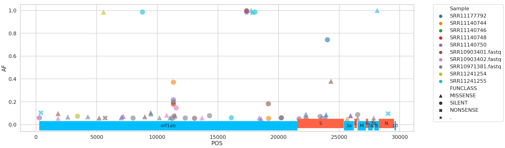
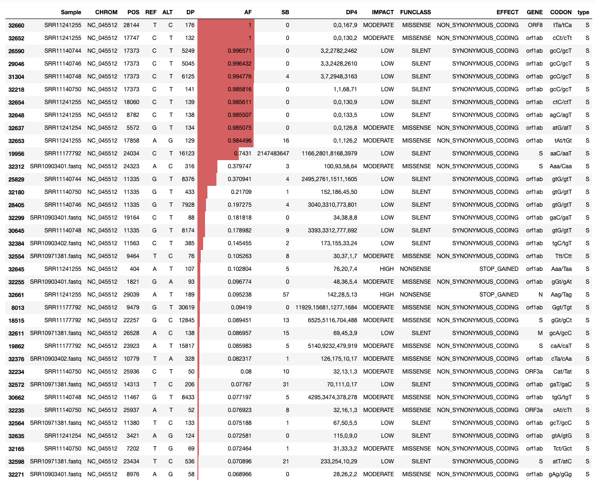

# Analysis of variation within individual COVID-19 samples | March 6 2020

## Live Resources

| usegalaxy.org | usegalaxy.eu | usegalaxy.org.au | usegalaxy.be |
|:--------:|:------------:|:------------:|:------------:|
|  |  |  |  |
|  |  |  |  |
|  |  |  |  |

## What's the point?

The absolute majority of SARS-COV-2 data is in the form of assembled genomic sequences. This is unfortunate because any variation that exists within individual samples is obliterated--converted to the most frequent base--during the assembly process. However, knowing underlying evolutionary dynamics is critical for tracing evolution of the virus as it allows identification of genomic regions under different selective regimes and understanding of its population parameters.

## Outline

Raw sequencing reads are required to detected within-sample variation. As of March 10 the following datasets are available:

|Run|BioProject|Center Name|Instrument|LibraryLayout|LibrarySource|MBases|Collection_Date|Host|Status|
|---|----------|-----------|----------|-------------|-------------|------|---------------|----|------|
|SRR10948474|PRJNA601630|HKU|MinION|S|GENOMIC|284|Jan-2020|Homo sapiens||
|SRR10948550|PRJNA601630|HKU|MinION|S|GENOMIC|146|Jan-2020|Homo sapiens||
|SRR11241255|PRJNA610428|UWash|MiSeq|S|VIRAL RNA|22|28-Feb-2020|Homo sapiens|:white_check_mark:|
|SRR11241254|PRJNA610428|UWash|MiSeq|S|VIRAL RNA|22|27-Feb-2020|Homo sapiens|:white_check_mark:|
|SRR10971381|PRJNA603194|Fudan|MiniSeq|P|METATRANSCRIPTOMIC|8031|02-Jan-2020|Homo sapiens|:white_check_mark:|
|SRR11247078|PRJNA610428|UWash|MiSeq|S|VIRAL RNA|199|29-Feb-2020|Homo sapiens||
|SRR11247076|PRJNA610428|UWash|MiSeq|S|VIRAL RNA|11|01-Mar-2020|Homo sapiens|:white_check_mark:|
|SRR11247075|PRJNA610428|UWash|MiSeq|S|VIRAL RNA|0|01-Mar-2020|Homo sapiens|:white_check_mark:|
|SRR11247077|PRJNA610428|UWash|MiSeq|S|VIRAL RNA|118|01-Mar-2020|Homo sapiens|:white_check_mark:|
|SRR10902284|PRJNA601630|UHK|MinION|S|METAGENOMIC|90|Jan-2020|Homo sapiens||
|SRR11092056|PRJNA605983|WIV|MiSeq|P|METAGENOMIC|1484|30-Dec-2019|Homo sapiens|:x:|
|SRR11092057|PRJNA605983|WIV|MiSeq|P|METAGENOMIC|1456|30-Dec-2019|Homo sapiens|:x:|
|SRR11092061|PRJNA605983|WIV|HiSeq 3000|P|METAGENOMIC|10276|30-Dec-2019|Homo sapiens|:x:|
|SRR11092064|PRJNA605983|WIV|MiSeq|P|METAGENOMIC|1036|30-Dec-2019|Homo sapiens|:x:|
|SRR11085733|PRJNA606159|WIV|HiSeq 3000|P|METAGENOMIC|3868|Mar-2018|Hipposideros larvatus||
|SRR11085736|PRJNA606159|WIV|HiSeq 3000|P|METAGENOMIC|3458|Mar-2018|Rhinolophus affinis||
|SRR11085737|PRJNA606159|WIV|HiSeq 3000|P|METAGENOMIC|3087|Mar-2018|Scotophilus kuhlii||
|SRR11085738|PRJNA606159|WIV|HiSeq 3000|P|METAGENOMIC|4198|Mar-2018|Pipistrellus abramus||
|SRR11085740|PRJNA606159|WIV|HiSeq 3000|P|METAGENOMIC|2755|Mar-2018|Miniopterus pusillus||
|SRR11085741|PRJNA606159|WIV|HiSeq 3000|P|METAGENOMIC|3480|Mar-2018|Rousettus aegyptiacus||
|SRR11085797|PRJNA606165|WIV|HiSeq 3000|P|METAGENOMIC|3296|24-Jul-2013|Rhinolophus affinis||
|SRR11140744|PRJNA607948|UW|MiSeq|P|METAGENOMIC|226|2020-02-14|Homo sapiens|:white_check_mark:|
|SRR11140745|PRJNA607948|UW|GridION|S|METAGENOMIC|260|2020-02-14|Homo sapiens||
|SRR11140746|PRJNA607948|UW|MiSeq|P|METAGENOMIC|159|2020-02-14|Homo sapiens|:white_check_mark:|
|SRR11140748|PRJNA607948|UW|MiSeq|P|METAGENOMIC|190|2020-02-14|Homo sapiens|:white_check_mark:|
|SRR11140749|PRJNA607948|UW|GridION|S|METAGENOMIC|304|2020-02-14|Homo sapiens||
|SRR11140750|PRJNA607948|UW|MiSeq|P|METAGENOMIC|7|2020-02-14|Homo sapiens|:white_check_mark:|
|SRR11140751|PRJNA607948|UW|GridION|S|METAGENOMIC|23|2020-02-14|Homo sapiens||
|SRR11092059|PRJNA605983|WIV|HiSeq 3000|P|METAGENOMIC|11539|30-Dec-2019|Homo sapiens||
|SRR11092060|PRJNA605983|WIV|HiSeq 3000|P|METAGENOMIC|8902|30-Dec-2019|Homo sapiens||
|SRR11092062|PRJNA605983|WIV|HiSeq 1000|P|METAGENOMIC|18391|30-Dec-2019|Homo sapiens|:x:|
|SRR11092063|PRJNA605983|WIV|HiSeq 3000|P|METAGENOMIC|20124|30-Dec-2019|Homo sapiens|:x:|
|SRR11092058|PRJNA605983|WIV|MiSeq|P|METAGENOMIC|2232|30-Dec-2019|Homo sapiens|:x:|
|SRR10903401|PRJNA601736|WU|MiSeq|P|METATRANSCRIPTOMIC|143|||:white_check_mark:|
|SRR10903402|PRJNA601736|WU|MiSeq|P|METATRANSCRIPTOMIC|203|||:white_check_mark:|
|SRR11177792|PRJNA608651|UTP|MiSeq|P|GENOMIC|2817|13-Jan-2020|Homo sapiens|:white_check_mark:|
|SRR11149660|PRJNA608224|UMelb|GridION|S|VIRAL RNA|1770|10-Feb-2020|Homo sapiens||
|SRR11140747|PRJNA607948|UW|GridION|S|METAGENOMIC|359|2020-02-14|Homo sapiens||

###### UW = University of Wisconsin; UHG = University of Hong Kong; UWash = University of Washington; WIV = Wuhan Institute OF Virology, Umelb = University of Melbourne, UTP = Universidad Tecnologica De Pereira, HKU = HKU-Shenzhen Hospital, P = Paired, S = Single, :white_check_mark: = analyzed successfully, :x: = contains no useful data (see [updates](https://github.com/galaxyproject/SARS-CoV-2/tree/master/updates)).

This list is generated by first downloading SRA accessions from [NCBI COVID-19 page](https://www.ncbi.nlm.nih.gov/genbank/sars-cov-2-seqs/) and [SRA](https://www.ncbi.nlm.nih.gov/Taxonomy/Browser/wwwtax.cgi?mode=Info&id=2697049). Next, we compute a union of two lists:

To understand the extent of sequence variation within these samples we performed the following analysis. 

### Analysis of Illumina data

 1. Map all reads against COVID-19 reference [NC_045512.2](https://www.ncbi.nlm.nih.gov/nuccore/NC_045512) using `bwa mem`
 2. Filter reads with mapping quality of at least 20, that were mapped as proper pairs
 3. Perform realignments using `lofreq viterbi`
 4. Call variants using `lofreq call`
 5. Annotate variants using `snpeff` against database created from NC_045512.2 GenBank file
 6. Convert VCFs into tab delimited dataset

### Analysis of ONT data

 1. Process reads using `porechop`
 2. Filter reads using `filtlong` using Illumina data as "reference" to exclude non-typical *k*-mers
 3. Map reads against COVID-19 reference [NC_045512.2](https://www.ncbi.nlm.nih.gov/nuccore/NC_045512) using `minimap2`
 4. Call variants using `lofreq call`
 5. Annotate variants using `snpeff` against database created from NC_045512.2 GenBank file
 6. Convert VCFs into tab delimited dataset

:warning: We obtained vastly different results depending on whether the reads were filtered with `filtlong` or now. As a result we did not incorporate variation from ONT data into our report at this time. 

The combined file containing variants from all currently available datasets is available [here](variant_list.tsv)

Next, we analyzed this tab delimited data in a [Jupyter notebook](variation_analysis.ipynb).

## Inputs

### Workflow

1. GenBank file for the reference COVID-19 [genome](https://www.ncbi.nlm.nih.gov/nuccore/NC_045512).
   The GenBank record is used by `snpeff` to generate a database for variant annotation.
2. Downloaded reads as either paired (for paired end data) or single (for single end data) collections.

### Jupyter notebook

The Jupyter notebook requires the GenBank file (#1 from above) and the output of the workflow described below.

## Outputs

The workflow produces a [table of variants](variant_list.tsv) that looks like this:

<table>
  <thead>
    <tr style="text-align: right;">
      <th></th>
      <th>Sample</th>
      <th>CHROM</th>
      <th>POS</th>
      <th>REF</th>
      <th>ALT</th>
      <th>DP</th>
      <th>AF</th>
      <th>SB</th>
      <th>DP4</th>
      <th>IMPACT</th>
      <th>FUNCLASS</th>
      <th>EFFECT</th>
      <th>GENE</th>
      <th>CODON</th>
    </tr>
  </thead>
  <tbody>
    <tr>
      <th>0</th>
      <td>SRR10903401</td>
      <td>NC_045512</td>
      <td>1409</td>
      <td>C</td>
      <td>T</td>
      <td>124</td>
      <td>0.040323</td>
      <td>1</td>
      <td>66,53,2,3</td>
      <td>MODERATE</td>
      <td>MISSENSE</td>
      <td>NON_SYNONYMOUS_CODING</td>
      <td>orf1ab</td>
      <td>Cat/Tat</td>
    </tr>
    <tr>
      <th>1</th>
      <td>SRR10903401</td>
      <td>NC_045512</td>
      <td>1821</td>
      <td>G</td>
      <td>A</td>
      <td>95</td>
      <td>0.094737</td>
      <td>0</td>
      <td>49,37,5,4</td>
      <td>MODERATE</td>
      <td>MISSENSE</td>
      <td>NON_SYNONYMOUS_CODING</td>
      <td>orf1ab</td>
      <td>gGt/gAt</td>
    </tr>
    <tr>
      <th>2</th>
      <td>SRR10903401</td>
      <td>NC_045512</td>
      <td>1895</td>
      <td>G</td>
      <td>A</td>
      <td>107</td>
      <td>0.037383</td>
      <td>0</td>
      <td>51,52,2,2</td>
      <td>MODERATE</td>
      <td>MISSENSE</td>
      <td>NON_SYNONYMOUS_CODING</td>
      <td>orf1ab</td>
      <td>Gta/Ata</td>
    </tr>
    <tr>
      <th>3</th>
      <td>SRR10903401</td>
      <td>NC_045512</td>
      <td>2407</td>
      <td>G</td>
      <td>T</td>
      <td>122</td>
      <td>0.024590</td>
      <td>0</td>
      <td>57,62,1,2</td>
      <td>MODERATE</td>
      <td>MISSENSE</td>
      <td>NON_SYNONYMOUS_CODING</td>
      <td>orf1ab</td>
      <td>aaG/aaT</td>
    </tr>
    <tr>
      <th>4</th>
      <td>SRR10903401</td>
      <td>NC_045512</td>
      <td>3379</td>
      <td>A</td>
      <td>G</td>
      <td>121</td>
      <td>0.024793</td>
      <td>0</td>
      <td>56,62,1,2</td>
      <td>LOW</td>
      <td>SILENT</td>
      <td>SYNONYMOUS_CODING</td>
      <td>orf1ab</td>
      <td>gtA/gtG</td>
    </tr>
  </tbody>
</table>

Here, most fields names are descriptive. **SB** = the Phred-scaled probability of strand bias as calculated by [lofreq](https://csb5.github.io/lofreq/) (0 = no strand bias); **DP4** = strand-specific depth for reference and alternate allele observations (Forward reference, reverse reference, forward alternate, reverse alternate).

The variants we identified were distributed across the SARS-CoV-2 genome in the following way:

The following table describes variants with frequencies above 10%:

## History and workflow

We use two separate workflows for performing paired and single end data analyses:

| Variation analysis workflows                |
|----------------|
| |
|Workflow for the analysis of single end Illumina reads < 100 bp |
||
|Workflow for the analysis of paired end Illumina reads  |

## BioConda

Tools used in this analysis are also available from BioConda:

| Name | Link |
|------|----------------|
| `bwa` |  |
| `samtools` |  |
| `lofreq` |  |
| `snpeff` |  |
| `snpsift` |  |
| `porechop` |  |
| `filtlong` |  |
| `minimap2` |  |
