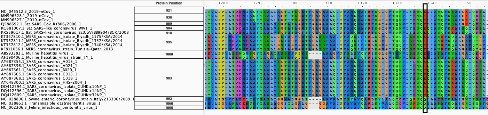

| usegalaxy.org | usegalaxy.eu | usegalaxy.org.au | usegalaxy.be |
|:--------:|:------------:|:------------:|:------------:|
|  |  |  |  |
|  |  |  |  |

# Analysis of S-protein polymorphism

## What's the point?

In [the previous portion](https://github.com/galaxyproject/SARS-CoV-2/tree/master/4-Variation) of this study we found a non-synonymous polymorphism within the *S*-gene. In this section we are trying to interpret its possible effect.

## Outline

Obtain coding sequences of S proteins from a diverse group of coronaviruses. Generate amino acid alignment to assess conservation of the polymorphic location.

## Input

Downloaded [CDS sequences](Spike_cds.fasta) of coronavirus Spike proteins from [NCBI Viral Resource](https://www.ncbi.nlm.nih.gov/labs/virus/vssi/#/virus?SeqType_s=Nucleotide&VirusLineage_ss=SARS-CoV-2,%20taxid:2697049) for the following coronaviruses:

| Accession  |  Descriptin |
|------------|-------------|
|FJ588692.1	 | Bat SARS Coronavirus Rs806/2006 |
|KR559017.1	 | Bat SARS-like coronavirus BatCoV/BB9904/BGR/2008 |
|KC881007.1	 | Bat SARS-like coronavirus WIV1 |
|KT357810.1	 | MERS coronavirus isolate Riyadh_1175/KSA/2014 |
|KT357811.1	 | MERS coronavirus isolate Riyadh_1337/KSA/2014 |
|KT357812.1	 | MERS coronavirus isolate Riyadh_1340/KSA/2014 |
|KF811036.1	 | MERS coronavirus strain Tunisia-Qatar_2013 |
|AB593383.1	 | Murine hepatitis virus |
|AF190406.1	 | Murine hepatitis virus strain TY |
|AY687355.1	 | SARS coronavirus A013 |
|AY687356.1	 | SARS coronavirus A021 |
|AY687361.1	 | SARS coronavirus B029 |
|AY687365.1	 | SARS coronavirus C013 |
|AY687368.1	 | SARS coronavirus C018 |
|AY648300.1	 | SARS coronavirus HHS-2004 |
|DQ412594.1	 | SARS coronavirus isolate CUHKtc10NP |
|DQ412596.1	 | SARS coronavirus isolate CUHKtc14NP |
|DQ412609.1	 | SARS coronavirus isolate CUHKtc32NP |
|MN996528.1	 | nCov-2019 |
|MN996527.1	 | nCov-2019 |
|NC_045512.2 | nCov-2019 |
|NC_002306.3 | Feline infectious peritonitis virus |
|NC_028806.1 | Swine enteric coronavirus strain Italy/213306/2009 |
|NC_038861.1 | Transmissible gastroenteritis virus |

These viruses were chosen based on a publication by Duquerroy et al. ([2005](http://dx.doi.org/10.1016/j.virol.2005.02.022)). The sequences were extracted manually--a painful process. We will develop a tool for parsing particular CDS sequences automatically for future analyses.

## Output

We produce two alignments, one at the nucleotide and one at the amino acid level, of Betacoronavirus spike proteins. The alignments can be visualized with the `Multiple Sequence Alignment` visualization in Galaxy :

 

| Alignments of Spike proteins |
|:-------------------------------:|
|  |
| **A**. CDS alignments |
|  |
| **B**. Protein alignment |

## Workflow and history

The Galaxy history containing the latest analysis can be found [here](https://usegalaxy.org/u/aun1/h/covid-19-s-protein-aa). The publicly accessible [workflow](https://usegalaxy.org/u/aun1/w/covid-19-s-gene-aa) can be downloaded and installed on any Galaxy instance. It contains all information about tool versions and parameters used in this analysis.

The `transeq` tool converts the CDS sequences into protein sequences, which we then align to each other using `mafft`. The output is fed into `tranalign` along with the nucleotide sequences. `tranalign` produces a nucleotide alignment coherent with the protein alignment.

## BioConda

Tools used in this analysis are also available from BioConda:

| Name     | Link |
|----------|----------------|
| `mafft`  |  |
| `emboss` |  |
