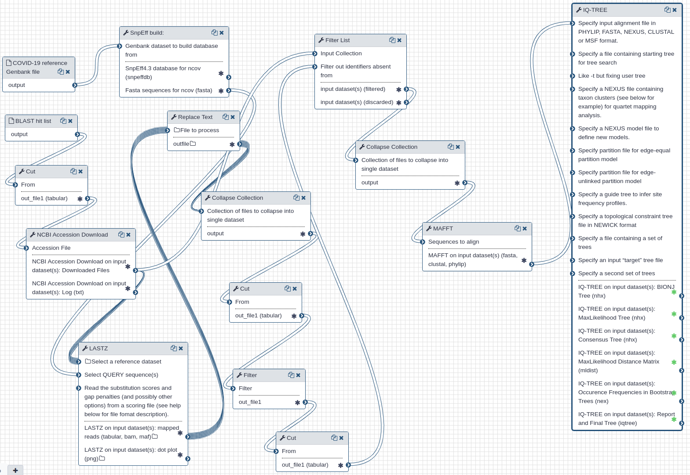

| usegalaxy.org | usegalaxy.org.au | usegalaxy.eu |
|:--------:|:------:|:------------:|
| [](https://usegalaxy.org/u/aun1/h/ncov-intrasample-variation) | [](https://usegalaxy.org/u/aun1/h/ncov-intrasample-variation) | [](https://usegalaxy.org/u/aun1/h/ncov-intrasample-variation) |
| [](variation_analysis.ipynb) | [](variation_analysis.ipynb) | [](variation_analysis.ipynb) |


# Comparative analysis of coronovirus sequences

## What's the point?

What is the phylogenetic relationship between assembled sequences and other coronaviruses?

## Outline

We mapped Unicycler assembly produces at [step 1](https://github.com/galaxyproject/SARS-CoV-2/tree/master/Assembly) against `nr` database at NCBI using `blastn`  and downloaded [hit table](4GRC05K5014-Alignment-HitTable.csv). This analysis indicated that our assembly is 100% identical to [NC_045512](https://www.ncbi.nlm.nih.gov/nuccore/NC_045512).

We then used this hit table to Galaxy workflow that:

 1. downloaded sequences
 2. aligned downloaded sequences against COVID-19 reference [NC_045512](https://www.ncbi.nlm.nih.gov/nuccore/NC_045512) using `lastz`
 3. identified sequences that align with at least 75% of NC_045512
 4. created multiple alignment of sequences from the previous step using `mafft`
 5. computed a maximum likelihood tree using `iqtree`

## Inputs

The analysis takes two inputs:

 1. Hit table generated by blast
 2. Genbank file for COVID-19 reference genome [NC_045512](https://www.ncbi.nlm.nih.gov/nuccore/NC_045512)

 The hit table has the following format:

 ```
COVID-19,MN988668.1,100.000,29781,0,0,1,29781,29838,58,0.0,54996
COVID-19,NC_045512.2,100.000,29781,0,0,1,29781,29839,59,0.0,54996
COVID-19,MN994468.1,99.993,29781,2,0,1,29781,29839,59,0.0,54985
COVID-19,MN985325.1,99.990,29781,3,0,1,29781,29839,59,0.0,54979
COVID-19,MN938384.1,99.990,29781,3,0,1,29781,29807,27,0.0,54979
COVID-19,MN997409.1,99.987,29781,4,0,1,29781,29839,59,0.0,54974
COVID-19,MN975262.1,99.983,29781,5,0,1,29781,29839,59,0.0,54968
....
```

the workflow:
 
  - extracts accession numbers (the second column) for hit table
  - downloads all corresponding FASTA files
  - aligned them using `lastz`
  - selected all sequences that align over at least 75% of the reference
  - uses these sequences to create multiple alignment and phylogenetic tree

## Outputs

1. A multiple alignment of sequences that align over at least 75% of the reference
2. A maximum likelihood tree


## History and workflow

Galaxy workspace (history) containing the most current analysis can be imported from [here](https://usegalaxy.org/u/aun1/h/ncov-comp).

The [workflow](https://usegalaxy.org/u/aun1/w/comp) is available at Galaxy public site and can downloaded and installed on any Galaxy instance. It contains version information for all tools used in this analysis. 

the workflow performs the following steps:
 
  - extracts accession numbers (the second column) for hit table
  - downloads all corresponding FASTA files
  - aligned them using `lastz`
  - selected all sequences that align over at least 75% of the reference
  - uses these sequences to create multiple alignment and phylogenetic tree



## BioConda

Tools used in this analysis are also available from BioConda:

| Name | Link |
|------|----------------|
| `lastz` | [](https://anaconda.org/bioconda/lastz) |
| `mafft` | [](https://anaconda.org/bioconda/mafft) |
| `iqtree` | [](https://anaconda.org/bioconda/iqtree) |

