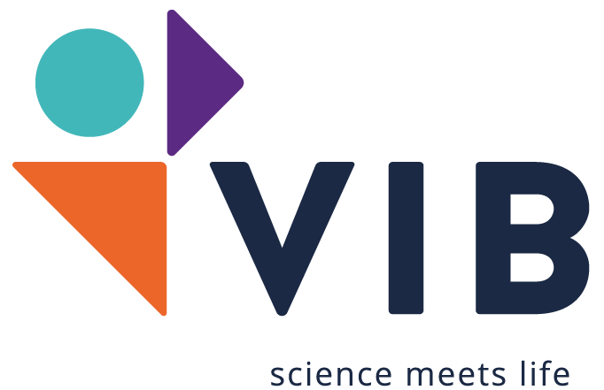
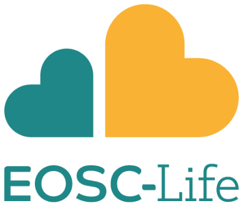

# Initial analysis of COVID-19 data using Galaxy, BioConda and public research infrastructure (XSEDE, de.NBI-cloud, ARDC cloud)

Powered by: 

[Dannon Baker](https://github.com/dannon),
[Marius van den Beek](https://github.com/mvdbeek),
[Dave Bouvier](https://github.com/davebx),
[John Chilton](https://github.com/jmchilton),
[Nate Coraor](https://github.com/natefoo),
[Frederik Coppens](frederikcoppens),
[Ignacio Eguinoa](https://github.com/ieguinoa),
[Simon Gladman](https://github.com/slugger70),
[Björn Grüning](https://github.com/bgruening),
[Delphine Larivière](https://github.com/Delphine-L),
[Andrew Lonie](https://github.com/alonie),
[Nicholas Keener](https://github.com/nickeener),
[Sergei Kosakovsky Pond](https://github.com/spond),
[Wolfgang Maier](https://github.com/wm75),
[Anton Nekrutenko](https://github.com/nekrut),
[James Taylor](https://github.com/jxtx),
[Steven Weaver](https://github.com/stevenweaver)

This repo serves as a companion to our study describing the analysis of early COVID-19 data:

> [No more business as usual: agile and effective responses to emerging pathogen threats require open data and open analytics](https://doi.org/10.1101/2020.02.21.959973). usegalaxy.org, usegalaxy.eu, usegalaxy.org.au, usegalaxy.be and hyphy.org development teams, Anton Nekrutenko, Sergei L Kosakovsky Pond. *bioRxiv* 2020.02.21.959973; doi: https://doi.org/10.1101/2020.02.21.959973

It contains descriptions of workflows and exact versions of all software used. The goals of this study were to:

 1. Underscore the importance of access to raw data
 2. Demonstrate that existing community efforts in curation and deployment of biomedical software can reliably support rapid reproducible research during global crises

Our analysis was divided into six parts listed below (we also added "Updates" section where will be keeping track of new data as it appears). Each part has a dedicated page that provides links to input datasets, intermediate and final results, workflows, and Galaxy histories that list all details for each analysis. These workflows can be re-run by any of three global Galaxy instances in the [US](http://usegalaxy.org), in [Europe](http://usegalaxy.eu) and in [Australia](https://usegalaxy.org.au), as well as in the [ELIXIR Belgium](https://usegalaxy.be) Galaxy instance.

  1. [Pre-processing of raw read data](1-PreProcessing)
  2. [Assembly of COVID-19 genome](2-Assembly)
  3. [Estimation of timing for most recent common ancestor (MRCA)](3-MRCA)
  4. [Analysis of variation within individual isolates](4-Variation)
  5. [Analysis of Spike protein substitutions](5-S-analysis)
  6. [Analysis of recombination and selection](6-RecombinationSelection)

In addition we will be looking at newly released data here &#8594; [Updates: Analysis of additional data](updates)

 The analyses have been performed using the [Galaxy](http://galaxyproject.org) platform and open source tools from [BioConda](https://bioconda.github.io/). Tool runs used [XSEDE](https://www.xsede.org/) resources maintained by the Texas Advanced Computing Center ([TACC](https://www.tacc.utexas.edu/)), Pittsburgh Supercomputing Center ([PSC](https://www.psc.edu/)), and [Indiana University](https://jetstream-cloud.org/) in the U.S., [de.NBI](https://www.denbi.de/) and [VSC](https://www.vscentrum.be) cloud resources on the European side, and [ARDC](https://ardc.edu.au) cloud resources in Australia.

 

   &nbsp;
   &nbsp;
   &nbsp;
   &nbsp;
   &nbsp;
   &nbsp;
   &nbsp;
   &nbsp;
   &nbsp;
   &nbsp;
   &nbsp;
   &nbsp;
   &nbsp;
   &nbsp;
   &nbsp;
   &nbsp;
   &nbsp;
   &nbsp;
  

