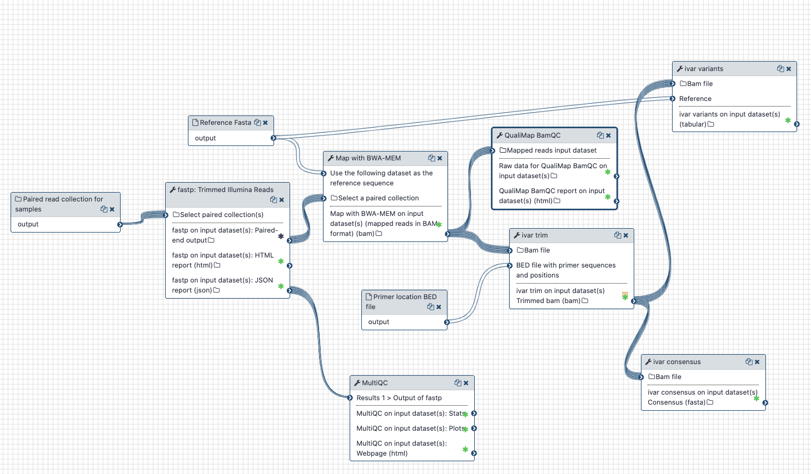

## Live Resources

| usegalaxy.eu | usegalaxy.org.au |
|:--------:|:------------:|
| <FlatShield label="data" message="view" href="https://usegalaxy.eu/library/list#folders/F2a32545de855d335" alt="Raw data" /> | |
| <FlatShield label="workflow" message="run" href="https://usegalaxy.eu/u/wolfgang-maier/w/covid19-variation-analysis-on-artic-pe-data" alt="Galaxy workflow" /> | <FlatShield label="workflow" message="run" href="https://usegalaxy.org.au/u/simongladman/w/covid-19-variation-analysis-on-artic-pe-data" alt="Galaxy workflow" />  |
| <FlatShield label="history" message="view" href="https://usegalaxy.eu/u/wolfgang-maier/h/artic-example-analysis" alt="Galaxy history" /> | |

## Background

The [ARTIC Network](https://artic.network) is a collaborative project between a number of laboratories around the world that wants to provide protocols and advice on viral outbreaks. Their website states that part of their goal is to develop *"an end-to-end system for processing samples from viral outbreaks to generate real-time epidemiological information that is interpretable and actionable by public health bodies."*

The ARTIC network has made available laboratory protocols, primer sets and bioinformatics workflows. The protocol they use relies on targeted amplification of viral sequences using tiled, multiplexed primers, an approach [first described for Zika virus sequencing](https://www.nature.com/articles/nprot.2017.066).

Since this approach, as the ARTIC website states, *"has been proven to have high sensitivity and work directly from clinical samples (compared to metagenomics approaches)"*, it has been widely adopted by groups worldwide and a fair percentage of the COVID genome sequences uploaded to GISAID and raw reads uploaded to the SRA have been produced by this method.

Along with the laboratory protocols for sequencing (both for Illumina and Nanopore sequencing technologies), several tools and workflows have been developed to handle what is essentially non-random sequencing data.

## Analyzing ARTIC data with Galaxy

### What's the point?

Our goal is to enable and provide state-of-the-art workflows for the analysis of SARS-CoV-2 ARTIC data using the Galaxy platform.

While it is possible to treat ARTIC data like regular whole-genome sequencing (WGS) data and analyze it with WGS workflows like the ones we developed for the [analysis of within-samples variation](../genomics/4-Variation/), failure to take the specific nature of the data, and specifically the presence of amplicon primer sequences, into account would lead to suboptimal results.

### A Galaxy workflow for the analysis of Illumina paired-end sequenced ARTIC amplicon data

Compared to our workflow for WGS data, the workflow optimized for ARTIC data analysis includes the following changes:

1. No effort is made to deduplicate the sequenced reads data

   Identical pairs of reads are commonly seen with highly amplified data from narrow ampliconic regions, but cannot be seen as prove that the reads have originated from the same viral template molecule.

2. Amplicon primer sequences are trimmed off the sequenced reads before variant calling

   A naive analysis including resequenced primer sequences in the variant calling step would underestimate the frequency of variant alleles at primer binding sites, which, in turn, may lead to not calling real variants at all or to misclassifying fixed genomic variants as within-sample variation.

   We use the [iVar software](https://andersen-lab.github.io/ivar/html/) from the Andersen Lab at the
Scripps Research Institute in California for trimming the primer section of reads *after* mapping based on known primer binding sites.

   This step also reduces strand-bias for variants at primer binding sites.

   Note also that Illumina-sequencing protocols for the ARTIC approach typically include random fragmentation of the amplicons as part of their library preparation step in order to achieve full coverage of all amplicons.
   To account for this, we do *not* use iVar's option to discard reads that do not end in a primer sequence.

3. Read pairs amplified with a potential bias in primer binding are not used for calculating variant call statistics

   If within-sample variation affects a primer binding site, the primer is expected to bind preferentially to the perfectly matching reference sequence as opposed to sequences carrying the variant allele, i.e., amplicons generated with such biased primers will more likely capture the sequence of viral template molecules without the variant than with it, and this extends to any linked variants within the amplicon region.

   In order to avoid an allele frequency bias for such linked variants, one solution is to not use data from biased
   amplicons (for which at least one primer binding site displays within-sample variation) at all.

   We implement this idea and perform a first round of variant calling to detect primer binding site variants. We then use *iVar* again to remove reads from biased amplicons prior to a second round of *unbiased* variant calling.

   Since removing the information from whole amplicons is a rather drastic measure, which will leave a gap of no coverage in the tiled layout of reads, we then compare the variant lists before and after amplicon removal, and add variants lost in the second round of calling back in to the final list of variants. Those variants get flagged as not having passed amplicon removal though to indicate that their call statistics might not be reliable.

|  |
|:------------------:|
| Galaxy workflow for the analysis of Illumina paired-end sequenced ARTIC amplicon data |

### Required Inputs

The workflow requires:

1. A collection of the forward and reverse reads in `fastq` format of all samples to be analyzed

2. The SARS-CoV-2 [reference FASTA sequence](https://www.ncbi.nlm.nih.gov/nuccore/NC_045512.2?report=fasta)

3. A BED file describing the binding sites of all primers used to generate the tiled amplicons

   The ARTIC project provides BED files for use with this workflow as part of their [SARS-CoV-2 resources repo](https://github.com/artic-network/artic-ncov2019/tree/master/primer_schemes/nCoV-2019).
   
   For reproducibility we provide here copies of the:
   
   - [v3 primer scheme BED file](nCoV-2019_v3.bed)
   - [v1 primer scheme BED file](nCoV-2019_v1.bed)

   Please take care to use the correct primer BED file corresponding to the version of the primers used during sequencing! If in doubt, consider this:
   
   - Later BED file versions should also work reasonably well with older sequencing data, while the other way round is more problematic
   - v2 of the primer scheme has been in use for only a very short time before it got superseded by v3.

4. An amplicon info file

   This tabular file should consist of one line per amplicon, which should list *all* primers involved in the generation of this amplicon. For reproducibility we provide files with:
   
   - [amplicon info for the v3 primer scheme](ARTIC_SARS_CoV-2_amplicon_info_v3.tsv)
   - [amplicon info for the v1 primer scheme](ARTIC_SARS_CoV-2_amplicon_info_v1.tsv)

### Outputs

The workflow generates a collection of variant lists (one VCF dataset per sample).
Each dataset lists *all* variants discovered during variant calling and meeting minimal quality criteria.
The VCF `FILTER` column is used to indicate variants with an apparent allele frequency of `< 0.05`, variants failing a strand-bias test, and variants that could not be recalled upon removal of reads from biased amplicons.

     &nbsp;&nbsp;
     &nbsp;&nbsp;
     &nbsp;&nbsp;
     &nbsp;

## BioConda

Tools used in this analysis are also available from BioConda:

| Name | Link |
|------|----------------|
| `multiqc` |  |
| `qualimap` |  |
| `fastp` |  |
| `bwa` |  |
| `samtools` |  |
| `ivar` |  |
| `lofreq` |  |
| `vcflib` |  |
| `snpeff` |  |

## Reference

Nathan D Grubaugh, Karthik Gangavarapu, Joshua Quick, Nathaniel L Matteson, Jaqueline Goes De Jesus, Bradley J Main, Amanda L Tan, Lauren M Paul, Doug E Brackney,
Saran Grewal, Nikos Gurfield, Koen KA Van Rompay, Sharon Isern, Scott F Michael, Lark L Coffey, Nicholas J Loman, Kristian G Andersen,
[An amplicon-based sequencing framework for accurately measuring intrahost virus diversity using PrimalSeq and iVar](https://doi.org/10.1101/383513), Genome Biology 2019 20:8

