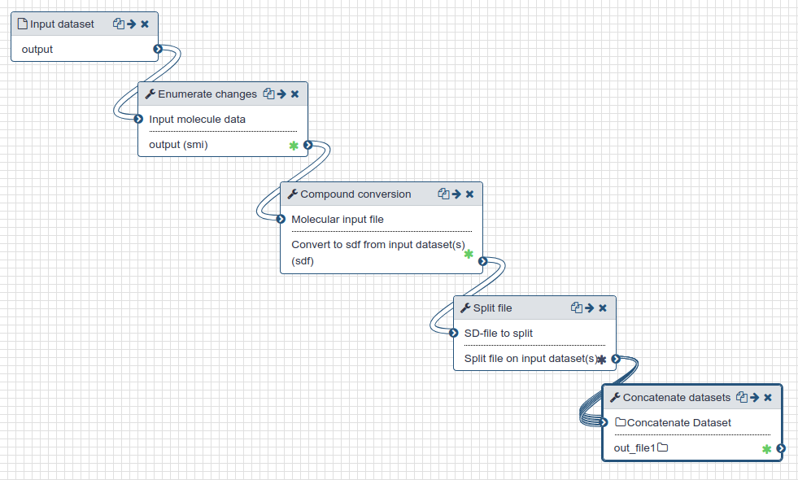

# Preparation for docking

This section describes the preparation of protein and ligands for docking.

## Live Resources

| usegalaxy.eu | 
|:--------:|
| <FlatShield label="history" message="view" href="https://usegalaxy.eu/u/sbray/h/charge-enumeration" alt="Galaxy history" /> | 
| <FlatShield label="workflow" message="run" href="https://usegalaxy.eu/u/sbray/w/charge-enumeration" alt="Galaxy workflow" /> | 

## Outline

- The PDB files from crystallography were prepared by removing all crystallographic waters and then protonated at pH 7.4 using OpenBabel.
- The initial ~42,000 candidate compounds in SMILES format are enumerated using Dimorphite-DL [1] and [RDKit](http://www.rdkit.org) to a total of ~150,000 compounds with relevant charge forms.  
- For each of these, a three-dimensional structure is generated using OpenBabel [2] and saved in SD-format.
- The SD-file is split into chunks of 1,000 molecules each ready for docking.

## History and workflow

A Galaxy workspace (history) containing the most current analysis can be imported from [here](https://usegalaxy.eu/u/sbray/h/charge-enumeration).

The publicly accessible [workflow](https://usegalaxy.eu/u/sbray/w/charge-enumeration) can be downloaded and installed on any Galaxy instance. It contains version information for all tools used in this analysis.

| Preparation for docking  |
|:----------------:|
| |
| Preparation of protein and ligands for docking.  <FlatShield label="workflow" message="run" href="https://usegalaxy.eu/u/sbray/w/charge-enumeration" alt="Workflow preparation for docking" /> |

## References

[1] Dimorphite-DL: an open-source program for enumerating the ionization states of drug-like small molecules,
Robb *et al.* [doi:10.1186/s13321-019-0336-9](https://doi.org/doi:10.1186/s13321-019-0336-9).

[2] Open Babel: An open chemical toolbox. O'Boyle *et. al* [doi:10.1186/1758-2946-3-33](https://doi.org/10.1186/1758-2946-3-33).
