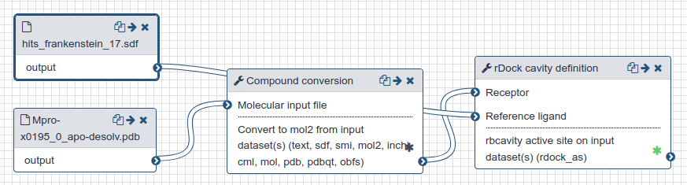

# Active site preparation

This section describes the preparation of the active site for docking. The screening of the active site was repeated 17 times, for each of the 17 fragment screening crystal structures that were available at the time (more are expected).

## Live Resources

| usegalaxy.eu | 
|:--------:|
|  | 
|  | 

## Outline

- A file describing the active site of the protein for each of the fragment screening crystal structures was generated using rDock's `rbcavity` (with `rbcavity -was -d -r`).
- Creating a single hybrid molecule that contains all the ligands - [the 'frankenstein' ligand](https://www.informaticsmatters.com/blog/2018/11/23/cavities-and-frankenstein-molecules.html).

## History and workflow

A Galaxy workspace (history) containing the most current analysis can be imported from [here](https://usegalaxy.eu/u/sbray/h/mpro-active-site-generation).

The publicly accessible [workflow](https://usegalaxy.eu/u/sbray/w/mpro-active-site-generation) can be downloaded and installed on any Galaxy instance. It contains version information for all tools used in this analysis.

 

  Docking
   &nbsp;  
 

 