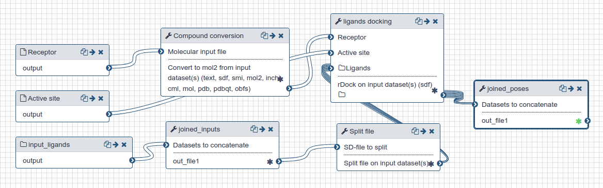

# Docking

This section describes the docking procedure. This was repeated 17 times, for each of the 17 fragment screening crystal structures that were available at the time (more are expected).

## Live Resources

| usegalaxy.eu | 
|:--------:|
|  |
|  |

## Outline

Docking is performed with rDock [1] using as inputs:
 
- PDB file of the protein of the fragment screening crystal structure with the ligand and waters removed, and protonated (using OpenBabel [2]) at pH 7.4
- The active site definition for that protein prepared as described in [step 2](../2-ActiveSitePrep)
- Candidate molecules prepared as described in [step 1](../1-DockingPrep)

25 poses were generated for each molecule.

### Inputs

A complete list of all inputs is provided in [this history](https://usegalaxy.eu/u/timdudgeon/h/mpro-docking-inputs). The `hits_frankenstein_17.sdf` file contains the 'Frankenstein ligand' used to generate the active site; the `Mpro-x*as` files contain active site definitions for all 17 fragments; the `hits.sdf` file contains the structures of the fragment hits; and the `EnumeratedCandidates` collection contains all candidates prepared for docking.

## History and workflow

A Galaxy workspace (history) containing the most current analysis can be imported from [here](https://usegalaxy.eu/u/timdudgeon/h/mpro-x0161).

The publicly accessible [workflow](https://usegalaxy.eu/u/sbray/w/mpro-docking-only) can be downloaded and installed on any Galaxy instance. It contains version information for all tools used in this analysis.

 

  Docking
   &nbsp;  
 

 
 ## References

[1] Ruiz-Carmona et al. (2014). rDock: a fast, versatile and open source program for docking ligands to proteins and nucleic acids. PLoS Computational Biology. 10 (4). doi:[10.1371/journal.pcbi.1003571](https://doi.org/10.1371%2Fjournal.pcbi.1003571).

[2] Open Babel: An open chemical toolbox. O'Boyle et al. [doi:10.1186/1758-2946-3-33](https://doi.org/10.1186/1758-2946-3-33).
