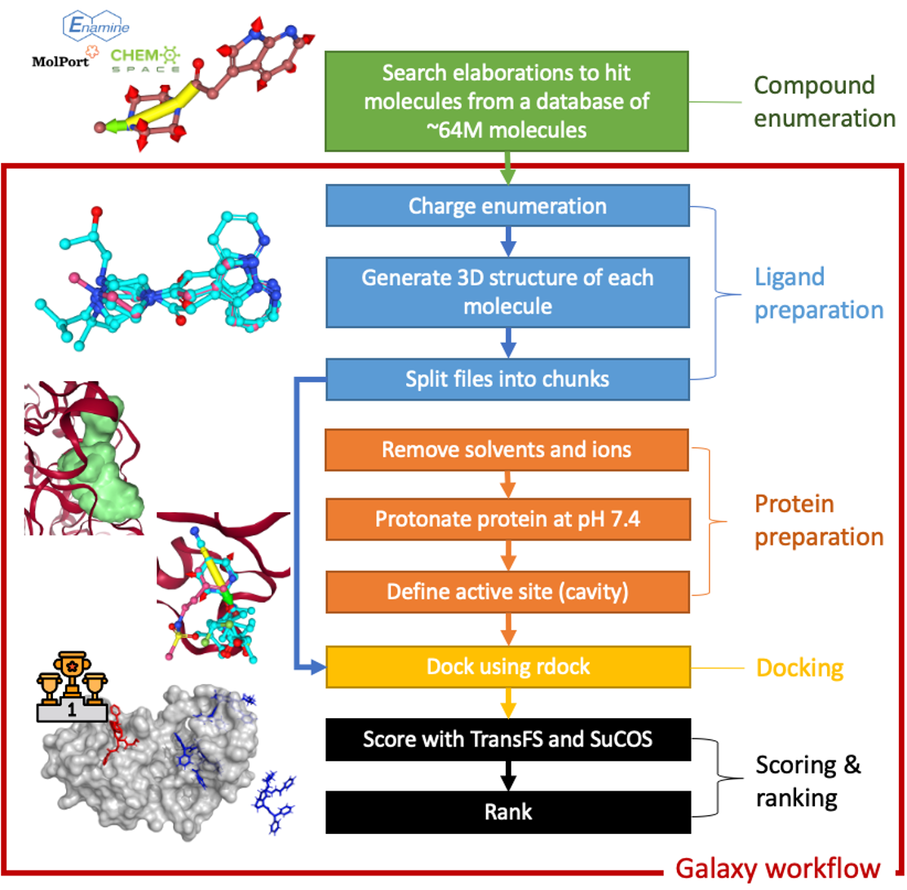
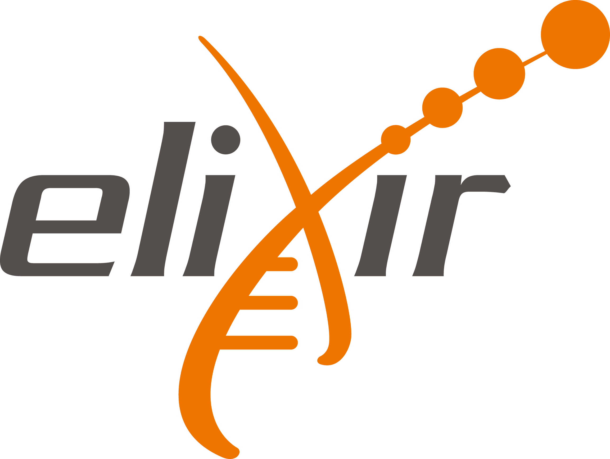
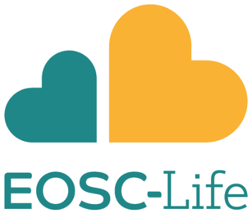

# Virtual screening of the SARS-CoV-2 main protease (de.NBI-cloud, STFC)

Powered by: 

[Tim Dudgeon](https://github.com/tdudgeon),
[Simon Bray](https://github.com/simonbray),
[Gianmauro Cuccuru](https://github.com/gmauro),
[Björn Grüning](https://github.com/bgruening),
[Rachael Skyner](https://github.com/reskyner),
[Jack Scantlebury](http://users.ox.ac.uk/~hert5790/),
[Susan Leung](https://uk.linkedin.com/in/susan-leung-aa87aaa3),
[Frank von Delft](https://www.thesgc.org/profile/oxford/fvondelft)

This repo serves as a companion to our recent docking simulations on the SARS-CoV-2 main protease.

It contains descriptions of workflows and exact versions of all software used. The goals of this study were to:

 1. Underscore the importance of access to raw data
 2. Demonstrate that existing community efforts in curation and deployment of computational chemistry software can reliably support rapid reproducible research during global crises

------------

## Background

The [Diamond Light Source's XChem team](https://www.diamond.ac.uk/Instruments/Mx/Fragment-Screening.html) recently completed [a successful fragment screen on the SARS-CoV-2 main protease (MPro)][1], which provided 55 fragment hits (which can be viewed interactively [here](https://fragalysis.diamond.ac.uk/viewer/react/preview/target/Mpro) ). In an effort to identify candidate molecules for binding, [InformaticsMatters](http://informaticsmatters.com), the XChem group and the [European Galaxy team](https://galaxyproject.eu) have joined forces to construct and execute a Galaxy workflow for performing and evaluating molecular docking on a massive scale.

  

## Workflow
The diagram below describes the worfklow used in this work. Further details of the steps can be found in the
**compound enumeration** and **Docking and scoring workflow** sections.

### Compound enumeration

An initial list of ~42,000 candidate molecules was assembled by using the [Fragalysis fragment network][2] to elaborate from the initial fragment hits. The fragment network takes a big set of compounds, and splits them up into parts – rings, linkers and substituents. These parts form the nodes in a graph network. The edges between these nodes describe how the bits of molecules can be linked together to make new molecules. From this information, we know how we can change a molecule by searching the network for new bits to add to an initial hit, with transformations described along the edges in the graph-network.   

This was done using [Informatics Matters’ Fragnet Search APIs](https://fragnet.informaticsmatters.com), querying a database of ~64M molecules available from [Enamine REAL](https://enamine.net/), [ChemSpace](https://chem-space.com/) and [MolPort](http://www.molport.com) using query parameters of 2 edge traversals and a change in heavy atom count of 5 and ring atom count of 2.   

### Docking and scoring workflow (Galaxy)

The enumerated compounds were used as inputs for the docking and scoring workflow. The workflow consists of the following steps, each of which was carried out using tools installed on the European Galaxy server:
1. [Charge enumeration](1-DockingPrep) of those 42,000 candidate molecules to generate ~159,000 docking candidates.
2. [Generation of 3D conformations](1-DockingPrep) based on SMILES strings of the candidate molecules.
3. [Preparation of active site for docking](2-ActiveSitePrep) using rDock.
3. [Docking](3-Docking) of molecules into each of the MPro binding sites using rDock, generating 25 docking poses for each molecule.
4. [Evaluation of the docking poses](4-Scoring) using a [deep learning approach][3] developed at the University of Oxford, employing augmentation of training data with incorrectly docked ligands to prompt the model to learn from protein-ligand interactions. The algorithm was deployed on the European Galaxy server inside a Docker container, thanks to work by InformaticsMatters and the European Galaxy team.
5. [Scoring](4-Scoring) of the top scoring pose from each molecule against the original fragment screening hit ligands using the [SuCOS MAX shape and feature overlay algorithm][4], again deployed on the European Galaxy server by InformaticsMatters and the European Galaxy team.
6. [Selection](5-Selection) of compounds available in the [Enamine REAL](https://enamine.net/) and [ChemSpace](https://chem-space.com/) databases for purchase and further study.

This workflow was repeated for each of the 17 fragment screening crystal structures that were available at the time: Mpro -x1249, -x0072, -x0104, -x0107, -x0161, -x0195, -x0305, -x0354, -x0387, -x0434, -x0540, -x0678, -x0874, -x0946, -x0995, -x1077 and -x1093 (more hits have been found since).
 
Of these steps, the third (docking) is the most compute-intensive. Here, the project benefited from the enormous distributed compute capacity which underlies the European Galaxy project. Over 5000 CPUs were made available, provided by [Diamond’s STFC-IRIS](https://www.diamond.ac.uk) cluster at Harwell, UK and the [de.NBI cloud](https://www.denbi.de) in Freiburg, Germany. With each docking job requiring 1 CPU, thousands of poses could thus be docked in parallel, allowing millions of poses to be docked over a single weekend. The fourth step (pose scoring), while less computationally expensive, was accelerated thanks to GPUs provided by de.NBI and STFC. In total, the entire workflow described here took around 120,000 hours of CPU time (13 years) to complete.

All data is publicly available via [https://usegalaxy.eu](https://usegalaxy.eu),
together with the workflows used for data generation, and we are working to provide more detailed documentation that will allow other users to perform similar studies, including on other systems. Histories for each fragment structures are provided [here](Histories).

## Training
We have published a [tutorial](https://training.galaxyproject.org/training-material/topics/computational-chemistry/tutorials/covid19-docking/tutorial.html), as part of the [Galaxy Training Network](https://galaxyproject.org/teach/gtn/), describing how to perform a small-scale version of this analysis on the European Galaxy server. It also acts as a more detailed version of the documentation on this site.

## Future work
Having identified promising candidate ligands, we are now looking for funding to purchase compounds as a basis for further experimental study.

[1]: https://www.diamond.ac.uk/covid-19/for-scientists/Main-protease-structure-and-XChem.html "Diamond Light Source, press release."

[2]: https://diamondlightsource.atlassian.net/wiki/spaces/FRAG/pages/8323192/The+Astex+Fragment+network  "Skyner, The (Astex) Fragment network, Diamond Public Confluence."

[3]: https://www.biorxiv.org/content/10.1101/2020.03.06.979625v1 "Scantlebury et al., Dataset Augmentation Allows Deep Learning-Based Virtual Screening To Better Generalise To Unseen Target Classes, And Highlight Important Binding Interactions."

[4]: https://dx.doi.org/10.26434/chemrxiv.8100203.v1 "Leung et al., SuCOS is Better than RMSD for Evaluating Fragment Elaboration and Docking Poses"

In addition we will be looking at newly released data here &#8594; [Updates: Analysis of additional data](Histories)

## Supporters and collaborators
The experiments have been performed using the [Galaxy](http://galaxyproject.org) platform and open source tools from [BioConda](https://bioconda.github.io/) and [conda-forge](https://conda-forge.org/). Tools were run using cloud resources provided by [de.NBI](https://www.denbi.de/) and [STFC](https://stfc.ukri.org/).

 

   &nbsp;
   &nbsp;
   &nbsp;
  &nbsp;
   &nbsp;
  &nbsp;
   &nbsp;
   &nbsp;
   &nbsp;
   &nbsp;
   &nbsp;
  

