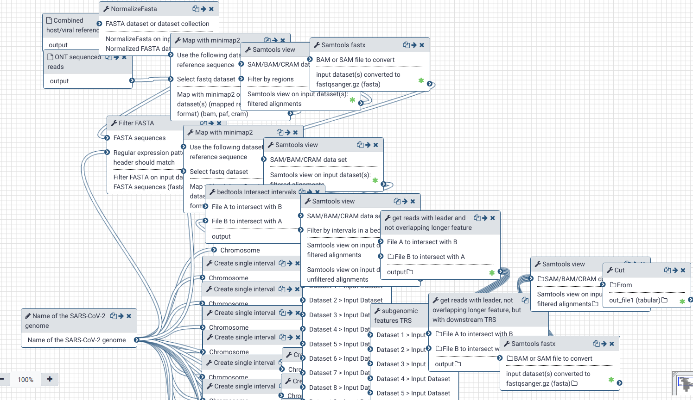
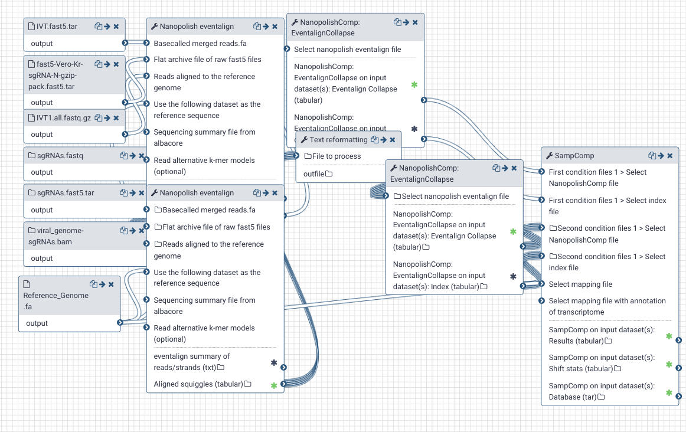

# Evaluation of Nanopore direct RNAseq data in Galaxy

Direct RNA sequencing  (DRS) using Oxford Nanopore technologies enables direct sensing of native RNA molecules. The RNA modification detection workflows for DRS data utilize the electrical deviations in the signal to identify RNA modifications directly in vivo by comparing the signal  to unmodified  RNA samples that are transcribed in vitro.

Uo to now, two different works have tackled understanding the scope of SARS-CoV-2 genomic and sub-genomic RNAs using Nanopore DRS ([Kim et al.](https://doi.org/10.1016/j.cell.2020.04.011) and [Taiaroa et al.](https://doi.org/10.1101/2020.03.05.976167) ). Here, we provide workflows for the methylation analysis of SARS-CoV-2 within Galaxy framework in a scalable and reproducible fashion. In this way, we can provide a consistent analysis of the two available datasets. Thanks to the scalable nature of the Galaxy workflows, we will be able to consistenly process upcoming DRS data as well.

## Galaxy Workflows

### Data pre-processing
Due to the nature of SARS-CoV-2 transcriptions, the sub-genomic RNAs (sgRNA) that encode the structural proteins are overlapping with each other. This requests for special care in mapping the sequencing data and correct assignments of the reads to the associated ORF and sgRNA. The pre-processing workflow performs the alignment step for the whole datasets, and follows up with categorizing the reads based on the identified ORF origin of the transcript.  

### Methylation analysis

The most reliable approach for identifying the putatively modified nucleotides from the sequencing data is by comparing the distribution of raw electrical signals between two conditions. Tombo and Nanocompore are two tools that can be used for this purpose. Here, as the alternative condition, we use the in vitro transcribed oligos of SARS-CoV-2 from Kim et al..

Powered by:
<FlatShield label="usegalaxy" message="eu" href="https://usegalaxy.eu"/>

