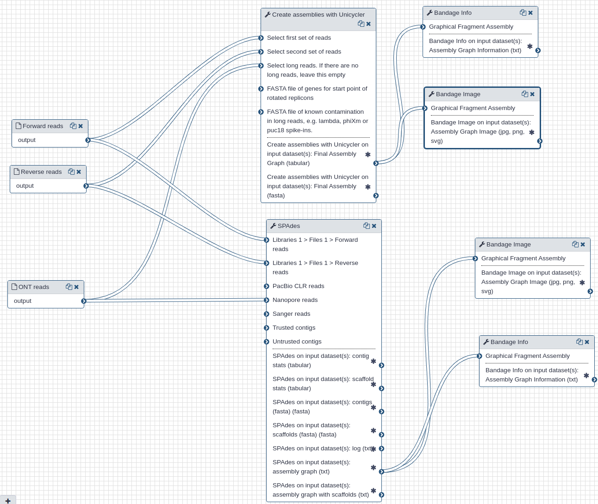

# Assembly of SARS-CoV-2 from pre-processed reads

## Live Resources

| usegalaxy.org | usegalaxy.eu | usegalaxy.org.au | usegalaxy.be | usegalaxy.fr |
|:--------:|:------------:|:------------:|:------------:|:------------:|
| <FlatShield label="workflow" message="run" href="https://usegalaxy.org/u/aun1/w/covid-19-assembly" alt="Galaxy workflow" /> | <FlatShield label="workflow" message="run" href="https://usegalaxy.eu/u/wolfgang-maier/w/covid-19-assembly" alt="Galaxy workflow" /> | <FlatShield label="workflow" message="run" href="https://usegalaxy.org.au/u/simongladman/w/covid-19-assembly" alt="Galaxy workflow" /> | <FlatShield label="workflow" message="run" href="https://usegalaxy.be/u/ieguinoa/w/covid-19-assembly" alt="Galaxy workflow" /> | <FlatShield label="workflow" message="run" href="https://usegalaxy.fr/u/lecorguille/w/covid-19-assembly-of-genome-sequence" alt="Galaxy workflow" /> |
| <FlatShield label="history" message="view" href="https://usegalaxy.org/u/aun1/h/covid-19-assembly" alt="Galaxy history" /> | <FlatShield label="history" message="view" href="https://usegalaxy.eu/u/wolfgang-maier/h/covid-19-genome-assembly" alt="Galaxy history" /> | <FlatShield label="history" message="view" href="https://usegalaxy.org.au/u/simongladman/h/covid-19-assembly" alt="Galaxy history" /> | <FlatShield label="history" message="view" href="https://usegalaxy.be/u/ieguinoa/h/covid-19-assembly" alt="Galaxy history" /> | <FlatShield label="history" message="view" href="https://usegalaxy.fr/u/lecorguille/h/covid-19-assembly" alt="Galaxy history" /> |

## What's the point?

Use a combination of Illumina and Oxford Nanopore reads to produce SARS-CoV-2 genome assembly.

## Outline

We use Illumina and Oxford Nanopore reads that were pre-processed to remove human-derived sequences. We use two assembly tools: [`spades`](http://cab.spbu.ru/software/spades/) and [`unicycler`](https://github.com/rrwick/Unicycler). While `spades` is a tool fully dedicated to assembly, `unicycler` is a "wrapper" that combines multiple existing tools. It uses `spades` as an engine for short read assembly while utilizing [`mimiasm`](https://github.com/lh3/miniasm) and [`racon`](https://github.com/isovic/racon) for assembly of long noisy reads.

In addition to assemblies (actual sequences) the two tools produce assembly graphs that can be used for visualization of assembly with [`bandage`](https://rrwick.github.io/Bandage/).

## Inputs

Filtered Illumina and Oxford Nanopore reads produced during the [pre-processing step](../1-PreProcessing/) are used as inputs to the assembly tools.

## Outputs

Each tool produces assembly (contigs) and assembly graph representations. The largest contigs generated by `unicycler` and `spades` were 29,781 and 29,907 nts, respectively, and had 100% identity over their entire length.

The following figures show visualizations of assembly graphs produced with `spades` and `unicycler`. The complexity of the graphs is not surprising given the metagenomic nature of the underlying samples.

| Assembly graphs for Unicycler (A) and SPAdes (B) |
|:-------------------------------|
| 
| **A**. Unicycler assembly graph |
| 
| **B**. SPAdes assembly graph |

## History and workflow

A Galaxy workspace (history) containing the most current analysis can be imported from [here](https://usegalaxy.org/u/aun1/h/covid-19-assembly).

The publicly accessible [workflow](https://usegalaxy.org/u/aun1/w/covid-19-assembly) can be downloaded and installed on any Galaxy instance. It contains version information for all tools used in this analysis.

## BioConda

Tools used in this analysis are also available from BioConda:

| Name | Link |
|------|----------------|
| `unicycler` |  |
| `spades` |  |
| `bandage` |  |
