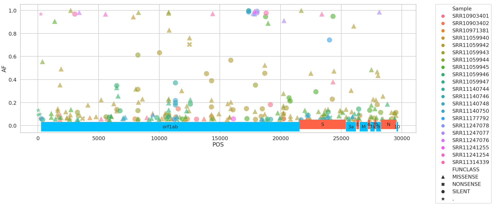
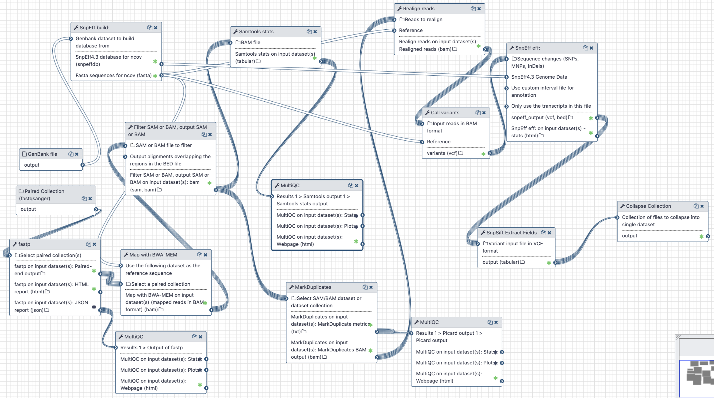

# Analysis of variation within individual COVID-19 samples | March 26 2020

<!--
## Live Resources

<!--
| usegalaxy.org | usegalaxy.eu | usegalaxy.org.au | usegalaxy.be | usegalaxy.fr |
|:--------:|:------------:|:------------:|:------------:|:------------:|
|  |  |  |  |  |
|  |  |  |  |  |
|  |  |  |  |  |

--->

## What's the point?

The absolute majority of SARS-COV-2 data is in the form of assembled genomic sequences. This is unfortunate because any variation that exists within individual samples is obliterated--converted to the most frequent base--during the assembly process. However, knowing underlying evolutionary dynamics is critical for tracing evolution of the virus as it allows identification of genomic regions under different selective regimes and understanding of its population parameters.

## Data availability (:fire: updated daily)

Raw sequencing reads are required to detected within-sample variation. We update the list of available data daily using the following logic implemented in [fetch_sra_acc.sh](fetch_sra_acc.sh):

 1. Two resources list read data available for SARS-CoV-2: [SARS-CoV-2 resource](https://www.ncbi.nlm.nih.gov/core/assets/genbank/files/ncov-sequences.yaml) and [SRA itself](https://www.ncbi.nlm.nih.gov/sra/?term=txid2697049[Organism:noexp]).
 2. We pull accession numbers from these two resources ([genbank.txt](genbank.txt) and [sra.txt](sra.txt)) and compute their union ([union.txt](union.txt))
 3. From the list obtained at the previous step we exclude bad datasets and non human samples (see [this file](acc2exclude.txt) or view datasets directly in [run selector](https://trace.ncbi.nlm.nih.gov/Traces/study/?acc=SRR11085733%2CSRR11085797%2CSRR11085741%2CSRR11085740%2CSRR11085738%2CSRR11085737%2CSRR11085736%2CSRR11092056%2CSRR11092057%2CSRR11092058%2CSRR11092059%2CSRR11092060%2CSRR11092061%2CSRR11092062%2CSRR11092063%2CSRR11092064&ff=on#)). This produces a list of current SRA accession: [current.txt](current.txt).
 4. Finally, we restrict this list to only datasets produced with the Illumina platform ([current_illumina.txt](current_illumina.txt)). Oxford Nanopore data is used later to confirm indel polymorphisms. This is done by uploading accessions listed in
[current.txt](current.txt) to SRA Run Selector and filtering on `platform=ILLUMINA`.

The list of currently analyzed datasets is below:

| Accessions | Date | Galaxy history |
|--------|---------|--------------|
| [SRR10903401](https://www.ncbi.nlm.nih.gov/sra/?term=SRR10903401) [SRR10903402](https://www.ncbi.nlm.nih.gov/sra/?term=SRR10903402) [SRR10971381](https://www.ncbi.nlm.nih.gov/sra/?term=SRR10971381) [SRR11059940](https://www.ncbi.nlm.nih.gov/sra/?term=SRR11059940) [SRR11059941](https://www.ncbi.nlm.nih.gov/sra/?term=SRR11059941) [SRR11059942](https://www.ncbi.nlm.nih.gov/sra/?term=SRR11059942) [SRR11059943](https://www.ncbi.nlm.nih.gov/sra/?term=SRR11059943) [SRR11059944](https://www.ncbi.nlm.nih.gov/sra/?term=SRR11059944) [SRR11059945](https://www.ncbi.nlm.nih.gov/sra/?term=SRR11059945) [SRR11059946](https://www.ncbi.nlm.nih.gov/sra/?term=SRR11059946) [SRR11059947](https://www.ncbi.nlm.nih.gov/sra/?term=SRR11059947) [SRR11140744](https://www.ncbi.nlm.nih.gov/sra/?term=SRR11140744) [SRR11140746](https://www.ncbi.nlm.nih.gov/sra/?term=SRR11140746) [SRR11140748](https://www.ncbi.nlm.nih.gov/sra/?term=SRR11140748) [SRR11140750](https://www.ncbi.nlm.nih.gov/sra/?term=SRR11140750) [SRR11177792](https://www.ncbi.nlm.nih.gov/sra/?term=SRR11177792) [SRR11241254](https://www.ncbi.nlm.nih.gov/sra/?term=SRR11241254) [SRR11241255](https://www.ncbi.nlm.nih.gov/sra/?term=SRR11241255) [SRR11247075](https://www.ncbi.nlm.nih.gov/sra/?term=SRR11247075) [SRR11247076](https://www.ncbi.nlm.nih.gov/sra/?term=SRR11247076) [SRR11247077](https://www.ncbi.nlm.nih.gov/sra/?term=SRR11247077) [SRR11247078](https://www.ncbi.nlm.nih.gov/sra/?term=SRR11247078) [SRR11278090](https://www.ncbi.nlm.nih.gov/sra/?term=SRR11278090) [SRR11278091](https://www.ncbi.nlm.nih.gov/sra/?term=SRR11278091) [SRR11278092](https://www.ncbi.nlm.nih.gov/sra/?term=SRR11278092) [SRR11278164](https://www.ncbi.nlm.nih.gov/sra/?term=SRR11278164) [SRR11278165](https://www.ncbi.nlm.nih.gov/sra/?term=SRR11278165) [SRR11278166](https://www.ncbi.nlm.nih.gov/sra/?term=SRR11278166) [SRR11278167](https://www.ncbi.nlm.nih.gov/sra/?term=SRR11278167) [SRR11278168](https://www.ncbi.nlm.nih.gov/sra/?term=SRR11278168) [SRR11314339](https://www.ncbi.nlm.nih.gov/sra/?term=SRR11314339) | Beginning of outbreak - March 20, 2020 | [Paired End](https://usegalaxy.org/u/aun1/h/covid-19-variation-pe-mar-19) [Single End](https://usegalaxy.org/u/aun1/h/covid-19-variation-se-mar-19)|
|[SRR11397714](https://www.ncbi.nlm.nih.gov/sra/?term=SRR11397714) [SRR11397715](https://www.ncbi.nlm.nih.gov/sra/?term=SRR11397715) [SRR11397716](https://www.ncbi.nlm.nih.gov/sra/?term=SRR11397716) [SRR11397717](https://www.ncbi.nlm.nih.gov/sra/?term=SRR11397717) [SRR11397718](https://www.ncbi.nlm.nih.gov/sra/?term=SRR11397718) [SRR11397719](https://www.ncbi.nlm.nih.gov/sra/?term=SRR11397719) [SRR11397720](https://www.ncbi.nlm.nih.gov/sra/?term=SRR11397720) [SRR11397721](https://www.ncbi.nlm.nih.gov/sra/?term=SRR11397721) [SRR11397728](https://www.ncbi.nlm.nih.gov/sra/?term=SRR11397728) [SRR11397729](https://www.ncbi.nlm.nih.gov/sra/?term=SRR11397729) [SRR11397730](https://www.ncbi.nlm.nih.gov/sra/?term=SRR11397730) [SRR11393704](https://www.ncbi.nlm.nih.gov/sra/?term=SRR11393704) | March 25, 2020 | [Paired and Single Ends](https://usegalaxy.org/u/aun1/h/covid-19-variation-march-25) |
| [SRR11410528](https://www.ncbi.nlm.nih.gov/sra/?term=SRR11410528) [SRR11410529](https://www.ncbi.nlm.nih.gov/sra/?term=SRR11410529) [SRR11410532](https://www.ncbi.nlm.nih.gov/sra/?term=SRR11410532) [SRR11410533](https://www.ncbi.nlm.nih.gov/sra/?term=SRR11410533) [SRR11410536](https://www.ncbi.nlm.nih.gov/sra/?term=SRR11410536) [SRR11410538](https://www.ncbi.nlm.nih.gov/sra/?term=SRR11410538) [SRR11410540](https://www.ncbi.nlm.nih.gov/sra/?term=SRR11410540) [SRR11410541](https://www.ncbi.nlm.nih.gov/sra/?term=SRR11410541) [SRR11410542](https://www.ncbi.nlm.nih.gov/sra/?term=SRR11410542) [SRR11409417](https://www.ncbi.nlm.nih.gov/sra/?term=SRR11409417) | March 26, 2020 |  [Paired End](https://usegalaxy.org/u/aun1/h/covid-19-variation-march-26) |

Next we fetch fastq datasets for accession listed in [current_illumina.txt](current_illumina.txt) using Galaxy's wrapper for `fasterq-dump` located in **"Get data"** tool section. We also download Genbank file for SARS-CoV-2 reference [NC_045512.2](https://www.ncbi.nlm.nih.gov/nuccore/NC_045512). Finally we apply the following workflows to Paired and Single end data, respectively:

### Analysis of Illumina Paired End data

 1. Map all reads against COVID-19 reference [NC_045512.2](https://www.ncbi.nlm.nih.gov/nuccore/NC_045512) using `bwa mem`
 1. Filter reads with mapping quality of at least 20, that were mapped as proper pairs
 1. Mark duplicate reads with `picard markduplicates`
 1. Perform realignments using `lofreq viterbi`
 1. Call variants using `lofreq call`
 1. Annotate variants using `snpeff` against database created from NC_045512.2 GenBank file
 1. Convert VCFs into tab delimited dataset

### Analysis of Illumina Single End data

 1. Map all reads against COVID-19 reference [NC_045512.2](https://www.ncbi.nlm.nih.gov/nuccore/NC_045512) using `bowtie2` (because all SE datasets we have seen so far contain short, 75 bp, reads)
 1. Filter reads with mapping quality of at least 20
 1. Mark duplicate reads with `picard markduplicates`
 1. Perform realignments using `lofreq viterbi`
 1. Call variants using `lofreq call`
 1. Annotate variants using `snpeff` against database created from NC_045512.2 GenBank file
 1. Convert VCFs into tab delimited dataset

<!--
### Analysis of ONT data

 1. Process reads using `porechop`
 2. Filter reads using `filtlong` using Illumina data as "reference" to exclude non-typical *k*-mers
 3. Map reads against COVID-19 reference [NC_045512.2](https://www.ncbi.nlm.nih.gov/nuccore/NC_045512) using `minimap2`
 4. Call variants using `lofreq call`
 5. Annotate variants using `snpeff` against database created from NC_045512.2 GenBank file
 6. Convert VCFs into tab delimited dataset

:warning: We obtained vastly different results depending on whether the reads were filtered with `filtlong` or not. As a result we did not incorporate variation from ONT data into our report at this time.

-->

After running both workflows the data is combined into a single dataset ([variant_list.tsv](variant_list.tsv)) and analyzed using in [Jupyter notebook](variation_analysis.ipynb).

## Inputs

### Workflow

1. GenBank file for the reference COVID-19 [genome](https://www.ncbi.nlm.nih.gov/nuccore/NC_045512).
   The GenBank record is used by `snpeff` to generate a database for variant annotation.
2. Downloaded reads as either paired (for paired end data) or single (for single end data) collections. Reads can be downloaded using Galaxy's wrapper for `fasterq-dump` located in **"Get data"** tool section.

### Jupyter notebook

The Jupyter notebook requires the GenBank file (#1 from above) and the output of the workflow described below.

## Outputs

The workflow produces a [table of variants](variant_list.tsv) (also [filtered](variant_list.05.tsv) at 5% allele frequency) that looks like this:

<table>
  <thead>
    <tr style="text-align: right;">
      <th></th>
      <th>Sample</th>
      <th>CHROM</th>
      <th>POS</th>
      <th>REF</th>
      <th>ALT</th>
      <th>DP</th>
      <th>AF</th>
      <th>SB</th>
      <th>DP4</th>
      <th>IMPACT</th>
      <th>FUNCLASS</th>
      <th>EFFECT</th>
      <th>GENE</th>
      <th>CODON</th>
    </tr>
  </thead>
  <tbody>
    <tr>
      <th>0</th>
      <td>SRR10903401</td>
      <td>NC_045512</td>
      <td>1409</td>
      <td>C</td>
      <td>T</td>
      <td>124</td>
      <td>0.040323</td>
      <td>1</td>
      <td>66,53,2,3</td>
      <td>MODERATE</td>
      <td>MISSENSE</td>
      <td>NON_SYNONYMOUS_CODING</td>
      <td>orf1ab</td>
      <td>Cat/Tat</td>
    </tr>
    <tr>
      <th>1</th>
      <td>SRR10903401</td>
      <td>NC_045512</td>
      <td>1821</td>
      <td>G</td>
      <td>A</td>
      <td>95</td>
      <td>0.094737</td>
      <td>0</td>
      <td>49,37,5,4</td>
      <td>MODERATE</td>
      <td>MISSENSE</td>
      <td>NON_SYNONYMOUS_CODING</td>
      <td>orf1ab</td>
      <td>gGt/gAt</td>
    </tr>
    <tr>
      <th>2</th>
      <td>SRR10903401</td>
      <td>NC_045512</td>
      <td>1895</td>
      <td>G</td>
      <td>A</td>
      <td>107</td>
      <td>0.037383</td>
      <td>0</td>
      <td>51,52,2,2</td>
      <td>MODERATE</td>
      <td>MISSENSE</td>
      <td>NON_SYNONYMOUS_CODING</td>
      <td>orf1ab</td>
      <td>Gta/Ata</td>
    </tr>
    <tr>
      <th>3</th>
      <td>SRR10903401</td>
      <td>NC_045512</td>
      <td>2407</td>
      <td>G</td>
      <td>T</td>
      <td>122</td>
      <td>0.024590</td>
      <td>0</td>
      <td>57,62,1,2</td>
      <td>MODERATE</td>
      <td>MISSENSE</td>
      <td>NON_SYNONYMOUS_CODING</td>
      <td>orf1ab</td>
      <td>aaG/aaT</td>
    </tr>
    <tr>
      <th>4</th>
      <td>SRR10903401</td>
      <td>NC_045512</td>
      <td>3379</td>
      <td>A</td>
      <td>G</td>
      <td>121</td>
      <td>0.024793</td>
      <td>0</td>
      <td>56,62,1,2</td>
      <td>LOW</td>
      <td>SILENT</td>
      <td>SYNONYMOUS_CODING</td>
      <td>orf1ab</td>
      <td>gtA/gtG</td>
    </tr>
  </tbody>
</table>

Here, most fields names are descriptive. **SB** = the Phred-scaled probability of strand bias as calculated by [lofreq](https://csb5.github.io/lofreq/) (0 = no strand bias); **DP4** = strand-specific depth for reference and alternate allele observations (Forward reference, reverse reference, forward alternate, reverse alternate).

The variants we identified were distributed across the SARS-CoV-2 genome in the following way:

The following table describes variants with frequencies above 10%:

## Workflow and Histories

### Workflows

We use two separate workflows for performing paired and single end data analyses:

| Variation analysis workflows                |
|----------------|
| |
|Workflow for the analysis of single end Illumina reads < 100 bp |
||
|Workflow for the analysis of paired end Illumina reads  |

### Histories

We analyze paired end and single end data in separate histories. Next we combine output of the two workflows into a new history where Jupyter analysis is performed. These three histories are:

 - [Paired end](https://usegalaxy.org/u/aun1/h/covid-19-variation-pe-mar-19)
 - [Single end](https://usegalaxy.org/u/aun1/h/covid-19-variation-se-mar-19)
 - [Jupyter analysis](https://usegalaxy.org/u/aun1/h/covid-19-variation-jupyter-1)

## BioConda

Tools used in this analysis are also available from BioConda:

| Name | Link |
|------|----------------|
| `bwa` |  |
| `samtools` |  |
| `lofreq` |  |
| `snpeff` |  |
| `snpsift` |  |
| `porechop` |  |
| `filtlong` |  |
| `minimap2` |  |
