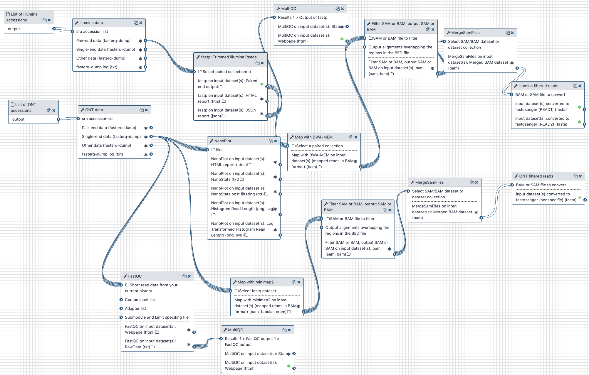

## Preprocessing of raw SARS-CoV-2 reads

The raw reads available so far are generated from bronchoalveolar lavage fluid (BALF) and are metagenomic in nature: they contain human reads, reads from potential bacterial co-infections as well as true COVID-19 reads.

### Live Resources

| usegalaxy.org | usegalaxy.eu | usegalaxy.org.au | usegalaxy.be | usegalaxy.fr |
|:--------:|:------------:|:------------:|:------------:|:------------:|
| <FlatShield label="workflow" message="run" href="https://usegalaxy.org/u/aun1/w/covid-19-pre-pp" alt="Galaxy workflow" /> | <FlatShield label="workflow" message="run" href="https://usegalaxy.eu/u/wolfgang-maier/w/covid-19-read-pre-processing" alt="Galaxy workflow" /> | <FlatShield label="workflow" message="run" href="https://usegalaxy.org.au/u/simongladman/w/covid-19-read-pre-processing" alt="Galaxy workflow" /> | <FlatShield label="workflow" message="run" href="https://usegalaxy.be/u/ieguinoa/w/covid-19-read-pre-processing" alt="Galaxy workflow" /> | <FlatShield label="workflow" message="run" href="https://usegalaxy.fr/u/lecorguille/w/covid-19-read-pre-processing-with-download" alt="Galaxy workflow" /> |
| <FlatShield label="history" message="view" href="https://usegalaxy.org/u/aun1/h/covid-19-pre-processing" alt="Galaxy history" /> | <FlatShield label="history" message="view" href="https://usegalaxy.eu/u/wolfgang-maier/h/covid-19-sequenced-reads-preprocessing" alt="Galaxy history" /> | <FlatShield label="history" message="view" href="https://usegalaxy.org.au/u/simongladman/h/covid-19-alternate-pre-processing" alt="Galaxy history" /> | <FlatShield label="history" message="view" href="https://usegalaxy.be/u/ieguinoa/h/covid-19---preprocessing-from-local-files" alt="Galaxy history" /> | <FlatShield label="history" message="view" href="https://usegalaxy.fr/u/lecorguille/h/covid-19-pre-processing" alt="Galaxy history" /> |


### What's the point?

Assess quality of reads, remove adapters and remove reads mapping to human genome.

### The outline

Illumina and Oxford nanopore reads are pulled from the NCBI SRA (links to SRA accessions are available [here](https://www.ncbi.nlm.nih.gov/genbank/sars-cov-2-seqs/)). They are then processed separately as described in the [workflow section](#the-history-and-the-workflow).

### Inputs

> :boom: If you experience problems downloading data from NCBI SRA, use Galaxy history pre-populated with inputs as described in "Alternate Workflow" section [below](#alternate-workflow).

Only SRA accessions are required for this analysis. The described analysis was performed with all SRA SARS-CoV accessions available as of Feb 20, 2020:

1. Illumina reads

   ```
   SRR10903401
   SRR10903402
   SRR10971381
   ```

2. Oxford Nanopore reads

   ```
   SRR10948550
   SRR10948474
   SRR10902284
   ```

### Outputs

This workflow produces three outputs that are used in two subsequent analyses:

| #  | Output | Used in |
|----|------|---------|
| 1. | A combined set of adapter-free Illumina reads without human contamination | [Assembly](../2-Assembly/) |
| 2. | A combined set of Oxford Nanopore reads without human contamination | [Assembly](../2-Assembly/) |
| 3. | A collection of adapter-free Illumina reads from which human reads *have not* been removed | [Variation detection](../4-Variation/) |

### The history and the workflow

A Galaxy workspace (history) containing the most current analysis can be imported from [here](https://usegalaxy.org/u/aun1/h/covid-19-pre-processing).

The publicly accessible [workflow](https://usegalaxy.org/u/aun1/w/covid-19-pre-pp) can be downloaded and installed on any Galaxy instance. It contains version information for all tools used in this analysis.

The workflow performs the following steps:

#### Illumina

 - Illumina reads are QC'ed and adapter sequences are removed using `fastp`
 - Quality metrics are computed and visualized using `fastqc`  and `multiqc`
 - Reads are mapped against human genome version `hg38` using `bwa mem`
 - Reads that **do not map** to `hg38` are filtered out using `samtools view`
 - Reads are converted back to fastq format using `samtools fastx`

#### Oxford nanopore

 - Reads are QC'ed using `nanoplot`
 - Quality metrics are computed and visualized using `fastqc`  and `multiqc`
 - Reads are mapped against human genome version `hg38` using `minimap2`
 - Reads that **do not map** to `hg38` are filtered out using `samtools view`
 - Reads are converted back to fastq format using `samtools fastx`



### BioConda

Tools used in this analysis are also available from BioConda:

| Name | Link |
|------|----------------|
| `sra-tools` | [](https://anaconda.org/bioconda/sra-tools) |
| `fastqc` | [](https://anaconda.org/bioconda/fastqc) |
| `multiqc` | [](https://anaconda.org/bioconda/multiqc) |
| `fastp` | [](https://anaconda.org/bioconda/fastp) |
| `nanoplot` | [](https://anaconda.org/bioconda/nanoplot) |
| `bwa` | [](https://anaconda.org/bioconda/bwa) |
| `picard` | [](https://anaconda.org/bioconda/picard) |
| `samtools` | [](https://anaconda.org/bioconda/samtools) |


### Alternate Workflow

An alternate starting point has been created for those not wanting to wait for the data to be downloaded from the NCBI SRA. (This can especially be an issue in Australia or Europe.)

There is a shared [history](https://usegalaxy.org.au/u/simongladman/h/covid-19-raw-data) containing all of the starting data in appropriate collections and an alternate [workflow](https://usegalaxy.org.au/u/simongladman/w/covid-19-alternate-pre-processing) able to make use of this alternate input. Apart from a slightly different starting point, the workflow and the outputs it produces are identical to that above.

| usegalaxy.org | usegalaxy.eu | usegalaxy.org.au | usegalaxy.be |
|:-----------:|:------------:|:----------------:|:----------------:|
| <FlatShield label="Input History" message="view" href="https://usegalaxy.org/u/aun1/h/covid-19-sra-data" alt="Input History" /> | <FlatShield label="Input History" message="view" href="https://usegalaxy.eu/u/wolfgang-maier/h/covid-19-raw-data" alt="Input History" /> | <FlatShield label="Input History" message="view" href="https://usegalaxy.org.au/u/simongladman/h/covid-19-raw-data" alt="Input History" /> | <FlatShield label="Input History" message="view" href="https://usegalaxy.be/u/ieguinoa/h/covid-19-raw-data" alt="Input History" /> |
| <FlatShield label="workflow" message="run" href="https://usegalaxy.org/u/aun1/w/copy-of-covid-19-read-pre-processing" alt="Galaxy alternate workflow" /> | <FlatShield label="workflow" message="run" href="https://usegalaxy.eu/u/wolfgang-maier/w/covid-19-read-pre-processing-without-downloading-from-sra" alt="Galaxy alternate workflow" /> | <FlatShield label="workflow" message="run" href="https://usegalaxy.org.au/u/simongladman/w/covid-19-alternate-pre-processing" alt="Galaxy alternate workflow" /> | <FlatShield label="workflow" message="run" href="https://usegalaxy.be/u/ieguinoa/w/covid-19-read-pre-processing-alternative" alt="Galaxy alternate workflow" /> |
| <FlatShield label="final History" message="view" href="https://usegalaxy.org/u/aun1/h/covid-19-pre-processing" alt="Galaxy final history" /> | <FlatShield label="final History" message="view" href="https://usegalaxy.eu/u/wolfgang-maier/h/covid-19-read-pre-processing-without-downloading-from-sra" alt="Galaxy final history" /> | <FlatShield label="final History" message="view" href="https://usegalaxy.org.au/u/simongladman/h/covid-19-alternate-pre-processing" alt="Galaxy final history" /> | <FlatShield label="final History" message="view" href="https://usegalaxy.be/u/ieguinoa/h/covid-19---preprocessing-from-local-files" alt="Galaxy final history" /> |


