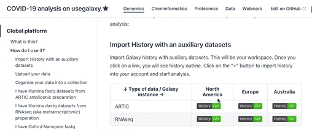
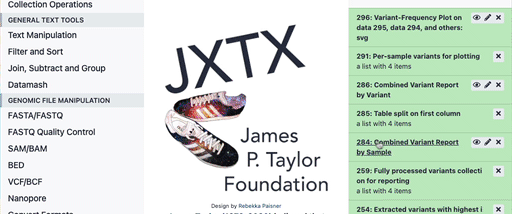
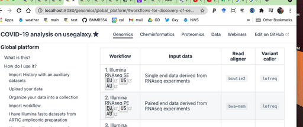
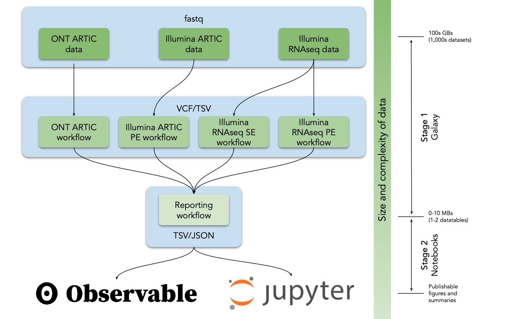
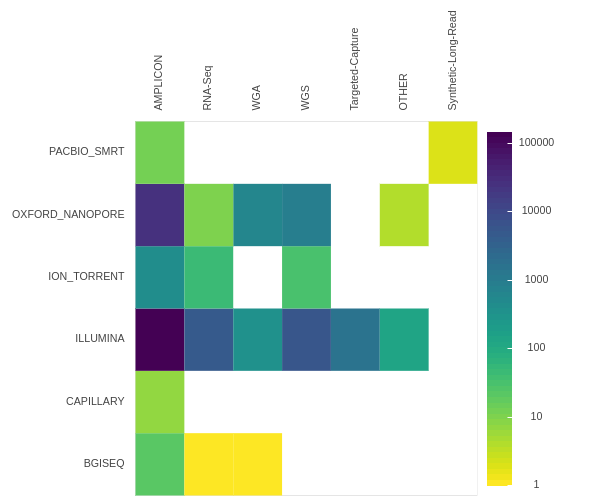
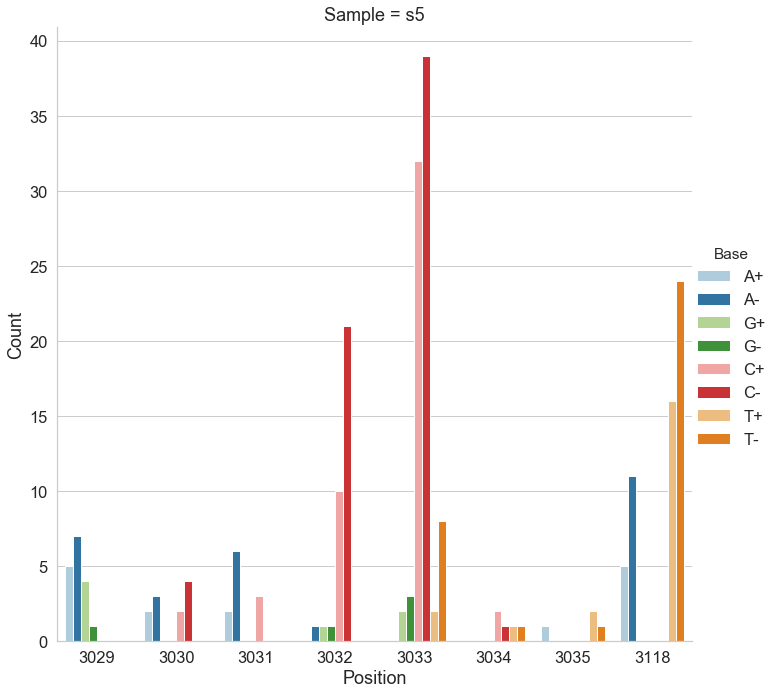
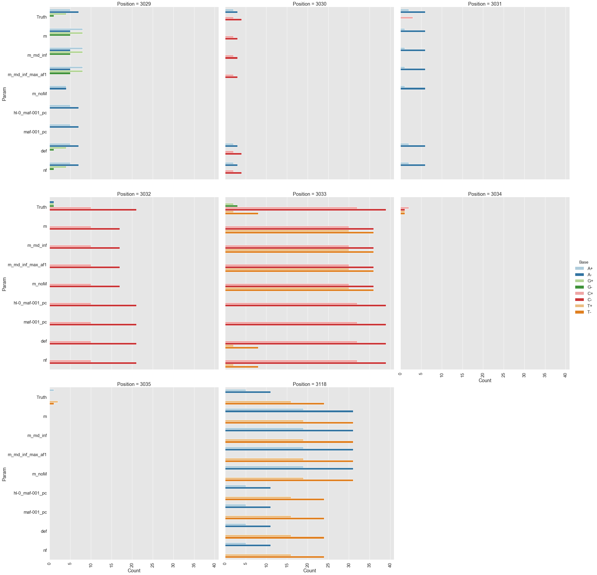

# Global platform for SARS-CoV-2 analysis

## What is this?

This is an interactive companion to our [upcoming manuscript](https://doi.org/10.1101/2021.03.25.437046) describing a global Galaxy-based data analysis platform for analysis of SARS-CoV-2 allelic variation. As [Fig. 1](#figure-1) shows it works like this:

1. You run an appropriate analysis [workflow](#table-1). This generates variant list tables;
2. You then use Jupyter or Observable notebooks to interpret these tables;

These workflows allow one to identify allelic variants in SARS-CoV-2 genome with frequencies ranging from 5% to 100%. 

This documents is organized in two sections:

	<ol>
		<li><a href="#how-do-i-use-it">A "How to?" guide on using our system</a></li>
		<li><a href="#workflows-for-discovery-of-sequence-variants">A description of analyses we have done on existing data</a></li>
	</ol>

## How do I use it?

The workflows accept raw [fastq](https://en.wikipedia.org/wiki/FASTQ_format) reads as input. They can be run on either of the three global Galaxy instances:

 - Galaxy North America ([https://usegalaxy.org](https://usegalaxy.org))
 - Galaxy Europe ([https://usegalaxy.eu](https://usegalaxy.eu))
 - Galaxy Australia ([https://usegalaxy.org.au](https://usegalaxy.org.au))

Pick one closest to you and create an account. Now you are ready to start the analysis.

### Import History with an auxiliary datasets

Import Galaxy history with auxiliary datasets. This will be your workspace. Depending on which Galaxy instance you have chosen (US, EU, or AU) and what kind of analysis you need to do (RNAseq or Ampliconic) click on a corresponding link in the table below:

| &#8595; Type of data / Galaxy instance &#8594; | North America | Europe | Australia |
|------------------------------------------------|----|----|----|
| ARTIC v3    |  |  |  |
| RNAseq      |    |    |    |

You will see the history outline. Click on the <kbd>+</kbd> button to import the history into your account and start an analysis.

How to import history:  
	

These auxiliary histories contain SARS-CoV-2 reference and gene name aliases (to give gene regions easily recognizable names). In addition, ARTIC histories contain two datasets describing the ARTIC primer scheme.

### Upload your data

Before you can begin any Galaxy analysis, you need to upload the data. Here are your choices for doing this. Depending of how many datasets and what their origin is, you can do the following:

| Few datasets <small>(1-10)</small>  | Many datasets <small>(10-&#8734;)</small> | Import from [SRA](https://www.ncbi.nlm.nih.gov/sra) |
|-----|------|------|
| <iframe width="140" height="79" src="https://www.youtube.com/embed/FFCDx1rMGAQ" title="YouTube video player" frameborder="0" allow="accelerometer; autoplay; clipboard-write; encrypted-media; gyroscope; picture-in-picture" allowfullscreen></iframe> | <iframe width="140" height="79" src="https://www.youtube.com/embed/hC8KSuT_OP8" title="YouTube video player" frameborder="0" allow="accelerometer; autoplay; clipboard-write; encrypted-media; gyroscope; picture-in-picture" allowfullscreen></iframe> | <iframe width="140" height="79" src="https://www.youtube.com/embed/Q4t-beYZ-do" title="YouTube video player" frameborder="0" allow="accelerometer; autoplay; clipboard-write; encrypted-media; gyroscope; picture-in-picture" allowfullscreen></iframe> | 

### Organize your data into a collection

Collections are a way to represent arbitrarily large sets of samples as a single entity, thus making downstream analysis very convenient.

If you uploaded data from SRA, it will already be organized as a collection! Go to the next step.

The following video shows how to create a single or paired collection depending on the type of data you have:

| Type of collection | A very short demo |
|-------------------|------|
| Paired (Illumina data) | <iframe width="140" height="79" src="https://www.youtube.com/embed/6toVj35q1r0" title="YouTube video player" frameborder="0" allow="accelerometer; autoplay; clipboard-write; encrypted-media; gyroscope; picture-in-picture" allowfullscreen></iframe> |
| Single (Illumina or ONT data) | <iframe width="140" height="79" src="https://www.youtube.com/embed/6ZU9hFjnRDo" title="YouTube video player" frameborder="0" allow="accelerometer; autoplay; clipboard-write; encrypted-media; gyroscope; picture-in-picture" allowfullscreen></iframe> | 

### Run workflows

Depending on what kind of data you have (RNAseq or ARTIC / single or paired / Illumina or ONT) pick a workflow from the table below:

| &#8595; Type of data / Galaxy instance &#8594; | North America | Europe | Australia |
|------------------------------------------------|----|----|----|
| Illumina RNAseq PE |  |  |  |
| Illumina RNAseq SE |  |  |  |
| Illumina ARTIC PE     |  |  |  |
| ONT ARTIC          |  |  |  |
| Reporting          |  |  |  |

Click on the appropriate workflow and browser will open a new tab with Galaxy's workflow invocation interface. Fill in appropriate parameters and click <kbd>▶ Run workflow</kbd>.

Once it completes, run the "Reporting workflow" on the output of the previous workflow. In the end it will generate two variant lists: one grouped by sample and one by variant (these datasets are described [here](https://github.com/galaxyproject/SARS-CoV-2/tree/master/data/var).)

These data can now be analyzed in either Jupyter or ObservableHQ [notebooks](#table-3).

### Using existing Jupyter notebook

1. Open the notebook in Google Colaboratory: 
2. Replace `per_sample_url` and `per_variant_url` with URLs of the dataset produced by the Reporting Workflow. For example:

How to copy URL of a galaxy dataset into Jupyter Notebook:  
	

<!--

### Creating a new Jupyter notebook

### Using existing ObservableHQ notebook

-->

### What if I want to modify workflows?

Running workflows as described [above](#run-workflows) will run exactly as we designed them. But what if you want to modify them? In this case you can import then into your own Galaxy accounts and use workflow editor to perform any modification you like: change parameters, switch tools and so on.

To do this first pick workflow from the table below:

| &#8595; Type of data / Galaxy instance &#8594; | North America | Europe | Australia |
|------------------------------------------------|----|----|----|
| Illumina RNAseq PE |  |  |  |
| Illumina RNAseq SE |  |  |  |
| Illumina ARTIC PE     |  |  |  |
| ONT ARTIC          |  |  |  |
| Reporting          |  |  |  |

Click on the <kbd>+</kbd> to import workflow into your account:

How to import workflow:  
	

## Workflows for discovery of sequence variants

We developed five analysis workflows to support the identification of allelic variants in SARS-CoV-2 from deep sequencing reads ([Table 1](#table-1)). A user begins the analysis by uploading reads in FASTQ format into Galaxy ([Fig. 1](#figure-1)) as a dataset collection (a dataset collection is a way to represent an arbitrarily large collection of samples as a singular entity within a user's workspace; see video pre-pended with "Dataset Collections" at the [following YouTube channel](https://youtube.com/playlist?list=PLNFLKDpdM3B9UaxWEXgziHXO3k-003FzE)). These datasets can either be uploaded by the user, obtained from local data mirrors or retrieved directly from the Sequence Read Archive at NCBI. The four primary analysis workflows (#1-4 in [Table 1](#table-1)) convert FASTQ data to annotated AVs through a series of steps that include quality control, trimming, mapping, deduplication, AV calling, and filtering. All Illumina workflows use [lofreq](https://csb5.github.io/lofreq/) as the principal AV caller. We selected it based on extensive testing ([Methods](#methods)). All four workflows produce identically annotated VCF output that is further processed by the Reporting workflow (#5 in [Table 1](#table-1)) to generate data tables describing AVs. These data tables are further processed with Jupyter directly in Galaxy and with ObservableHQ to generate all figures and tables shown here.

----

#### Table 1 
Workflow description. Clicking <kbd>EU</kbd>, <kbd>EU</kbd>, or <kbd>AU</kbd> buttons will take you to workflow at [US](https://usegalaxy.org), [European](https://usegalaxy.eu), or [Australian](https://usegalaxy.org.au) instance.

| Workflow | Input data | Read aligner | Variant caller |
|----------|-------------|---|---|---|
|1. Illumina RNAseq SE [<kbd>EU</kbd>](https://usegalaxy.eu/u/wolfgang-maier/w/covid-19-variation-analysis-on-se-data)[<kbd>US</kbd>](https://usegalaxy.org/u/aun1/w/covid-19-variation-analysis-on-wgs-se-data)[<kbd>AU</kbd>](https://usegalaxy.org.au/u/nekrut/w/covid-19-variation-analysis-on-wgs-se-data) |  Single end data derived from RNAseq experiments | `bowtie2` | `lofreq` |
|2.  Illumina RNAseq PE [<kbd>EU</kbd>](https://usegalaxy.eu/u/wolfgang-maier/w/covid-19-variation-analysis-on-pe-data)[<kbd>US</kbd>](https://usegalaxy.org/u/aun1/w/covid-19-variation-analysis-on-wgs-pe-data)[<kbd>AU</kbd>](https://usegalaxy.org.au/u/nekrut/w/covid-19-variation-analysis-on-wgs-pe-data) |  Paired end data derived from RNAseq experiments | `bwa-mem` | `lofreq` |
|3.  Illumina ARTIC [<kbd>EU</kbd>](https://usegalaxy.eu/u/wolfgang-maier/w/covid19-variation-analysis-on-artic-pe)[<kbd>US</kbd>](https://usegalaxy.org/u/aun1/w/covid-19-variation-analysis-on-artic-pe-data-1)[<kbd>AU</kbd>](https://usegalaxy.org.au/u/nekrut/w/covid-19-variation-analysis-on-artic-pe-data) |   Paired-end data generated with ARTIC protocols | `bwa-mem` | `lofreq` |
|4.  ONT ARTIC [<kbd>EU</kbd>](https://usegalaxy.eu/u/wolfgang-maier/w/covid-19-variation-analysis-of-artic-ont-data)[<kbd>US</kbd>](https://usegalaxy.org/u/aun1/w/covid-19-variation-analysis-of-artic-ont-data)[<kbd>AU</kbd>](https://usegalaxy.org.au/u/nekrut/w/covid-19-variation-analysis-of-artic-ont-data ) |  ONT fastq files generated with ARTIC protocols | `minimap2` | `medaka` |
|5.  Reporting [<kbd>EU</kbd>](https://usegalaxy.eu/u/wolfgang-maier/w/covid19-variation-analysis-reporting)[<kbd>US</kbd>](https://usegalaxy.org/u/aun1/w/covid-19-variation-analysis-reporting)[<kbd>AU</kbd>](https://usegalaxy.org.au/u/nekrut/w/covid-19-variation-analysis-reporting)| Output of any of the above workflows | - | - |

----
#### Figure 1
Analysis flow in our analysis system. VCF = variant call format, TSV = tab separated values, JSON = JavaScript Object Notation. 

----

## Application of workflows for analysis of intrahost variation

### Selecting data

As of late January 2021 the NCBI sequence read archive contained 190,288 raw read SARS-CoV-2 datasets ([Fig. 2](#figure_2)). There are three primary types of data: (1) Illumina-based Ampliconic, (2) Oxford nanopore (ONT)-based Ampliconic, and (3) Illumina-based RNASeq. Illumina-based RNASeq is the most suitable experimental approach for accurate assessment of intra-host SARS-CoV-2 sequence variability—the main focus of our example application.  It avoids amplification biases characteristic of PCR-based enrichment approaches such as [PrimalSeq](http://dx.doi.org/10.1371/journal.pone.0239403)—a primary methodology used to generate Illumina- and ONT-based ampliconic datasets. However, because one of the key objectives of this study is to provide freely accessible workflows for the analysis of all types of SARS-CoV-2 sequence data we developed procedures for handling ampliconic data as well. Thus here we will describe two distinct analytical strategies: one for Illumina-based RNASeq data and another for Amplicon data. We have also developed workflows for the analysis of ONT data including AV analysis, for consensus sequence building from variants called with any of our upstream workflows, and for processing of direct RNA sequencing data.  These will be described in a separate report.

For each of the Illumina RNA-seq and Illumina ARTIC data generation approaches we initially identified the ten studies utilizing these approaches that yielded the largest numbers of individual read datasets ([Supplementary Table 1](#supplemental-table-1)). From these ten studies, we filtered out all those without associated publications.  Because metadata for SRA datasets are generally of low quality, associated publications reveal important information about the datasets such as, for example, which ARTIC primer set versions were used or how RNA was isolated. Of datasets with associated publications we settled on two ([PRJNA622837](https://www.ncbi.nlm.nih.gov/bioproject/PRJNA622837/) and [PRJEB37886](https://www.ncbi.nlm.nih.gov/bioproject/PRJEB37886/)), for subsequent analysis (see [Methods](#methods)). Whereas PRJNA622837 focused on the a[nalysis of SARS-CoV-2 transmission in the Boston area of the USA](https://science.sciencemag.org/content/early/2020/12/09/science.abe3261), PRJEB37886 is from the ongoing [UK genomic surveillance effort](https://science.sciencemag.org/content/early/2021/01/07/science.abf2946). While the entire PRJNA622837 dataset was gathered before September 2020, prior to emergence of N501Y lineages of concern (B.1.1.7, B.1.351 and P.1), the PRJEB37886 dataset contains samples isolated both before and after the emergence of these lineages. Since we were interested in determining whether signature mutations found in the N501Y lineages were detectable, and possibly detectably evolving under positive selection, in the datasets prior to the emergence of the N501Y lineages, we separated the PRJEB37886 dataset into a pre-N501Y lineage emergence dataset, hereafter called “COG-Pre” (containing accessions ERR4603708 - ERR4604210) and a post-N501Y lineage emergence dataset, hereafter called “COG-Post” (accessions ERR4859723 - ERR4861540).

----

#### Figure 2
Counts of SRA datasets stratified by platform (Y-axis) and library strategy (X-axis).

----

### From fastq to variant lists

We generated raw AV lists for all these datasets ([Table 2](#table-2)) by applying the Illumina RNAseq workflow (#2 in [Table 1](#table-1)) to the Boston dataset and the ARTIC workflow (#3 in [Table 1](#table_1)) to  the COG-Pre and COG-Post datasets.  Only AVs that both occurred at an allele frequency (AF) 5% or greater, and were supported by 10 or more reads were included (see [Methods](#methods)). After identifying AVs we used the reporting workflow to generate a final AV summary—a single dataset listing all AVs in all samples. For each AV, the report was richly annotated, including information on per strand counts and allele frequencies for all samples, and potential functional impacts of each AV. Reports can be accessed from [GitHub](https://github.com/galaxyproject/SARS-CoV-2/tree/master/data/var) ([Table 2](#table-2)).

----

#### Table 2  

Allelic-variant (AV) counts pre/post filtering. AVs= number of all detected AVs; Sites = number of distinct variable sites across SARS-CoV-2 genome; Samples = number of samples in the corresponding dataset. Data tables are available from [GitHub](https://github.com/galaxyproject/SARS-CoV-2/tree/master/data/var).

| Dataset | AVs | Sites | Samples |
|---------|-----|-------|---------|
| "Boston" | 9,249/8,492 | 1,027/315 | 639 |
| "COG-Pre" | 7,338/4,761 | 2,747/287 | 503 |
| "COG-Post" | 38,919/38,813 | 5,760/1,795 | 1,818 |

### From variant lists to Biology

Exploratory analysis of AV data was then carried out in Jupyter and ObservableHQ notebooks ([Table 3](#table-3)). For demonstration purposes we performed similar types of analysis in both [Jupyter](https://jupyter.org) and [ObservableHQ](https://observablehq.com) to highlight their utility. The notebooks include a number of data manipulation steps that calculate general descriptive statistics, plot the distributions of AVs across the genome and perform a variety of additional analyses that are important for contextualizing SARS-CoV-2 AVs. These additional analyses are briefly summarized below. 

----

#### Table 3

Notebooks used for analyses described below:

| Notebook environment | Name and link | Description |
| ---------------------|-------------|-----------|
| Jupyter              | [SRA_analysis.ipynb](https://raw.githubusercontent.com/galaxyproject/SARS-CoV-2/master/data/ipynb/SRA_analysis.ipynb)   | Analysis of SRA datasets and Figure 2. |
| Jupyter              | [intrahost.ipynb](https://raw.githubusercontent.com/galaxyproject/SARS-CoV-2/master/data/ipynb/intrahost.ipynb)  | Analysis of intrahost variation. Figures 4, S1, S2, S3, S4, S5, S6 |
| ObesrvableHQ | [Intrahost collection](https://observablehq.com/@spond/intrahost-variant-exploration-landing) | A collection of four notebooks for (1) Descriptive, (2) Spatial, (3) Variant centric, and (4) Pattern exploration of intrahost data |      

Any set of AV calls unavoidably includes erroneous calls that need to be filtered out. We assumed that a fraction of AVs with low frequencies are random errors, modeled by a simple Poisson distribution with per-site error rate λ. We then tabulated, for each position in the genome, the number of samples that contained an AV with 0.05 ≤ AF ≤ 0.5, inferred λ using a closed form ML estimator (the mean of per-base counts), and plotted the observed number of genome positions with *N* = 0,1,2… AV ([Fig. S1](#figure-s1)). In all three datasets the point where the predicted Poisson distribution clearly diverged from the observed distribution (*N* = 3 for the Boston dataset, and *N* = 2 for the COG-Pre and COG-Post datasets) could be taken as the error-vs-real threshold ([Fig. S1](#figure-s1)). Applying these thresholds to the data reduced AV counts as shown in [Table 2](#table-2). 

When considering AVs with all AFs, the dominant patterns of co-occurrence were clade-segregating sites in the data, e.g. high frequency AVs that exist in strong linkage disequilibrium (e.g. the 241/3037/14408/24403/25563 set seen as thick vertical lines in [Fig. 3A](#figure-3)). A more interesting pattern was observed when we restricted our attention only to relatively common low frequency AVs (Fig. 3B) among which there were several groups that co-occured in multiple samples (all exclusively at low frequencies). A cluster of eight low frequency AVs was identified in eight samples ([Table 4](#table-4); the probability of this occurring by chance is < 10-8). No similar low AF clusters were detected in either the COG-pre or COG-post datasets, but a cluster of two medium AF AVs (9096:C→T, 29692:G→T) co-occurred three times (expected *p* < 0.01).

-----

#### Figure 3. 

 Dot plot of all allelic-variants (AV) across samples. X-axis: genome position, Y-axis: Samples, colors correspond to functional classes of AVs. Samples are arranged by hierarchical clustering using cosine distances on mean allele frequencies of all AVs. 

 **A**. Dot-plot of all allelic variants in the “Boston” dataset; rows – samples, columns – genomic coordinates; samples are arranged by hierarchical clustering. Limited to variants that occur in at least 4 samples.

<iframe width="100%" height="796" frameborder="0"
  src="https://observablehq.com/embed/@spond/exploring-sars-cov-2-intrahost-variation-patterns?cells=fig1&auto=true"></iframe>

**B**. Dot-plot of observed variants in the “Boston” dataset; restricted to variants that appear only at AF≤10% and occur in at least 4 samples each. Variants are partitioned into 10 clusters, using K-medoids using the Hamming distance on AF vectors; the cluster with 8 variants is highlighted in orange.

<iframe width="100%" height="796" frameborder="0"
  src="https://observablehq.com/embed/@spond/exploring-sars-cov-2-intrahost-variation-patterns?cells=fig2&auto=true"></iframe>

-----

#### Table 4
A cluster of **eight** low frequency variants occured in 8 samples (the probability of this occurring by chance is < 10-8). 

|Nucleotide Variant|Sample count|Effect *gene*/aa change|
|------------------|------|--------------------|
| 4,338:C&rarr;T    | 29   | *nsp3*/S540F      |
| 6,604:A&rarr;G    | 54   | *nsp3*/L1295      |
| 9,535:C&rarr;T    | 37   | *nsp4*/T327       |
| 12,413:A&rarr;C   | 63   | *nsp8*/N108H      |
| 13,755:A&rarr;C   | 53   | *RdRp*/R105S      |
| 14,304:A&rarr;C   | 30   | *RdRp*/K288N      |
| 17,934:C&rarr;A   | 30   | *helicase*/T566   |
| 20,716:A&rarr;T   | 37   | *MethTr*/M20L     |
| 26,433:A&rarr;C   | 35   | *E*/K63N          |

Any newly identified AV set should be compared against a list of sites with known biological significance. In our analysis we selected two such site lists : (1) the signature or defining mutation sites found in the variants of concern, B.1.1.7, B.1.351 and P.1 (referred to hereafter as VOC sites); and (2) genomic sites detectably evolving under positive or negative selection in the global SARS-CoV-2 dataset (referred to hereafter as selected sites). 

The emergence of VOC starting with the B.1.1.7 lineage in the UK, raised intriguing questions about the genesis of this lineage, and a hypothesis that the variant arose in a chronically infected [immunocompromized host](https://virological.org/t/preliminary-genomic-characterisation-of-an-emergent-sars-cov-2-lineage-in-the-uk-defined-by-a-novel-set-of-spike-mutations/563/2). We were interested in how many of the [clade defining mutations](https://cov-lineages.org/global_report.html) were detectable at sub-consensus allele frequencies. Specifically, we analyzed the overlap between our data and five distinct mutation sets: B.1.1.7, P.1, B.1.351, A.23.1 as well as receptor-binding domain mutations identified by [Greany et al. 2020](https://www.biorxiv.org/content/10.1101/2020.12.31.425021v1) (called "Bloom" after the last author in the rest of this document; Fig. 4). Very few N501Y lineage mutations are detectable in pre B.1.1.7 datasets ([Fig. 4](#figure-4)). The L18F mutation (P.1, gene *S*) is present in ~0.5% of Boston samples. It is completely absent in "COG-Pre", while in "COG-Post" it reaches fixation in ~40% of samples. On the other hand the population frequency of E92K (P.1, gene *S*) stays constant for "COG-Pre" and "COG-Post" samples at ~3%. Only two of the mutations reported by Greaney et al. 21 are observed at appreciable frequency. 

------

#### Figure 4

 Intersection between allelic-variants (AV) reported here with AVs of concern (VOC). Big blob in "COG-Post" dataset corresponds to L18F change in gene S. Size of markers ∝ fraction of samples containing variant. [min;max] - maximum and minimum counts of samples containing variants shown in this figure. E.g., in **Boston** the largest marker corresponds to an AV shared by 7 samples, and the smallest by 3 samples. 

**Boston**

<embed type="text/html" src="figs/voc_Boston.html" width="600" height="320"></embed>

**COG-Pre**

<embed type="text/html" src="figs/voc_COG-Pre.html" width="600" height="320"></embed>

**COG-Post**

<embed type="text/html" src="figs/voc_COG-Post.html" width="600" height="320"></embed>

The [selected sites list](https://observablehq.com/@spond/revised-sars-cov-2-analytics-page) is continuously updated by the DataMonkey team using GISAID data as it accumulates (http://covid19.datamonkey.org). This list included all SARS-CoV-2 codon sites identified with [FEL](https://doi.org/10.1093/molbev/msi105) and [MEME](http://dx.doi.org/10.1371/journal.pgen.1002764) methods to be evolving under positive or negative selection with a *p*≤0.0001 significance cutoff on Feb 01, 2021. Because selection analyses identify codons (not individual genome positions) responsible for potential selective amino acid changes, we considered all non-synonymous nucleotide substitutions with AFs<80% that fell within the boundaries of codons with the signature of selection. There were two, three, and ten AVs overlapping with codons under selection in the Boston, COG-Pre, and COG-Pos" datasets, respectively ([Table 5](#table-5)). The two sites in the Boston dataset are below the consensus (<50%) frequency. The identification of low frequency AVs at codon sites displaying evidence of positive selection could provide an early indication of AVs that are adaptive mutations and therefore warrant closer monitoring as the pandemic unfolds. 

-----

#### Table 5

Allelic-variants (AVs) with maximum allele frequency <80% overlapping with codons under selection.`% samp` = fraction of samples containing a given AV in each dataset. `Above` and `Below` = numbers of variants above and below 5% threshold without applying stringent filtering criteria; `TRID` = gene name.

**Boston**

|   POS | REF   | ALT   | TRID   | AA    |    % samp |    mean |   min |   max | codon   |   above |   below |
|------:|:------|:------|:-------|:------|--------:|----------:|---------:|---------:|:--------|--------:|--------:|
| 25,842 | A     | C     | orf3a  | T151P | 6.25978 | 0.0835105 | 0.051111 | 0.180556 | ACT     |     317 |     257 |
| 22,254 | A     | G     | S      | I231M | 2.03443 | 0.0668125 | 0.050847 | 0.102804 | ATA     |     188 |     293 |

**COG-Pre**

|   POS | REF   | ALT   | TRID   | AA    |     frac |   AFmean |   AFamin |   AFamax | codon   |   above |   below |
|------:|:------|:------|:-------|:------|---------:|---------:|---------:|---------:|:--------|--------:|--------:|
| 21,637 | C     | T     | S      | P26S  | 0.397614 | 0.520099 | 0.260274 | 0.779925 | CCT     |       2 |       7 |
| 22,343 | G     | T     | S      | G261V | 0.397614 | 0.425237 | 0.091743 | 0.75873  | GGT     |       2 |       6 |
| 28,825 | C     | T     | N      | R185C | 0.397614 | 0.619001 | 0.528838 | 0.709163 | CGT     |       2 |      16 |

**COG-Post**

|   POS | REF   | ALT   | TRID   | AA     |     frac |   AFmean |   AFamin |   AFamax | codon   |   above |   below |
|------:|:------|:------|:-------|:-------|---------:|---------:|---------:|---------:|:--------|--------:|--------:|
|  1,463 | G     | A     | nsp2   | G220D  | 0.715072 | 0.737533 | 0.669195 | 0.767157 | GGT     |      13 |       0 |
| 22,343 | G     | T     | S      | G261V  | 0.660066 | 0.703605 | 0.672658 | 0.737692 | GGT     |      12 |       4 |
| 25,217 | G     | T     | S      | G1219V | 0.330033 | 0.752613 | 0.74618  | 0.756799 | GGT     |       6 |      11 |
| 21,845 | C     | T     | S      | T95I   | 0.275028 | 0.466971 | 0.069175 | 0.731614 | ACT     |       5 |      54 |
| 29,252 | C     | T     | N      | S327L  | 0.220022 | 0.196384 | 0.08399  | 0.359015 | TCG     |       4 |     120 |
| 29,170 | C     | T     | N      | H300Y  | 0.165017 | 0.314531 | 0.076923 | 0.735849 | CAT     |       3 |      26 |
|  4,441 | G     | T     | nsp3   | V575L  | 0.110011 | 0.725889 | 0.712103 | 0.739675 | GTG     |       2 |       3 |
| 21,829 | G     | T     | S      | V90F   | 0.110011 | 0.508576 | 0.242513 | 0.774639 | GTT     |       2 |       4 |
| 28,394 | G     | A     | N      | R41Q   | 0.110011 | 0.3188   | 0.054947 | 0.582654 | CGG     |       2 |       3 |
| 29,446 | G     | T     | N      | V392L  | 0.110011 | 0.770096 | 0.765545 | 0.774648 | GTG     |       2 |       2 |

### Continuous analysis of pandemic data with the Galaxy API

Genome surveillance projects at national levels like COG-UK produce sequencing data for unprecedented numbers of samples. To demonstrate that our system can satisfy the analysis needs of such projects, we are performing near real-time analysis of COG-UK sequencing data as it is being submitted to the European Sequence Archive (ENA). We set up an automated analysis system that runs our ARTIC AV-calling workflow and the reporting workflow programmatically on all new COG-UK ARTIC paired-end data via Galaxy's openly accessible API. The system also handles data organization into Galaxy histories and exports of resulting datasets. The resulting AV information will be made available through the [CRG Viral Beacon](https://covid19beacon.crg.eu/) project soon.

## Methods

### Analysis workflows
Analysis workflows are listed in Table 1. The two Illumina RNASeq workflows (#1 and #2 in Table 1) perform read mapping with bwa-mem and bowtie2, respectively, followed by sensitive allelic-variant (AV) calling across a wide range of AFs with lofreq (see AV calling section below).
The workflow for Illumina-based ARTIC data (#3 in Table 1) builds on the RNASeq workflow for paired-end data using the same steps for mapping and AV calling, but adds extra logic operators for trimming ARTIC primer sequences off reads with the ivar package. In addition, this workflow uses ivar also to identify amplicons affected by ARTIC primer-binding site mutations and excludes reads derived from such “tainted” amplicons when calculating AFs of other AVs.

The workflow for ONT-sequenced ARTIC data is modeled after the alignment/AV-calling steps of the ARTIC pipeline (https://artic.readthedocs.io/). It performs, essentially, the same steps as that pipeline’s minion command, i.e. read mapping with minimap2 and AV calling with medaka. Like the Illumina ARTIC workflow it uses ivar for primer trimming. Since ONT-sequenced reads have a much higher error rate than Illumina-sequenced reads and are therefore plagued more by false-positive AV calls, this workflow makes no attempt to handle amplicons affected by potential primer-binding site mutations.

All four workflows use SnpEff, specifically its 4.5covid19 version, for AV annotation.
The fifth workflow (Reporting) takes a table of AVs produced by any of the other four workflows and generates a list of AVs by Samples and by Variant. For an example see here.

Workflows default to requiring an AF ≥ 0.05 and AV-supporting reads of ≥ 10 (these and all other parameters can be easily changed by the user). For an AV to be listed in the reports it must surpass these thresholds in at least one sample of the respective dataset. We estimate that for AV calls with an AF ≥ 0.05 our analyses have a false-positive rate of < 15% for both Illumina RNAseq and Illumina ARTIC data, while the true-positive rate of calling such low-frequency AVs is ~80% and approaches 100% for AVs with an AF ≥ 0.15. This estimate is based on an initial application of the Illumina RNAseq and Illumina ARTIC workflows to two samples for which data of both types had been obtained at the virology department of the University of Freiburg and the assumption that AVs supported by both sets of sequencing data are true AVs. The second threshold of 10 AV-supporting reads is applied to ensure that calculated AFs are sufficiently precise for all AVs.

### Calling variants in haploid mixtures is not standardized

The development of modern genomic tools and formats have been driven by large collaborative initiatives such as 1,000 Genomes, GTEx and others. As a result the majority of current variant callers have been originally designed  for diploid genomes of human or model organisms where discrete allele frequencies are expected. Bacterial and viral samples are fundamentally different. They are represented by mixtures of multiple haploid genomes where the frequencies of individual variants are continuous. This renders many existing variant calling tools unsuitable for microbial and viral studies unless one is looking for fixed variants. However, recent advances in cancer genomics have prompted developments of somatic variant calling approaches that do not require normal ploidy assumptions and can be used for analysis of samples with chromosomal malformations or circulating tumor cells. The latter situation is essentially identical to viral or bacterial resequencing scenarios. As a result of these developments the current set of variant callers appropriate for microbial studies includes updated versions of “legacy” tools ([`FreeBayes`](https://github.com/ekg/freebayes) and `mutect2` (a part of [GATK](https://github.com/broadinstitute/gatk)) as well as dedicated packages ([`Breseq`](https://github.com/barricklab/breseq), [`SNVer`](http://dx.doi.org/10.1093/nar/gkr599), and [`lofreq`](https://github.com/CSB5/lofreq)). To assess the applicability of these tools we first considered factors related to their long-term sustainability, such as the health of the codebase as indicated by the number of code commits, contributors and releases as well as the number of citations. After initial testing we settled on three callers: `FreeBayes`, `mutect2`, and `lofreq` (Breseq’s new “polymorphism mode” has been in experimental state at the time of testing. `SNVer` is no longer actively maintained). `FreeBayes` contains a mode specifically designed for finding sites with continuous allele frequencies; `Mutect2` features a so called mitochondrial mode, and `lofreq` was specifically designed for microbial sequence analysis. 

### Benchmarking callers: `lofreq` is the best choice

Our goal was to identify variants in mixtures of multiple haplotypes sequenced at very high coverage. Such dataset are typical in modern bacterial and viral genomic studies. In addition, we are seeking to be able to detect variants with frequencies around the NGS detection threshold of ~ 1% ([Salk et al. 2018](http://dx.doi.org/10.1038/nrg.2017.117)). In order to achieve this goal we selected a test dataset, which is distinct from data used in recent method comparisons ([Bush et al. 2019](http://dx.doi.org/10.1101/653774); [Yoshimura et al. 2019](http://dx.doi.org/10.1099/mgen.0.000261)). These data originate from a duplex sequencing experiment recently performed by our group ([Mei et al. 2019](https://academic.oup.com/gbe/article/11/10/3022/5572121)).  In this dataset a population of *E. coli* cells transformed with pBR322 plasmid is maintained in a turbidostat culture for an extensive period of time. Adaptive changes accumulated within the plasmid are then revealed with duplex sequencing ([Schmitt et al. 2012](http://www.ncbi.nlm.nih.gov/entrez/query.fcgi?cmd=Retrieve&db=PubMed&dopt=Citation&list_uids=22853953)). Duplex sequencing allows identification of variants at very low frequencies. This is achieved by first tagging both ends of DNA fragments to be sequenced with unique barcodes and subjecting them to paired-end sequencing. After sequencing read pairs containing identical barcodes are assembled into families. This procedure allows to reliably separate errors introduced during library preparation and/or sequencing (present in some but not all members of a read family) from true variants (present in all members of a read family derived from both strands).

For the following analysis we selected two data points from [Mei et al. 2019](https://academic.oup.com/gbe/article/11/10/3022/5572121): one corresponding to the beginning of the experiment (s0) and the other to the end (s5). The first sample is expected to be nearly clonal with no variation, while the latter contains a number of adaptive changes with frequencies around 1%. We aligned duplex consensus sequences (DCS) against the pBR322. We then walked through read alignments to produce counts of non-reference bases at each position (Fig. 1). 

-------

<small>**Figure 1.** Counts of alternative bases at eight variable locations within pBR322.</small>

-------

Because all differences identified this way are derived from DCS reads they are a reasonable approximation for a “true” set of variants. s0 and s5 contained 38 and 78 variable sites with at least two alternative counts, respectively (among 4,361 bases on pBR322) of which 27 were shared. We then turned our attention to the set of sites that were determined by Mei et al. to be under positive selection (sites 3,029, 3,030, 3,031, 3,032, 3,033, 3,034, 3,035, 3,118). Changes at these sites increase the number of plasmid genomes per cell. Sample s0 does not contain alternative bases at any of these sites. Results of the application of the three variant callers with different parameter settings (shown in Table 2) are summarized in Fig. 2. 

------

<small>**Figure 2.** Calls made by `mutect2`, `freebayes`, and `lofreq`. For explanation of x-axis labels see Table 1.</small>

------

The `lofreq` performed the best followed by `mutect2` and `FreeBayes` (contrast "Truth" with "nf" and "def" in Fig. 2). The main disadvantage of `mutect2` is in its handling of multiallelic sites (e.g., 3,033 and 3,118) where multiple alternative bases exist. At these sites `mutect2` outputs alternative counts for only one of the variants (the one with highest counts; this is why at site 3,118 A and T counts are identical). Given these results we decided to use `lofreq` for the main analysis of the data.

<small>**Table 2.** Command line options for each caller.</small>

| Caller | Command line | Figure 2 label |
|:-------|:-------------|:--------------|
| `mutect2` | `--mitochondria-mode true` | m |
| `mutect2` | default | m_noM |
| `mutect2` | `--mitochondria-mode true --f1r2-max-depth 1000000` | m_md_inf |
| `mutect2` | `--mitochondria-mode true --f1r2-max-depth 1000000 -max-af 1`  | m_md_inf_max_af1 |
| `freebayes` | `--haplotype-length 0 --min-alternate-fraction 0.001 --min-alternate-count 1 --pooled-continuous --ploidy 1` | hl-0_maf-001_pc |
| `freebayes` | `-min-alternate-fraction 0.001 --pooled-continuous --ploidy 1` | maf-001_pc |
| `lofreq` | `--no-default-filter` | nf |
| `lofreq` | default | def |

### Supplemental Table 1.

Top 10 SRA BioProjects for three experimental strategies. BioProject IDs with a hyperlink correspond to a study chosen for subsequent analysis (Illumina RNAseq = Illumina Paired RNAseq data; Illumina Amp = Illumina Paired Artic data; *N* = number of SRA datasets in a given BioProject)

| Illumina RNAseq   |    *N* | Illumina Amp   |      *N* |
|:-------------|-----:|:-------------|-------:|:-------------|------:|
| [PRJNA622837](https://science.sciencemag.org/content/early/2020/12/09/science.abe3261)  | 1,564 | [PRJEB37886](https://science.sciencemag.org/content/early/2021/01/07/science.abf2946)    | 104,984 | PRJEB37886   | 20968 |
| PRJNA612578  |  964 | PRJNA613958  |  14,860 | 
| PRJNA650245  |  617 | PRJNA614995  |   3,967 | 
| PRJNA610428  |   42 | PRJNA645906  |   2,286 |
| PRJEB38546   |   26 | PRJNA639066  |   1,931 | 
| PRJNA634356  |   25 | PRJNA625551  |   1,163 |
| PRJNA650134  |   22 | PRJNA656534  |    567 | 
| PRJNA661544  |   15 | PRJNA686984  |    543 | 
| PRJNA638211  |   10 | PRJEB38723   |    542 |
| PRJNA605983  |    9 | PRJEB42024   |    539 |

## Examples of other analyses from our notebooks

#### Figure S1

Observed (red) versus predicted (orange) counts of samples sharing *N*=0, 1, 2, … varinants as a function of allelic-variant number for each dataset. The intersection of the lines gives the cutoff that was applied to each dataset.

**Boston**

<embed type="text/html" src="figs/thresholding_Boston.html" width="600" height="300"></embed>

**COG-Pre**

<embed type="text/html" src="figs/thresholding_COG-Pre.html" width="600" height="300"></embed>

**COG-Post**

<embed type="text/html" src="figs/thresholding_COG-Post.html" width="600" height="300"></embed>

-----

#### Figure S2 

Distributions of allele frequencies in the three datasets

**Boston**

<embed type="text/html" src="figs/af_histogram_Boston.html" width="600" height="300"></embed>

**COG-Pre**

<embed type="text/html" src="figs/af_histogram_COG-Pre.html" width="600" height="300"></embed>

**COG-Post**

<embed type="text/html" src="figs/af_histogram_COG-Post.html" width="600" height="300"></embed>

-----

#### Figure S3

Types and counts of nucleotide changes

**Boston**

<embed type="text/html" src="figs/substitutions_types_Boston.html" width="600" height="400"></embed>

**COG-Pre**

<embed type="text/html" src="figs/substitutions_types_COG-Pre.html" width="600" height="400"></embed>

**COG-Post**

<embed type="text/html" src="figs/substitutions_types_COG-Post.html" width="600" height="400"></embed>

-----

#### Figure S4

Relationship between population frequency and alternative allele frequency in the three datasets. CoV = coefficient of variation. PF = population frequency (e.g., how many samples in the dataset share a given variant).

**Boston**

<embed type="text/html" src="figs/cov_vs_pf_Boston.html" width="500" height="900"></embed>

**COG-Pre**

<embed type="text/html" src="figs/cov_vs_pf_COG-Pre.html" width="500" height="900"></embed>

**COG-Post**

<embed type="text/html" src="figs/cov_vs_pf_COG-Post.html" width="500" height="900"></embed>

-----

#### Figure S5. 

Distribution of allelic variants across the genome. Height of each bar is proportional to the coefficient of variation for alternative allele frequency.

**Boston**

<embed type="text/html" src="figs/genomic_dist_Boston.html" width="800" height="400"></embed>

**COG-Pre**

<embed type="text/html" src="figs/genomic_dist_COG-Pre.html" width="800" height="400"></embed>

**COG-Post**

<embed type="text/html" src="figs/genomic_dist_COG-Post.html" width="800" height="400"></embed>

-----

#### Figure S6. 

**Boston**

<embed type="text/html" src="figs/gene_dist_Boston.html" width="800" height="400"></embed>

**COG-Pre**

<embed type="text/html" src="figs/gene_dist_COG-Pre.html" width="800" height="400"></embed>

**COG-Post**

<embed type="text/html" src="figs/gene_dist_COG-Post.html" width="800" height="400"></embed>

