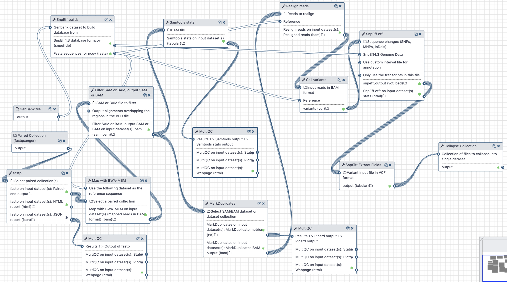
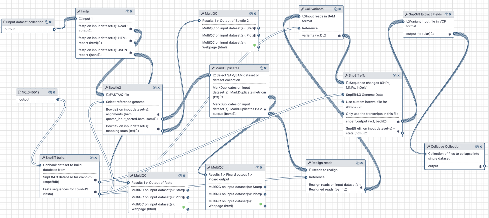
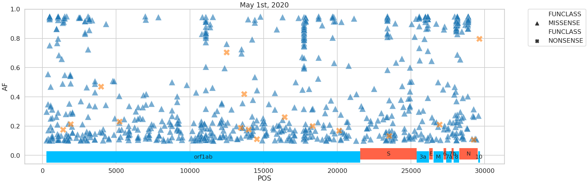

# Analysis of variation within individual COVID-19 samples | :fire: updated weekly

> Last update = May 20 

## Live Resources

| usegalaxy.org | usegalaxy.eu | usegalaxy.org.au | usegalaxy.be | usegalaxy.fr |
|:--------:|:------------:|:------------:|:------------:|:------------:|
| <FlatShield label="Paired end workflow" message="run" href="https://usegalaxy.org/u/aun1/w/covid-19-variation-analysis" alt="Galaxy PE workflow" /> <FlatShield label="Single end workflow" message="run" href="https://usegalaxy.org/u/aun1/w/covid-19-se-var" alt="Galaxy SE workflow" /> | <FlatShield label="Paired end workflow" message="run" href="https://usegalaxy.eu/u/wolfgang-maier/w/covid-19-variation-analysis-on-pe-data" alt="Galaxy PE workflow" /> <FlatShield label="Single end workflow" message="run" href="https://usegalaxy.eu/u/wolfgang-maier/w/covid-19-variation-analysis-on-se-data" alt="Galaxy SE workflow" /> | | | |
| <FlatShield label="history" message="view" href="https://usegalaxy.org/u/aun1/h/covid-19-variation" alt="Galaxy history" /> | | | | |

<!--  |  |  |-->

<!-- |  |  |  |
|  |  |  |  |  |-->

## What's the point?

The absolute majority of SARS-COV-2 data is in the form of assembled genomic sequences. This is unfortunate because any variation that exists within individual samples is obliterated--converted to the most frequent base--during the assembly process. However, knowing underlying evolutionary dynamics is critical for tracing evolution of the virus as it allows identification of genomic regions under different selective regimes and understanding of its population parameters.

## Outline

In this analysis we check for new data, run single- or paired-end analysis workflows, aggregate the results, combine them with the list produced in the previous days, and finally analyze the complete, up-to-date set of variants using Jupyter. Here is a brief outline with links:

| Step | Description |
|------|-------------|
| Obtain Illumina read [accessions](current_illumina.txt) | Generate list of newly released Illumina datasets. Performed daily. |
|  | If data is paired-end &#8594; run PE workflow |
| | If data is single-end &#8594; run SE workflow |
|  | Combine results of PE and SE workflow. This is done in a single Galaxy history that is used to aggregate results of all daily runs. |
|   | Start Jupyter notebook to analyze variants (it can started directly from history linked at the previous step) | 

## Obtaining the data

Raw sequencing reads are required to detection of within-sample sequence variants. We update the list of available data daily using the following logic implemented in [`fetch_sra_acc.sh`](fetch_sra_acc.sh):

 1. Fetch accessions from [SARS-CoV-2 resource](https://www.ncbi.nlm.nih.gov/core/assets/genbank/files/ncov-sequences.yaml), [Short Read Archive at NCBI](https://www.ncbi.nlm.nih.gov/sra/?term=txid2697049[Organism:noexp]), and [EBI](https://www.ebi.ac.uk/ena/browser/api/xml/links/taxon?accession=2697049&result=read_run&download=true).  This is done daily.
 2. A union of accessions from these three resources is then computed ([`union.txt`](union.txt)).
 3. Sample metadata is then obtained for all retained accession numbers and saved into [`current_metadata.txt`](current_metadata.txt).
 4. Metadata is used to split datasets into [`current_illumina.txt`](current_illumina.txt) and [`current_gridion.txt`](current_gridion.txt).
 5. In addition, we fetch all publicly available complete SARS-CoV-2 genomes. These are stored in 
[`genome_accessions.txt`](genome_accessions.txt) and [`current_complete_ncov_genomes.fasta`](current_complete_ncov_genomes.fasta). 

The list of currently analyzed datasets (as of April 28, 2020) is shown in Table 1 below.

<small>**Table 1.** SARS-CoV-2 Illumina datasets and corresponding analysis histories.</small>

| Date | Galaxy history |
|--------|---------|--------------|
| Beginning of outbreak - March 20, 2020 | [Paired End](https://usegalaxy.org/u/aun1/h/covid-19-variation-pe-mar-19) [Single End](https://usegalaxy.org/u/aun1/h/covid-19-variation-se-mar-19)|
| March 25, 2020                         | [Paired and Single Ends](https://usegalaxy.org/u/aun1/h/covid-19-variation-march-25)|
| March 26, 2020                         | [Paired End](https://usegalaxy.org/u/aun1/h/covid-19-variation-march-26)|
| April 2, 2020                          | [Paired and Single Ends](https://usegalaxy.eu/u/m.vandenbeek/h/april-2-sars-cov-variant-workflows)|
| April 8, 2020                          | [Paired and Single Ends](https://usegalaxy.org/u/aun1/h/april-8-update)|
| April 28, 2020                         | [Paired and Single Ends](https://usegalaxy.org/u/aun1/h/april-28-datasets)|
| May 2, 2020                            | [Paired and Single Ends](https://usegalaxy.org/u/sars-cov2-bot/h/2020-05-02-update-3)|
| May 9, 2020                            | [Paired and Single Ends](https://usegalaxy.org/u/sars-cov2-bot/h/2020-05-09-update)|
| May 17, 2020                           | [Paired and Single Ends](https://usegalaxy.org/u/sars-cov2-bot/h/2020-05-17-update)|
| May 18, 2020                           | [Paired and Single Ends](https://usegalaxy.org/u/sars-cov2-bot/h/2020-05-18-update)| 
| May 20, 2020                           | in progress |
| History for aggregation                | (https://usegalaxy.org/u/sars-cov2-bot/h/covid19-variant-aggregation-analysis)|

## How do we call variants?

This section provides background of how we settled on using `lofreq` as the principal variant caller for this project.

### Calling variants in haploid mixtures is not standardized

The development of modern genomic tools and formats have been driven by large collaborative initiatives such as 1,000 Genomes, GTEx and others. As a result the majority of current variant callers have been originally designed  for diploid genomes of human or model organisms where discrete allele frequencies are expected. Bacterial and viral samples are fundamentally different. They are represented by mixtures of multiple haploid genomes where the frequencies of individual variants are continuous. This renders many existing variant calling tools unsuitable for microbial and viral studies unless one is looking for fixed variants. However, recent advances in cancer genomics have prompted developments of somatic variant calling approaches that do not require normal ploidy assumptions and can be used for analysis of samples with chromosomal malformations or circulating tumor cells. The latter situation is essentially identical to viral or bacterial resequencing scenarios. As a result of these developments the current set of variant callers appropriate for microbial studies includes updated versions of “legacy” tools ([`FreeBayes`](https://github.com/ekg/freebayes) and `mutect2` (a part of [GATK](https://github.com/broadinstitute/gatk)) as well as dedicated packages ([`Breseq`](https://github.com/barricklab/breseq), [`SNVer`](http://dx.doi.org/10.1093/nar/gkr599), and [`lofreq`](https://github.com/CSB5/lofreq)). To assess the applicability of these tools we first considered factors related to their long-term sustainability, such as the health of the codebase as indicated by the number of code commits, contributors and releases as well as the number of citations. After initial testing we settled on three callers: `FreeBayes`, `mutect2`, and `lofreq` (Breseq’s new “polymorphism mode” has been in experimental state at the time of testing. `SNVer` is no longer actively maintained). `FreeBayes` contains a mode specifically designed for finding sites with continuous allele frequencies; `Mutect2` features a so called mitochondrial mode, and `lofreq` was specifically designed for microbial sequence analysis. 

### Benchmarking callers: `lofreq` is the best choice

Our goal was to identify variants in mixtures of multiple haplotypes sequenced at very high coverage. Such dataset are typical in modern bacterial and viral genomic studies. In addition, we are seeking to be able to detect variants with frequencies around the NGS detection threshold of ~ 1% ([Salk et al. 2018](http://dx.doi.org/10.1038/nrg.2017.117)). In order to achieve this goal we selected a test dataset, which is distinct from data used in recent method comparisons ([Bush et al. 2019](http://dx.doi.org/10.1101/653774); [Yoshimura et al. 2019](http://dx.doi.org/10.1099/mgen.0.000261)). These data originate from a duplex sequencing experiment recently performed by our group ([Mei et al. 2019](https://academic.oup.com/gbe/article/11/10/3022/5572121)).  In this dataset a population of *E. coli* cells transformed with pBR322 plasmid is maintained in a turbidostat culture for an extensive period of time. Adaptive changes accumulated within the plasmid are then revealed with duplex sequencing ([Schmitt et al. 2012](http://www.ncbi.nlm.nih.gov/entrez/query.fcgi?cmd=Retrieve&db=PubMed&dopt=Citation&list_uids=22853953)). Duplex sequencing allows identification of variants at very low frequencies. This is achieved by first tagging both ends of DNA fragments to be sequenced with unique barcodes and subjecting them to paired-end sequencing. After sequencing read pairs containing identical barcodes are assembled into families. This procedure allows to reliably separate errors introduced during library preparation and/or sequencing (present in some but not all members of a read family) from true variants (present in all members of a read family derived from both strands).

For the following analysis we selected two data points from [Mei et al. 2019](https://academic.oup.com/gbe/article/11/10/3022/5572121): one corresponding to the beginning of the experiment (s0) and the other to the end (s5). The first sample is expected to be nearly clonal with no variation, while the latter contains a number of adaptive changes with frequencies around 1%. We aligned duplex consensus sequences (DCS) against the pBR322. We then walked through read alignments to produce counts of non-reference bases at each position (Fig. 1). 

-------

<small>**Figure 1.** Counts of alternative bases at eight variable locations within pBR322.</small>

-------

Because all differences identified this way are derived from DCS reads they are a reasonable approximation for a “true” set of variants. s0 and s5 contained 38 and 78 variable sites with at least two alternative counts, respectively (among 4,361 bases on pBR322) of which 27 were shared. We then turned our attention to the set of sites that were determined by Mei et al. to be under positive selection (sites 3,029, 3,030, 3,031, 3,032, 3,033, 3,034, 3,035, 3,118). Changes at these sites increase the number of plasmid genomes per cell. Sample s0 does not contain alternative bases at any of these sites. Results of the application of the three variant callers with different parameter settings (shown in Table 2) are summarized in Fig. 2. 

------

<small>**Figure 2.** Calls made by `mutect2`, `freebayes`, and `lofreq`. For explanation of x-axis labels see Table 1.</small>

------

The `lofreq` performed the best followed by `mutect2` and `FreeBayes` (contrast "Truth" with "nf" and "def" in Fig. 2). The main disadvantage of `mutect2` is in its handling of multiallelic sites (e.g., 3,033 and 3,118) where multiple alternative bases exist. At these sites `mutect2` outputs alternative counts for only one of the variants (the one with highest counts; this is why at site 3,118 A and T counts are identical). Given these results we decided to use `lofreq` for the main analysis of the data.

<small>**Table 2.** Command line options for each caller.</small>

| Caller | Command line | Figure 2 label |
|:-------|:-------------|:--------------|
| `mutect2` | `--mitochondria-mode true` | m |
| `mutect2` | default | m_noM |
| `mutect2` | `--mitochondria-mode true --f1r2-max-depth 1000000` | m_md_inf |
| `mutect2` | `--mitochondria-mode true --f1r2-max-depth 1000000 -max-af 1`  | m_md_inf_max_af1 |
| `freebayes` | `--haplotype-length 0 --min-alternate-fraction 0.001 --min-alternate-count 1 --pooled-continuous --ploidy 1` | hl-0_maf-001_pc |
| `freebayes` | `-min-alternate-fraction 0.001 --pooled-continuous --ploidy 1` | maf-001_pc |
| `lofreq` | `--no-default-filter` | nf |
| `lofreq` | default | def |

## Galaxy workflows

`lofreq` is used in two galaxy workflows described in this section. Illumina data currently available for SARS-CoV-2 consists of paired- and single-end datasets. We use two similar yet distinct workflows to analysis these datasets.

### Analysis of Illumina Paired End data

------

<small>**Figure 3.** Workflow for the analysis of paired-end Illumina reads </small>

------

#### Inputs:

1. GenBank file for the reference COVID-19 [genome](https://www.ncbi.nlm.nih.gov/nuccore/NC_045512). The GenBank record is used by `snpeff` to generate a database for variant annotation.
2. Downloaded paired-end reads in fastq format as a paired dataset collection. Reads can be downloaded using Galaxy's wrapper for `fasterq-dump` located in **"Get data"** tool section.

#### Steps:

 1. Map all reads against COVID-19 reference [NC_045512.2](https://www.ncbi.nlm.nih.gov/nuccore/NC_045512) using `bwa mem`
 1. Filter reads with mapping quality of at least 20, that were mapped as proper pairs
 1. Mark duplicate reads with `picard markduplicates`
 1. Perform realignments using `lofreq viterbi`
 1. Call variants using `lofreq call`
 1. Annotate variants using `snpeff` against database created from NC_045512.2 GenBank file
 1. Convert VCFs into tab delimited dataset

#### Outputs 

A tab-delimited table of variants described in Table 2 below.

### Analysis of Illumina Single End data

-----

 
**Figure 4.** Workflow for the analysis of single-end Illumina reads < 100 bp 

-----

#### Inputs:

1. GenBank file for the reference COVID-19 [genome](https://www.ncbi.nlm.nih.gov/nuccore/NC_045512). The GenBank record is used by `snpeff` to generate a database for variant annotation.
2. Downloaded paired-end reads in fastq format as a dataset collection. Reads can be downloaded using Galaxy's wrapper for `fasterq-dump` located in **"Get data"** tool section.

#### Steps:

 1. Map all reads against COVID-19 reference [NC_045512.2](https://www.ncbi.nlm.nih.gov/nuccore/NC_045512) using `bowtie2` (because all SE datasets we have seen so far contain short, 75 bp, reads)
 1. Filter reads with mapping quality of at least 20
 1. Mark duplicate reads with `picard markduplicates`
 1. Perform realignments using `lofreq viterbi`
 1. Call variants using `lofreq call`
 1. Annotate variants using `snpeff` against database created from NC_045512.2 GenBank file
 1. Convert VCFs into tab delimited dataset

<!--
### Analysis of ONT data

 1. Process reads using `porechop`
 2. Filter reads using `filtlong` using Illumina data as "reference" to exclude non-typical *k*-mers
 3. Map reads against COVID-19 reference [NC_045512.2](https://www.ncbi.nlm.nih.gov/nuccore/NC_045512) using `minimap2`
 4. Call variants using `lofreq call`
 5. Annotate variants using `snpeff` against database created from NC_045512.2 GenBank file
 6. Convert VCFs into tab delimited dataset

:warning: We obtained vastly different results depending on whether the reads were filtered with `filtlong` or not. As a result we did not incorporate variation from ONT data into our report at this time.

-->

### Output

After running both workflows the data is combined into a single dataset ([variant_list.tsv](variant_list.tsv) and smaller dataset filtered at alternative allele frequency of 5% and above [variant_list.05.tsv](variant_list.05.tsv)).

These result datasets have the following structure:

<small>**Table 3.** Output of PE and SE workflows described above. Here, most fields names are descriptive. **SB** = the Phred-scaled probability of strand bias as calculated by [lofreq](https://csb5.github.io/lofreq/) (0 = no strand bias); **DP4** = strand-specific depth for reference and alternate allele observations (Forward reference, reverse reference, forward alternate, reverse alternate).</small>

<table>
  <thead>
    <tr style="text-align: right;">
      <th></th>
      <th>Sample</th>
      <th>CHROM</th>
      <th>POS</th>
      <th>REF</th>
      <th>ALT</th>
      <th>DP</th>
      <th>AF</th>
      <th>SB</th>
      <th>DP4</th>
      <th>IMPACT</th>
      <th>FUNCLASS</th>
      <th>EFFECT</th>
      <th>GENE</th>
      <th>CODON</th>
    </tr>
  </thead>
  <tbody>
    <tr>
      <th>0</th>
      <td>SRR10903401</td>
      <td>NC_045512</td>
      <td>1409</td>
      <td>C</td>
      <td>T</td>
      <td>124</td>
      <td>0.040323</td>
      <td>1</td>
      <td>66,53,2,3</td>
      <td>MODERATE</td>
      <td>MISSENSE</td>
      <td>NON_SYNONYMOUS_CODING</td>
      <td>orf1ab</td>
      <td>Cat/Tat</td>
    </tr>
    <tr>
      <th>1</th>
      <td>SRR10903401</td>
      <td>NC_045512</td>
      <td>1821</td>
      <td>G</td>
      <td>A</td>
      <td>95</td>
      <td>0.094737</td>
      <td>0</td>
      <td>49,37,5,4</td>
      <td>MODERATE</td>
      <td>MISSENSE</td>
      <td>NON_SYNONYMOUS_CODING</td>
      <td>orf1ab</td>
      <td>gGt/gAt</td>
    </tr>
    <tr>
      <th>2</th>
      <td>SRR10903401</td>
      <td>NC_045512</td>
      <td>1895</td>
      <td>G</td>
      <td>A</td>
      <td>107</td>
      <td>0.037383</td>
      <td>0</td>
      <td>51,52,2,2</td>
      <td>MODERATE</td>
      <td>MISSENSE</td>
      <td>NON_SYNONYMOUS_CODING</td>
      <td>orf1ab</td>
      <td>Gta/Ata</td>
    </tr>
    <tr>
      <th>3</th>
      <td>SRR10903401</td>
      <td>NC_045512</td>
      <td>2407</td>
      <td>G</td>
      <td>T</td>
      <td>122</td>
      <td>0.024590</td>
      <td>0</td>
      <td>57,62,1,2</td>
      <td>MODERATE</td>
      <td>MISSENSE</td>
      <td>NON_SYNONYMOUS_CODING</td>
      <td>orf1ab</td>
      <td>aaG/aaT</td>
    </tr>
    <tr>
      <th>4</th>
      <td>SRR10903401</td>
      <td>NC_045512</td>
      <td>3379</td>
      <td>A</td>
      <td>G</td>
      <td>121</td>
      <td>0.024793</td>
      <td>0</td>
      <td>56,62,1,2</td>
      <td>LOW</td>
      <td>SILENT</td>
      <td>SYNONYMOUS_CODING</td>
      <td>orf1ab</td>
      <td>gtA/gtG</td>
    </tr>
  </tbody>
</table>

## Jupyter notebook

Upon completion of single- and paired-end analysis workflows and combining their results into [a single file](variant_list.tsv) this file is loaded into a . The notebook is used to produce summaries such as distribution of variants across the SARS-CoV-2 genome:

-------

The variants we identified were distributed across the SARS-CoV-2 genome in the following way:

<small>**Figure 5**. Distribution of variants across the viral genome.</small>

-------

## Galaxy histories

Galaxy histories corresponding to all analyses performed so far are listed in [Table 1](#obtaining-the-data). The history used for aggregating results and launching jupyter notebook is here &#8594; .

## BioConda

Tools used in this analysis are also available from BioConda:

| Name | Link |
|------|----------------|
| `bwa` |  |
| `samtools` |  |
| `lofreq` |  |
| `snpeff` |  |
| `snpsift` |  |
| `porechop` |  |
| `filtlong` |  |
| `minimap2` |  |
|`bowtie2`||

