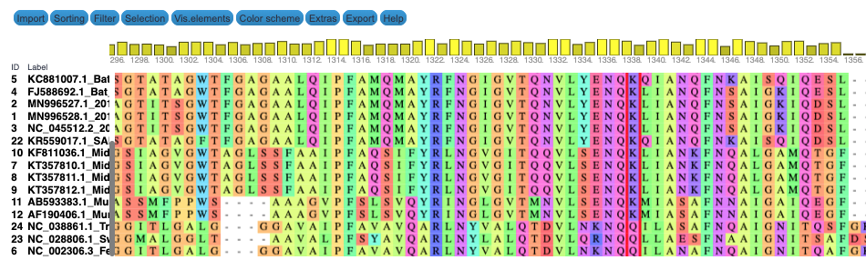
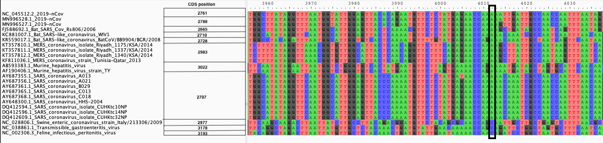
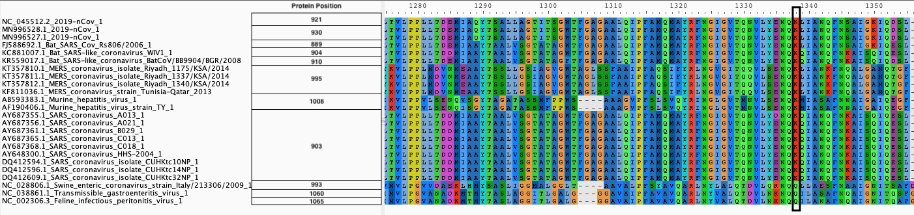
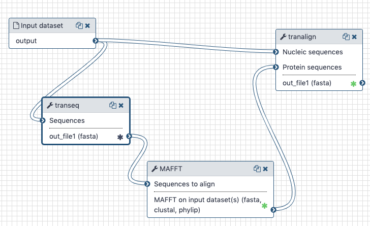

# Functionnal annotation - Example analysis of S-protein polymorphism

## Live Resources

| usegalaxy.org | usegalaxy.eu | usegalaxy.org.au | usegalaxy.be | usegalaxy.fr |
|:--------:|:------------:|:------------:|:------------:|:------------:|
| <FlatShield label="workflow" message="run" href="https://usegalaxy.org/u/aun1/w/covid-19-s-gene-aa" alt="Galaxy workflow" /> | <FlatShield label="workflow" message="run" href="https://usegalaxy.eu/u/wolfgang-maier/w/covid-19-s-gene-conservation" alt="Galaxy workflow" /> | <FlatShield label="workflow" message="run" href="https://usegalaxy.org.au/u/simongladman/w/covid-19-s-gene-aa" alt="Galaxy workflow" /> | <FlatShield label="workflow" message="run" href="https://usegalaxy.be/u/ieguinoa/w/covid-19-s-gene-aa" alt="Galaxy workflow" /> | <FlatShield label="workflow" message="run" href="https://usegalaxy.fr/u/lecorguille/w/covid-19-cov-s-gene-conservation" alt="Galaxy workflow" /> |
| <FlatShield label="history" message="view" href="https://usegalaxy.org/u/aun1/h/covid-19-s-protein-aa" alt="Galaxy history" /> | <FlatShield label="history" message="view" href="https://usegalaxy.eu/u/wolfgang-maier/h/covid-19-s-gene-conservation" alt="Galaxy history" /> | <FlatShield label="history" message="view" href="https://usegalaxy.org.au/u/simongladman/h/covid-19-s-gene-aa" alt="Galaxy history" /> | <FlatShield label="history" message="view" href="https://usegalaxy.be/u/ieguinoa/h/covid-19-s-protein-aa" alt="Galaxy history" /> | <FlatShield label="history" message="view" href="https://usegalaxy.fr/u/lecorguille/h/covid-19-5--s-protein-aa" alt="Galaxy history" /> |

## What's the point?

In [the previous portion](https://github.com/galaxyproject/SARS-CoV-2/tree/master/4-Variation) of this study, we found variations in SARS-2 Cov genome. To evaluate the impact of variations on the virus, we need to perform functional annotation of variants. A lot of literature is available on a wide variety of species of coronaviruses. To help with that task, we offer two valuable tools :
-   Tables of coordinate conversion between different species of coronaviruses, to help with the transfer of annotations
-   Tables of annotation of all residues. Compilated literature on Coronaviruses links each residue to their functional annotation, including from other species of coronavirus.

To illustrate the process,  we studied a non-synonymous polymorphism within the *S*-gene found in [the previous portion](https://github.com/galaxyproject/SARS-CoV-2/tree/master/4-Variation). We are trying to interpret its possible effect.

## Outline

Obtain coding sequences of S proteins from a diverse group of coronaviruses, and generate amino acid alignment to create a table of coordinate conversion.

## Input

Downloaded [CDS sequences](Spike_cds.fasta) of coronavirus Spike proteins from [NCBI Viral Resource](https://www.ncbi.nlm.nih.gov/labs/virus/vssi/#/virus?SeqType_s=Nucleotide&VirusLineage_ss=SARS-CoV-2,%20taxid:2697049) for the following coronaviruses:

| Accession  |  Description |
|------------|--------------|
| FJ588692.1     | Bat SARS Coronavirus Rs806/2006 |
| KR559017.1     | Bat SARS-like coronavirus BatCoV/BB9904/BGR/2008 |
| KC881007.1     | Bat SARS-like coronavirus WIV1 |
| KT357810.1     | MERS coronavirus isolate Riyadh_1175/KSA/2014 |
| KT357811.1     | MERS coronavirus isolate Riyadh_1337/KSA/2014 |
| KT357812.1     | MERS coronavirus isolate Riyadh_1340/KSA/2014 |
| KF811036.1     | MERS coronavirus strain Tunisia-Qatar_2013 |
| AB593383.1     | Murine hepatitis virus |
| AF190406.1     | Murine hepatitis virus strain TY |
| AY687355.1     | SARS coronavirus A013 |
| AY687356.1     | SARS coronavirus A021 |
| AY687361.1     | SARS coronavirus B029 |
| AY687365.1     | SARS coronavirus C013 |
| AY687368.1     | SARS coronavirus C018 |
| AY648300.1     | SARS coronavirus HHS-2004 |
| DQ412594.1     | SARS coronavirus isolate CUHKtc10NP |
| DQ412596.1     | SARS coronavirus isolate CUHKtc14NP |
| DQ412609.1     | SARS coronavirus isolate CUHKtc32NP |
| MN996528.1     | SARS-2 Cov |
| MN996527.1     | SARS-2 Cov |
| NC_045512.2 | SARS-2 Cov |
| NC_002306.3 | Feline infectious peritonitis virus |
| NC_028806.1 | Swine enteric coronavirus strain Italy/213306/2009 |
| NC_038861.1 | Transmissible gastroenteritis virus |

These viruses were chosen based on a publication by Duquerroy et al. ([2005](http://dx.doi.org/10.1016/j.virol.2005.02.022)). The sequences were extracted manually--a painful process.

## Output

We produce two alignments, one at the nucleotide and one at the amino acid level, of Betacoronavirus spike proteins. The alignments can be visualized with the `Multiple Sequence Alignment` Visualization in Galaxy :

 

| Alignments of Spike proteins |
|:-------------------------------:|
|  |
| **A**. CDS alignments |
|  |
| **B**. Protein alignment |

## Workflow and history

The Galaxy history containing the latest analysis can be found [here](https://usegalaxy.org/u/aun1/h/covid-19-s-protein-aa). The publicly accessible [workflow](https://usegalaxy.org/u/aun1/w/covid-19-s-gene-aa) can be downloaded and installed on any Galaxy instance. It contains all information about tool versions and parameters used in this analysis.

The `transeq` tool converts the CDS sequences into protein sequences, which we then align with each other using `mafft`. The output is fed into `tranalign` along with the nucleotide sequences. `tranalign` produces a nucleotide alignment coherent with the protein alignment.

## Generation of Coordinate maps

We used this workflow to generate alignment across Coronaviruses for each gene of SARS-2 Cov. From these alignments, using `mafft`, we created coordinate conversion. The `mafft -add` option allows the addition of sequences to an alignment, but also generated mapping of the new sequence to the coordinate in the alignment. We reported these mapping data to the SARS-2 Cov coordinate for more clarity.

These tables can be queried through the notebook included in this section. To find positions equivalent to your residue or region of interest :
-   Select the Gene
-   Select the species in which your coordinates are
-   Select the region of interest

## Residue annotations

Since the beginning of this project, we have been compilating functional information from literature for each residue of each gene of SARS-2 cov. The literature covers several species of coronavirus, and we used the coordinate tables presented above to transfer the annotations between species. In cases where the residue is different from the one annotated, it is specified in the table, and all annotations are linked to their article of origin.
Due to the considerable amount of literature available, the annotations are incomplete, but we are working on enriching them every day. You can contribute to the annotation effort by adding annotations in the tables on [Github](https://github.com/galaxyproject/SARS-CoV-2/tree/master/7-VariantsDescription/residue_annotation/)

## BioConda

Tools used in this analysis are also available from BioConda:

| Name     | Link |
|----------|----------------|
| `mafft`  |  |
| `emboss` |  |

## Notebooks
<observableNotebook notebookSource="@delphine-l/coordinate-conversion-between-species-of-coronavirus"/>
<observableNotebook notebookSource="@delphine-l/annotation-of-sars-2-coronavirus-genome"/>
