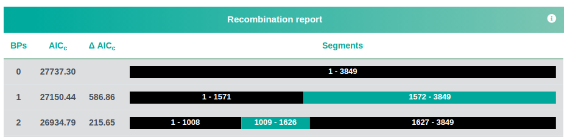
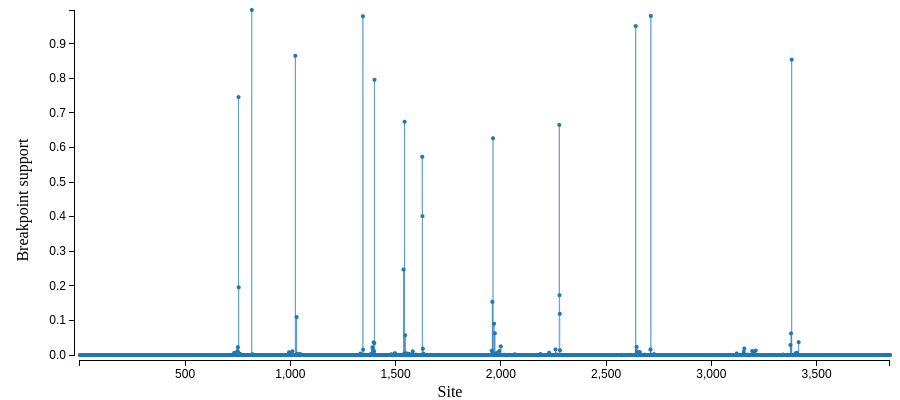
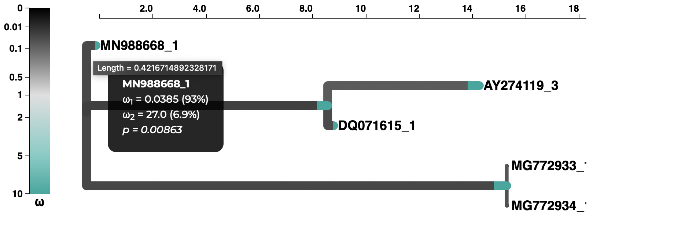
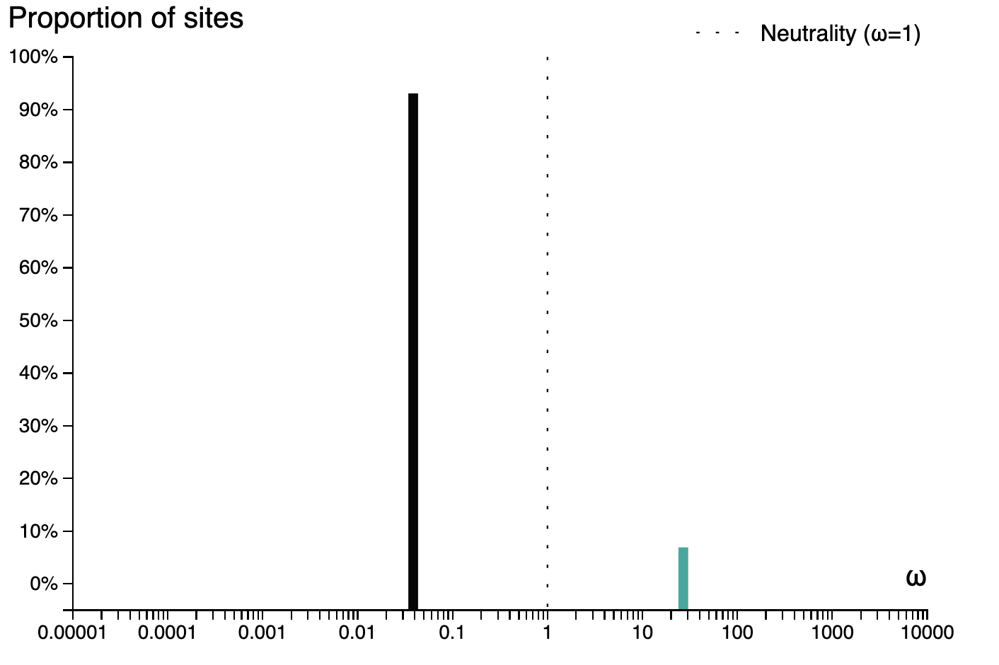
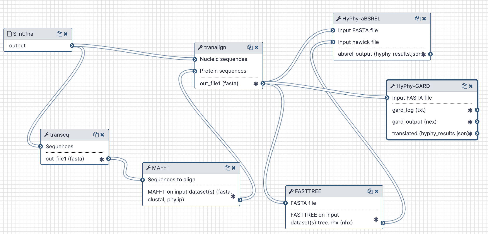

# Evolutionary Analysis

## Live Resources

| usegalaxy.org | usegalaxy.eu | usegalaxy.org.au | usegalaxy.be | usegalaxy.fr |
|:--------:|:------------:|:------------:|:------------:|:------------:|
| <FlatShield label="workflow" message="run" href="https://usegalaxy.org/u/aun1/w/covid-19-recsel" alt="Galaxy workflow" /> | <FlatShield label="workflow" message="run" href="https://usegalaxy.eu/u/wolfgang-maier/w/covid-19-recsel" alt="Galaxy workflow" /> | <FlatShield label="workflow" message="run" href="https://usegalaxy.org.au/u/simongladman/w/covid-19-recsel" alt="Galaxy workflow" /> | <FlatShield label="workflow" message="run" href="https://usegalaxy.be/u/ieguinoa/w/covid-19-recsel" alt="Galaxy workflow" /> | <FlatShield label="workflow" message="run" href="https://usegalaxy.fr/u/lecorguille/w/covid-19-recombination-and-selection-analysis" alt="Galaxy workflow" /> |
| <FlatShield label="history" message="view" href="https://usegalaxy.org/u/aun1/h/covid-19-recsel" alt="Galaxy history" /> | <FlatShield label="history" message="view" href="https://usegalaxy.eu/u/wolfgang-maier/h/covid-19-recombination-and-selection-analysis" alt="Galaxy history" /> | <FlatShield label="history" message="view" href="https://usegalaxy.org.au/u/simongladman/h/covid-19-s-gene-aa" alt="Galaxy history" /> | <FlatShield label="history" message="view" href="https://usegalaxy.be/u/ieguinoa/h/covid-19-recsel" alt="Galaxy history" /> | <FlatShield label="history" message="view" href="https://usegalaxy.fr/u/lecorguille/h/covid-19-6--recombination-and-selection-analysis" alt="Galaxy history" /> |

## What's the point?

[Wu et al.](https://doi.org/10.1038/s41586-020-2008-3) showed recombination between COVID-19 and bat coronaviruses located within the *S*-gene. We want to confirm this observation and provide a publicly accessible workflow for recombination detection.

In previous coronavirus outbreaks (SARS), retrospective analyses determined that adaptive substitutions might have occurred in the S-protein [Zhang et al.](https://www.ncbi.nlm.nih.gov/pmc/articles/PMC1609170/), e.g., related to [ACE2 receptor utilization](https://www.embopress.org/doi/full/10.1038/sj.emboj.7600640). While data on COVID-19 are currently limited, we investigated whether or not the lineage leading to them showed any evidence of positive diversifying selection.

## Outline

We employ a recombination detection algorithm (GARD) developed by [Kosakovsky Pond et al.](http://mbe.oxfordjournals.org/cgi/content/full/23/10/1891) and implemented in the `hyphy` package. To select a representative set of *S*-genes we perform a blast search using the *S*-gene CDS from [NC_045512](https://www.ncbi.nlm.nih.gov/nuccore/NC_045512) as a query against the `nr` database. We select [coding regions](S_nt.fna) corresponding to the *S*-gene from a number of COVID-19 genomes and original SARS isolates. This set of sequences can be found in [this repository](S_nt.fna)

We then generate a codon-based alignment using the workflow shown below and perform the recombination analysis using the `gard` tool from the `hyphy` package.

For selection analyses, we apply the [Adaptive Branch Site Random Effects](https://www.ncbi.nlm.nih.gov/pubmed/25697341) method to test whether or each branch of the tree shows evidence of diversifying positive selection along a fraction of sites using the `absrel` tool from the `hyphy` package.

## Inputs

A set of unaligned CDS sequences for the *S*-gene.

## Outputs

A recombination report:

and a map of possible recombination hotspots:

A selection analysis summary and tree (COVID-19 isolate is MN988668_1)

and a plot of the inferred &omega; distribution for the MN988668_1 branch.

## History and workflow

A Galaxy workspace (history) containing the most current analysis can be imported from [here](https://usegalaxy.org/u/aun1/h/covid-19-recsel).

The publicly accessible [workflow](https://usegalaxy.org/u/aun1/w/covid-19-recsel) can be downloaded and installed on any Galaxy instance. It contains version information for all tools used in this analysis.

The workflow takes unaligned CDS sequences, translates them with `EMBOSS:tanseq`, aligns translations using `mafft`, realigns original CDS input using the mafft alignment as a guide and sends this codon-based alignment to `gard`.

## BioConda

Tools used in this analysis are also available from BioConda:

| Name | Link |
|------|----------------|
| `emboss` |  |
| `mafft` |  |
| `hyphy` |  |
| `fasttree` |  |
