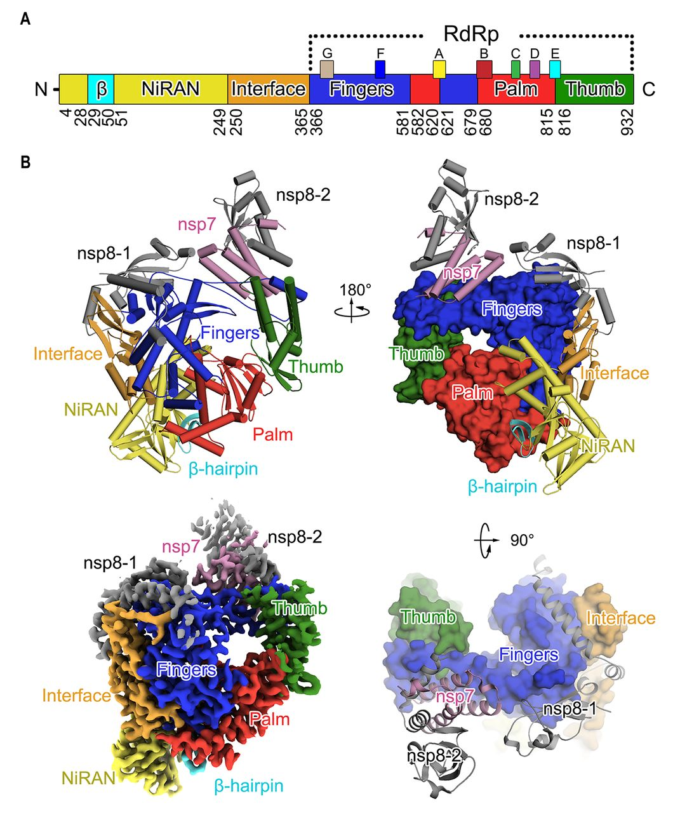

# nsp12 :  RNA dependant RNA polymerase (RdRp)

## Structure

RdRp is shaped like a cupped right hand with fingers, palm and thumb subdomains. The average length of the core RdRp domain is 500 amino acids. Active sites resemble other enzymes such as reverse transcriptase and DNA polymerase, indicating a  similar role in nucleotides transfer reactions ( enzymatic function : [2.7.1.68](https://www.genome.jp/dbget-bin/www_bget?ec:2.7.1.68) )
RdRp catalyzes RNA template dependent formation of phosphodiester bonds between ribonucleotide in presence of divalent metal ions.

Domains:

  - Palm: Junction of fingers and thumbs. Most of structurally conserved elements in the Palm domain are involved in catalysis. Contains: catalytic aspartate and the RNA Recognizing Motif (RRM).
  - Thumb: Harbor residues involved in packing against template RNA and stabilizing the initiating NTPs on the template. Unique C-terminus that folds back into the active site clift regulating RNA synthesis.
  -  Fingers: Hold the template RNA in place and facilitate polymerization. Index, middle and pinky.

In addition of the RdRp domain, coronaviruses contain an Nidovirus RdRp-associated nucleotidyltransferase (NiRAN) specific to nidoviruses. This domain is linked to the RdRp domain by an interface domain.

### Motifs

RdRp Contains 7 structural motifs, A to G. They present a high similarity in structure and disposition across various groups of viruses.
A to E: Palm domain
F, G : Fingers

#### Motif A

&beta;-strand, continues as helix/loop into the finger subdomain.

Contains a catalytic motif <math>D-X2-4-D</math>

The first Aspartate is invariant in various RdRps. The second aspartate act with a conserved asparagine from B and plays a role in the discriminate of NTPs over dNTPs.

A conserved lysine replace the second Aspartate in RdRps of ss(-) RNA viruses, allowing them to use manganese instead of magnesium as cofactor.

In SARS-CoV : <math> 612 -  <TEXT>PHLMGW<b>D</b>YPKC<b>D</b>RAM</TEXT></math>

#### Motif B

Assist the binding of template RNA and substrate discrimination.
Mainly a loop that connect a 	&beta;-strand of fingers to N-terminal helix arrrising from the palm.
Conserved glycine at the junction of the loop and the helix: indispensable for polymerase function. Threonine within the &alpha; helix facing the active so he conserved in most group IV and dsRNA viruses but absent in group V viruses.

In SARS-CoV :   <math> 678 -  <TEXT>GGTS<b>SG</b>DATTAYA<b>N</b>SVFNICQAVTANVNALLST</TEXT></math>

#### Motif C

Composed of one loop and one flanking	&beta;-strands.
The loop contains a conserved GDD motif essential for metal ions.
The C motif is juxtaposed with A motif and contribute to RRM. Conserved aspartates from GDD and first aspartate of <math> D-X2-4-D </math>  align at the tip of the RRM, aiding on efficient catalysis.

In SARS-CoV : <math> 753 -  <TEXT>FSMMIL<b>SDD</b>AVVCYN</TEXT></math>

#### Motif D

Composed of a &alpha;-helix and a flexible loop adjacent to the	&beta;-sheet of palm domain. Contains a conserved glycine. When an incorrect nucleotide is incorporated, the D motif is unable to achieve optimal conformation. The conserved lysine serves as general acid in the function of deprotonation of the pyrophosphate leaving group.

In SARS-CoV : <math> 771 -  <TEXT>AAQGLVASIKN<b>F</b>KAV<b>LYY</b>QNNVFMSE</TEXT></math>

#### Motif E
&beta; hairpin at the junction of palm and thumb subdomains. Termed as "primer grip" aid
the correct positioning of the 3' hydroxyl group of the primer for catalysis. An aromatic residue at the N-ter side faces C motif, residue the most conserved of the motif.

In SARS-CoV : <math> 810 -  <TEXT>HE<b>FCS</b>QHTMLV</TEXT></math>

#### Motif F

Composed of a loop and a &beta;-strand. Interacts with phosphate group of incoming NTPs. Made of positively charged residues that shields the negative charges of the phosphate groups of incoming NTP. Contains a conserved Arginine in the C-terminal region.

In SARS-CoV :  <math> 544 -  <TEXT>L<b>K</b>YAISA<b>K</b>N<b>R</b>ARTVAGV</TEXT></math>

#### Motif G

Compose a loop part of the template entrance tunnel in ss(+) RNA viruses and finger domains in dsRNA viruses. In segmented ss(-) RNA viruses, G is composed of a helix that interacts with the priming NTPs.

In SARS-CoV :  <math> 499 -  <TEXT>DK<b>SAGFP</b>FNKWG<b>K</b></TEXT></math>

### Channels

Entry channels
Lined with positively charged residues, which favor entry of NTP and template RNA into the active site.

-   Nucleotide entry Channel: Entry of substrate and divalent cations. Participate in the release of pyrophosphate moiety after polymerization
-   Template channel: Template recognition and driving NTB toward the catalytic center. G motif line the entry of the template channel, and B forms the base.

RNA exit channel: Formed by both palm and thumb. Exit for the template and newly synthesized RNA.

### RdRp complexes

Most common; divalent metal ions. Crucial for polymerization: they coordinate the catalytic aspartate and facilitate the formation of phosphodiester bonds between NTP.
2 metal ions: 1 permanently bound, the other is weakly associated and stabilize at different stages of catalyses.

# Complex nsp12, nsp7 and nsp8

## References

Venkataraman, Sangita, Burra VLS Prasad, and Ramasamy Selvarajan. "RNA dependent RNA polymerases: insights from structure, function and evolution." Viruses 10.2 (2018): 76.

Gao, Yan, et al. "Structure of the RNA-dependent RNA polymerase from COVID-19 virus." Science (2020).

Xu, Xiang, et al. "Molecular model of SARS coronavirus polymerase: implications for biochemical functions and drug design." Nucleic acids research 31.24 (2003): 7117-7130.

Enjuanes, Luis, ed. Coronavirus replication and reverse genetics. Vol. 287. Springer Science & Business Media, 2004.

# Coordinate conversion

| Accession | Source | Description |
|:------:|:-----------:|:-----------|
| NC_045512 | [NC_045512.2](https://www.ncbi.nlm.nih.gov/nuccore/NC_045512.2)  | Severe acute respiratory syndrome coronavirus 2 isolate Wuhan-Hu-1 (SARS-2-Cov) |
| NP_828869 | [NP_828869.1](https://www.ncbi.nlm.nih.gov/protein/NP_828869) | Severe acute respiratory syndrome-related coronavirus  |
| AMM70617 | [AMM70617.1](https://www.ncbi.nlm.nih.gov/protein/AMM70617) | Bat betacoronavirus |
| NP_839965 | [NP_839965.1](https://www.ncbi.nlm.nih.gov/protein/NP_839965) | Porcine epidemic diarrhea virus |
| QEY10680 | [QEY10680.1](https://www.ncbi.nlm.nih.gov/protein/QEY10680) | Dromedary camel coronavirus HKU23 |
| AID16548 | [AID16548.1](https://www.ncbi.nlm.nih.gov/protein/AID16548) | Bat coronavirus |
| AID16626 | [AID16626.1](https://www.ncbi.nlm.nih.gov/protein/AID16626) | Longquan Aa mouse coronavirus |
| NP_740629 | [NP_740629.1](https://www.ncbi.nlm.nih.gov/protein/NP_740629) | Infectious bronchitis virus |
| QDL88266 | [QDL88266.1](https://www.ncbi.nlm.nih.gov/protein/QDL88266) | Lucheng Rn rat coronavirus |
| AIW52770 | [AIW52770.1](https://www.ncbi.nlm.nih.gov/protein/AIW52770) | Human coronavirus 229E |
| AID16752 | [AID16752.1](https://www.ncbi.nlm.nih.gov/protein/AID16752) | Bat SARS-like coronavirus |
| KU740200 | [KU740200.1](https://www.ncbi.nlm.nih.gov/nuccore/KU740200.1) | Middle East respiratory syndrome coronavirus isolate MERS CoV/camel/Egypt/NRCE-NC163/2014 |
| AJ271965 | [AJ271965.2](https://www.ncbi.nlm.nih.gov/nuccore/AJ271965.2) | Transmissible gastroenteritis virus |
| NC_019843 | [NC_019843.3](https://www.ncbi.nlm.nih.gov/nuccore/NC_019843.3) | Middle East respiratory syndrome coronavirus |
