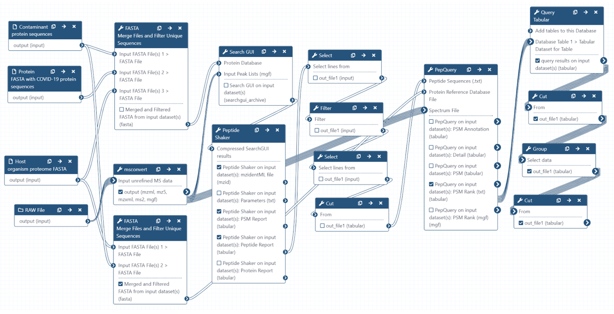

# Proteomics analysis of COVID-19 lung tissues

## Live Resources

| usegalaxy.eu |
|:--------:|:------------:|:------------:|:------------:|:------------:|
| <FlatShield label="Input data" message="view" href="https://usegalaxy.eu/u/pratikjagtap/h/pxd018241-inputs-for-pepquery-and-lorikeet-analysis  " alt="Raw data" /> |
| <FlatShield label="PXD018094 history1" message="view" href="https://usegalaxy.eu/u/pratikjagtap/h/1pxd018241-dataset-collection-search-for-raw01and02-pepquery-and-lorikeet-analysis-09092020 " alt="Galaxy history" /> |
| <FlatShield label="workflow" message="run" href="https://usegalaxy.eu/u/pratikjagtap/w/imported-single-dataset-pxd018241-workflow-for-pq-and-lk08222020" /> |

## Description

**[Leng et al](https://www.nature.com/articles/s41392-020-00355-9)** performed MS/MS analysis to characterize molecular mechanisms underlying COVID-19 pathogenesis in fresh lung tissues obtained from newly deceased patients with COVID-19 pneumonia. 

## Workflow

The Galaxy workflow includes RAW data conversion to MGF and mzML format. The MGF files are searched against the combined database of Human 
Uniprot proteome, contaminant proteins and SARS-Cov-2 proteins database using X!tandem, MSGF+, OMSSA search algorithms with SearchGUI and FDR 
and protein grouping using PeptideShaker. This resulted in detection of ---
 peptides from SARS-CoV-2 proteins. The detected peptides were 
searched against NCBInr to ascertain that these peptides were specific to SARS-CoV-2 proteins. The detected peptides were later subjected 
to analysis by PepQuery and Lorikeet to ascertain the quality of peptide identification.

## Results

The COVID-19 positive patient samples detected --- peptides from SARS-CoV-2 proteins.

