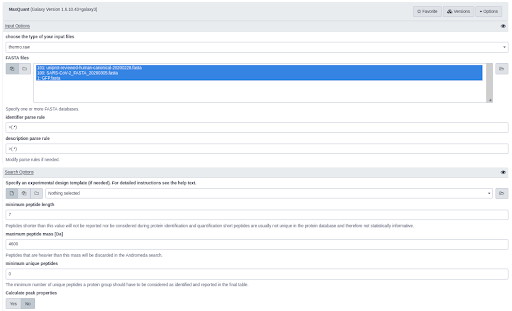

# SARS-Cov-2-human-protein-protein interaction

## Live Resources

| usegalaxy.eu |
|:--------:|:------------:|:------------:|:------------:|:------------:|
| <FlatShield label="data" message="view" href="https://usegalaxy.eu/library/list#folders/F557572555247ae52" alt="Raw data" /> |
| <FlatShield label="PXD018117 history" message="view" href="https://usegalaxy.eu/u/matthiasfahrner/h/maxquant-for-covid-study-using-mq-default-settings-1" alt="Galaxy history" /> |
| <FlatShield label="workflow" message="run" href="https://usegalaxy.eu/u/matthiasfahrner/w/maxquant-for-covid-study-using-mq-default-settings" alt="Galaxy workflow" /> |

## Description

[Gordon et al.](https://www.nature.com/articles/s41586-020-2286-9) applied affinity-purification mass spectrometry to identify
SARS-CoV-2-human protein-protein interaction map. 27 predicted SARS-CoV-2 Orfs were Strep-tagged and expressed in HEK293T/17 cells.
For each protein at least three independent biological replicates were prepared. Cells were lysed and proteins extracted with
affinity beads and digested while still bound to the beads. Peptides were removed from the beads, desalted and analyzed with
a Q-Exactive Plus mass spectrometer. Files were searched against the human proteome, EGFP sequence and SARS-CoV-2 protein sequencing using MaxQuant with default settings. 

## Workflow

All 98 raw files as well as the three fasta files with the protein sequences were downloaded from PRIDE and analyzed in MaxQuant using default settings.
To confirm the success of the affinity-purification approach, we evaluated if the quantities of the bait protein are higher than other proteins in the samples.
Together with trypsin and streptavidin the bait proteins had the highest relative quantities in the samples, confirming the success of the affinity-purification.

