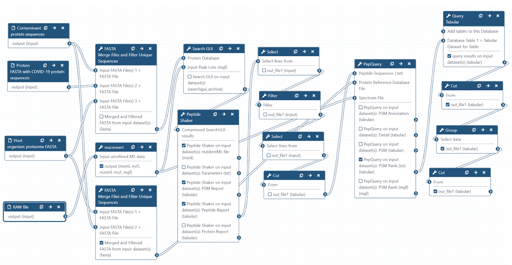
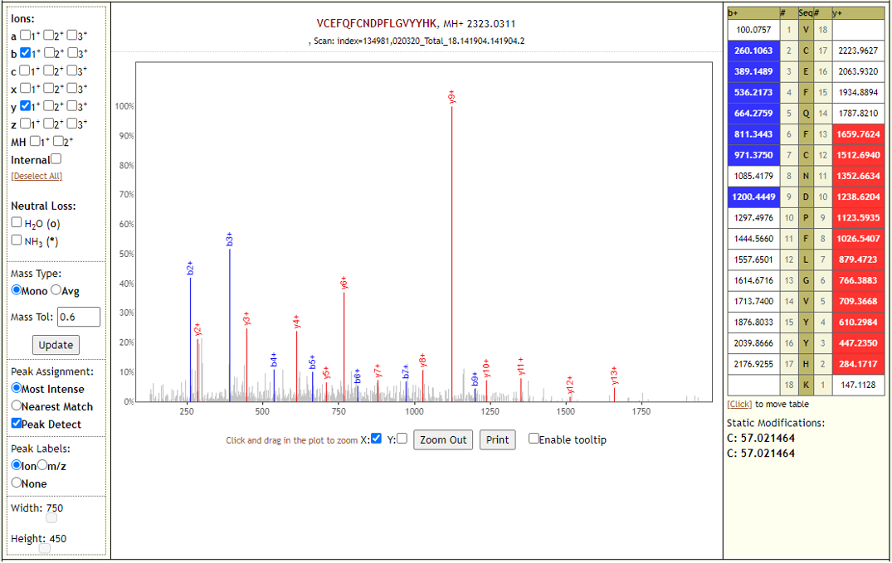
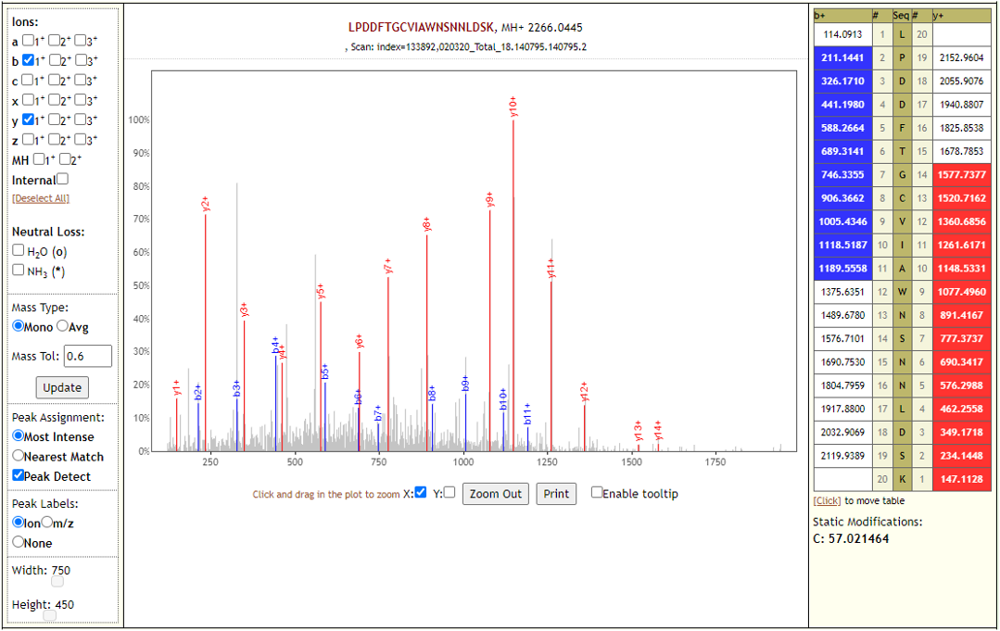
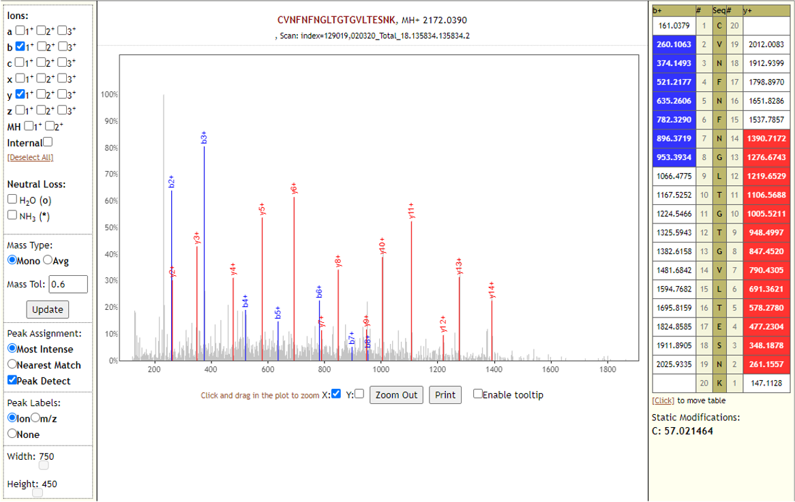
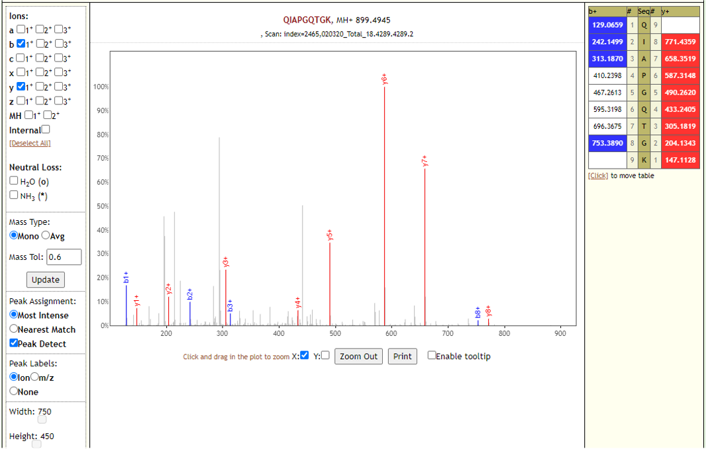

# Proteomics analysis of SARS-CoV-2 infected cell culture samples

## Live Resources

| usegalaxy.eu |
|:--------:|:------------:|:------------:|:------------:|:------------:|
| <FlatShield label="Input data" message="view" href="https://usegalaxy.eu/u/pratikjagtap/h/pxd018241-inputs-for-pepquery-and-lorikeet-09022020-analysis" alt="Raw data" /> |
| <FlatShield label="PXD018241 history1" message="view" href="https://usegalaxy.eu/u/pratikjagtap/h/1pxd018241-dataset-collection-search-for-raw01and02-pepquery-and-lorikeet-analysis-09092020 " alt="Galaxy history" /> |
| <FlatShield label="PXD018241 history2" message="view" href="https://usegalaxy.eu/u/pratikjagtap/h/2pxd018241-dataset-collection-search-for-raw-3and4-pepquery-and-lorikeet-analysis " alt="Galaxy history" /> |
| <FlatShield label="PXD018241 history3" message="view" href="https://usegalaxy.eu/u/pratikjagtap/h/3pxd018241-dataset-collection-search-for-raw5and6-pepquery-and-lorikeet-analysis-09092020  " alt="Galaxy history" /> |
| <FlatShield label="PXD018241 history4" message="view" href="https://usegalaxy.eu/u/pratikjagtap/h/4pxd018241-dataset-collection-search-for-raw7-8-pepquery-and-lorikeet-analysis-09072020 " alt="Galaxy history" /> |
| <FlatShield label="PXD018241 history5" message="view" href="https://usegalaxy.eu/u/pratikjagtap/h/5pxd018241-dataset-collection-search-for-raw9and10-pepquery-and-lorikeet-analysis  " alt="Galaxy history" /> |
| <FlatShield label="PXD018241 history6" message="view" href="https://usegalaxy.eu/u/pratikjagtap/h/6pxd018241-search-for-raw-11-12-pepquery-and-lorikeet-analysis-09112020  " alt="Galaxy history" /> |
| <FlatShield label="PXD018241 history7" message="view" href="https://usegalaxy.eu/u/pratikjagtap/h/7pxd018241-dataset-collection-search-for-13and14-pepquery-and-lorikeet-analysis-09072020     " alt="Galaxy history" /> |
| <FlatShield label="PXD018241 history8" message="view" href="https://usegalaxy.eu/u/pratikjagtap/h/8apxd018241-search-for-raw15-pepquery-and-lorikeet-analysis-09102020   " alt="Galaxy history" /> |
| <FlatShield label="PXD018241 history9" message="view" href="https://usegalaxy.eu/u/pratikjagtap/h/8bpxd018241-dataset-search-for-raw-16-pepquery-and-lorikeet-analysis-09092020  " alt="Galaxy history" /> |
| <FlatShield label="PXD018241 history10" message="view" href="https://usegalaxy.eu/u/pratikjagtap/h/9pxd018241-dataset-collection-search-for-17and18-pepquery-and-lorikeet-analysis   " alt="Galaxy history" /> |
| <FlatShield label="PXD018241 history11" message="view" href="https://usegalaxy.eu/u/pratikjagtap/h/10pxd018241-dataset-collection-search-for-raw19and20-pepquery-and-lorikeet-analysis " alt="Galaxy history" /> |
| <FlatShield label="workflow" message="run" href="https://usegalaxy.eu/u/pratikjagtap/w/imported-single-dataset-pxd018241-workflow-for-pq-and-lk08222020" /> |

## Description

**[Davidson et al](https://genomemedicine.biomedcentral.com/articles/10.1186/s13073-020-00763-0)** used SARS-CoV-2 grown in Vero E6 cells to propagate the novel coronavirus and generate viral transcriptome and tandem mass spectrometry was used to investigate the proteome and phosphoproteome of the virally infected cells. The transcriptome was usedas an input for an ORF-centric pipeline.Their analysis detected a 24 nt in-frame deletion in mRNA encoding the spike (S) glycoprotein 
and was predicted to remove a proposed furin cleavage site from the S glycoprotein. Tandem mass spectrometry identified over 500 viral
peptides and 44 phosphopeptides in virus-infected cells, covering almost all proteins predicted to be encoded by the SARS-CoV-2 genome, 
including peptides unique to the deleted variant of the S glycoprotein. Mass spectrometry data was acquired on an Orbitrap Fusion Lumos mass spectrometer (Thermo Scientific) in data-dependent acquisition mode and deposited in ProteomeXchange repository ([PXD018241](ftp://ftp.pride.ebi.ac.uk/pride/data/archive/2020/03/PXD018241)). We were interested in using the mass spectrometry dataset and searching it against the viral proteome to detect viral peptides from these samples. 

## Workflow

The Galaxy workflow includes RAW data conversion to MGF and mzML format. The MGF files are searched against the combined database of Human 
Uniprot proteome, contaminant proteins and SARS-Cov-2 proteins database using X!tandem, MSGF+, OMSSA search algorithms with SearchGUI and FDR 
and protein grouping using PeptideShaker. This resulted in detection of 579 peptides from SARS-CoV-2 proteins. The detected peptides were 
searched against NCBInr to ascertain that these peptides were specific to SARS-CoV-2 proteins. The detected peptides were later subjected 
to analysis by PepQuery and Lorikeet to ascertain the quality of peptide identification.

## Results

The COVID-19 positive patient samples detected 579 peptides from SARS-CoV-2 proteins. Few Lorikeet spectra of the detected peptides are shown below. 

