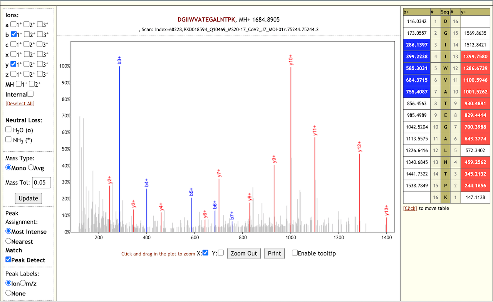
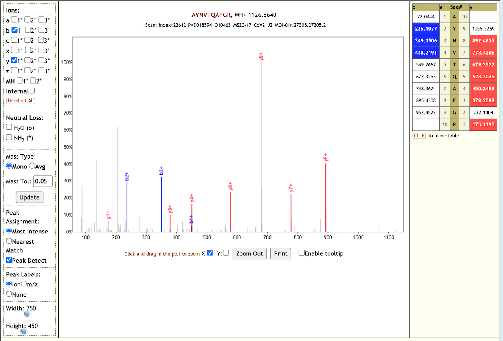
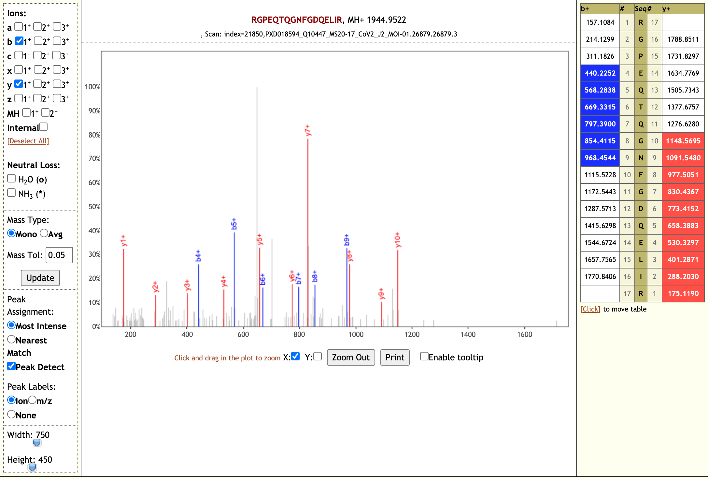
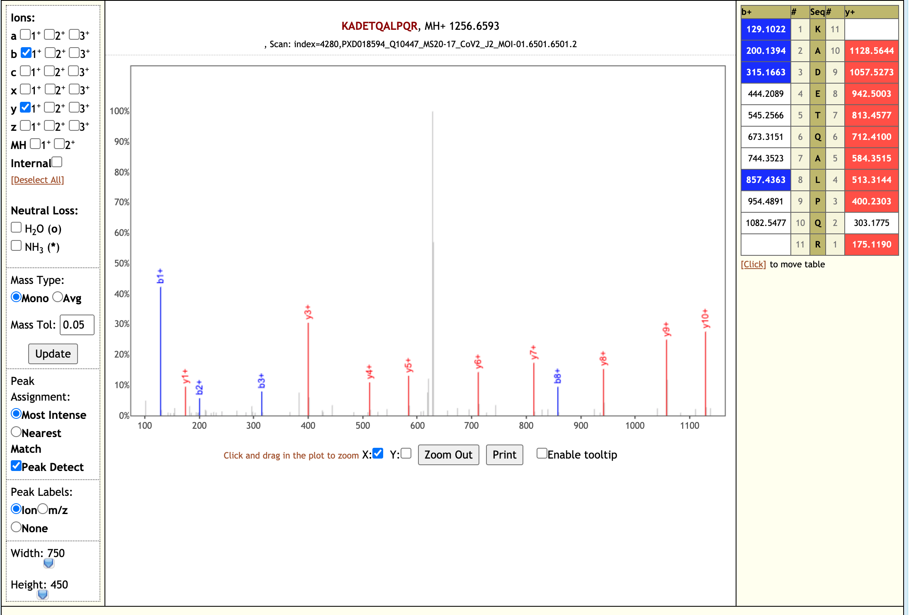

# Proteomics analysis of time-course data from SARS-CoV-2 infected cell culture samples

## Live Resources

| usegalaxy.eu |
|:--------:|:------------:|:------------:|:------------:|:------------:|
| <FlatShield label="Input data" message="view" href="https://usegalaxy.eu/u/pratikjagtap/h/pxd018594inputsforpqlk" alt="Raw data" /> |
| <FlatShield label="PXD018241 history1" message="view" href="https://usegalaxy.eu/u/pratikjagtap/h/pxd018594searchforpepquery-and-lorikeet-analysis " alt="Galaxy history" /> |
| <FlatShield label="workflow" message="run" href="https://usegalaxy.eu/u/pratikjagtap/w/dataset-collection-pxd018594-workflow-for-pq-and-lk-08222020" /> |

## Description

**[Grenga et al](http://europepmc.org/article/MED/32619390)**. were concerned with the need for generating the optimal amount of viral particles in the laboratory setting with the aim of generating the most effective vaccines possible against whole SARS-Cov-2 viral particles. In addition, they were interested in probing the temporal changes to the host proteome with infection with the aim of elucidating therapeutic targets. To these ends, Vero E6 cells were infected by Italy-INMI1 SARS-CoV-2 virus to define the kinetics of whole viral particle production. Cells were infected with two multiplicities of infection (MOI = .01, 0.001) and subsequently harvested at multiple time points (Day 1, 2, 3, 4, and 7) past infection.
In their analyses Grenga et al. found that in both cases that peak viral protein production occurred at approximately three days after infection, with six viral proteins being identified (the structural proteins N, S, and M as well as the protease coded by ORF1a as well as the accessory proteins coded by ORF3a and ORF7a). In examining the host proteome, it was found that the total expression patterns of all proteins formed discrete clusters by day harvested, with Day 1 and Day 7 being the most unique; furthermore, examination of the proteins within each MOI showed distinct clusters of temporal expression corresponding to particular functionalities.   
After harvesting the infected cells, autoclaving was used to lyse the cells as well as inactivate the virus. Proteins were then extracted and run on SDS-PAGE gels for a short migration, followed by in-gel digestion with trypsin. Peptides were then isolated and analyzed using data-dependent acquisition mode on a Q-Exactive HF Orbitrap mass spectrometer and the data analyzed using label-free quantitation. The resulting data was stored publicly at the ProteomeXchange repository ([PXD018594](https://www.ebi.ac.uk/pride/archive/projects/PXD018594)). For our analyses we used the 0.1 MOI dataset to detect viral peptides from these samples. 

## Workflow

The Galaxy workflow includes RAW data conversion to MGF format. The MGF files are searched against the combined database of Human Uniprot proteome, contaminant proteins and SARS-Cov-2 proteins database using X!tandem, MSGF+, OMSSA search algorithms with SearchGUI and False Discovery Rate (FDR) and Protein grouping using PeptideShaker. This resulted in detection of 99 peptides from SARS-CoV-2 proteins. The detected peptides were later subjected to analysis by PepQuery and Lorikeet to ascertain the quality of peptide identification. The peptides were later searched against NCBInr to ascertain that these peptides were specific to SARS-CoV-2 proteins. 

## Results

The COVID-19 positive patient samples detected 99 peptides from SARS-CoV-2 proteins. Here are a few lorikeet spectra of the detected peptides.

