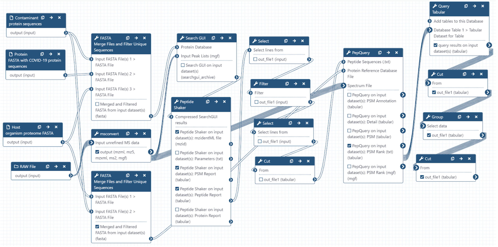

# Proteomics analysis of time-course data from SARS-CoV-2 infected cell culture samples

## Live Resources

| usegalaxy.eu |
|:--------:|:------------:|:------------:|:------------:|:------------:|
| <FlatShield label="Input data" message="view" href="https://usegalaxy.eu/u/pratikjagtap/h/pxd018594inputsforpqlk " alt="Raw data" /> |
| <FlatShield label="PXD018594 history" message="view" href="https://usegalaxy.eu/u/pratikjagtap/h/pxd018594searchforpepquery-and-lorikeet-analysis " alt="Galaxy history" /> |
| <FlatShield label="workflow" message="run" href="https://usegalaxy.eu/u/pratikjagtap/w/dataset-collection-pxd018594-workflow-for-pq-and-lk-08222020" /> |

## Description

## Workflow

The Galaxy workflow includes RAW data conversion to MGF format. The MGF files are searched against the combined database of Human Uniprot proteome, 
contaminant proteins and SARS-Cov-2 proteins database using X!tandem, MSGF+, OMSSA search algorithms with SearchGUI and False Discovery Rate (FDR) 
and Protein grouping using PeptideShaker. This resulted in detection of 99 peptides from SARS-CoV-2 proteins. The detected peptides were later subjected 
to analysis by PepQuery and Lorikeet to ascertain the quality of peptide identification. The peptides were later searched against NCBInr to ascertain 
that these peptides were specific to SARS-CoV-2 proteins. 

## Results

The COVID-19 positive patient samples detected 579 peptides from SARS-CoV-2 proteins.

