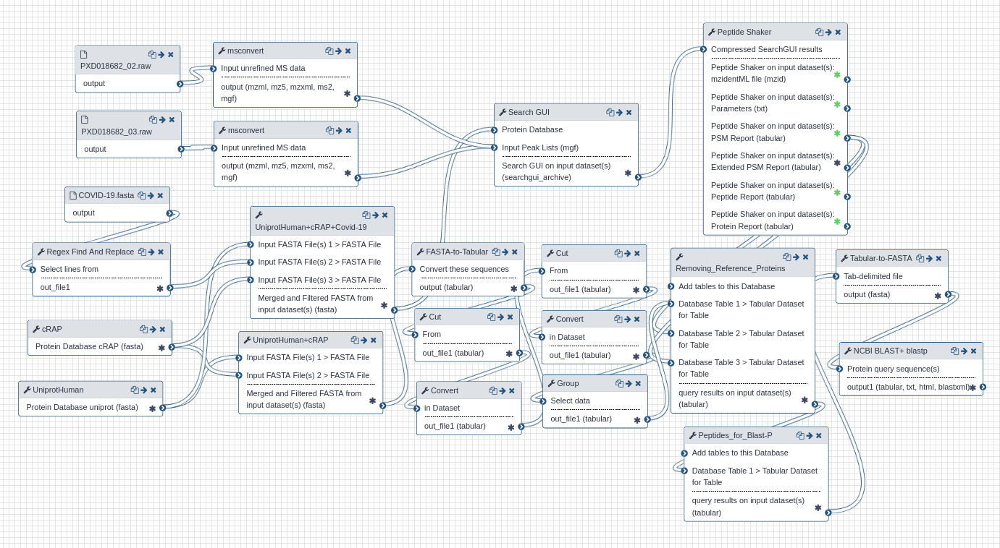

# Proteomics analysis of Gargling samples from CoviD-19 infected patients

## Live Resources

| usegalaxy.eu |
|:--------:|:------------:|:------------:|:------------:|:------------:|
| <FlatShield label="data" message="view" href="https://usegalaxy.eu/library/list#folders/F61b36ed9cec77ec5" alt="Raw data" /> |
| <FlatShield label="PDX018682 history" message="view" href="https://usegalaxy.eu/u/subina/h/covid-19pxd018682" alt="Galaxy history" /> |
| <FlatShield label="workflow" message="run" href="https://usegalaxy.eu/u/subina/w/covid-19pxd018682workflow" alt="Galaxy workflow" /> |

## Description

Ihling et al present a protein MS-based ‘proof-of-principle’ method to detect SARS-CoV-2 virus proteins from gargle samples from COVID-19 patients.
Their protocol consists of an acetone precipitation step, followed by tryptic digestion of gargle solution proteins, followed by MS analysis.
In the original manuscript, the authors detect peptides from SARS-CoV-2 virus proteins and present evidence for their spectral annotation.
This study is an initiative in developing a  routine MS-based diagnostic method for COVID-19 patients.

## Workflow

The Galaxy workflow includes RAW data conversion to MGF and mzML format. The MGF files are searched against the combined database of Human
Uniprot proteome, contaminant proteins and SARS-Cov-2 proteins database using X!tandem, MSGF+, OMSSA search algorithms with SearchGUI
and FDR and protein grouping using PeptideShaker. This resulted in detection of nine peptides from SARS-CoV-2 proteins.
The detected peptides were searched against NCBInr to ascertain that these peptides were specific to SARS-CoV-2 proteins.
The detected peptides were later subjected to analysis by PepQuery and Lorikeet to ascertain the quality of peptide identification.
