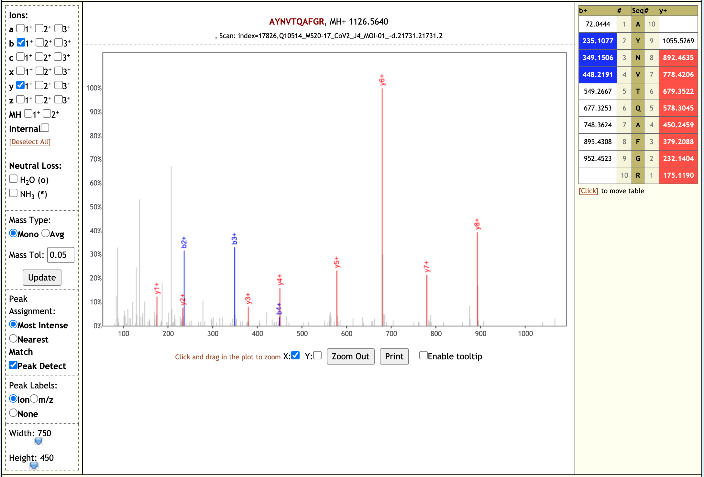

# Deep proteomic analysis of CoviD-19 virus infected Vero cells.

## Live Resources

| usegalaxy.eu |
|:--------:|:------------:|:------------:|:------------:|:------------:|
| <FlatShield label="data" message="view" href="https://usegalaxy.eu/u/pratikjagtap/h/pxd018804inputsforpqlk" alt="Raw data" /> |
| <FlatShield label="workflow" message="run" href="https://usegalaxy.eu/u/pratikjagtap/w/dataset-collection-pxd018804-workflow-for-pq-and-lk-08222020" alt="Galaxy workflow" /> |
| <FlatShield label="PDX018804-Q10486-90 history" message="view" href="https://usegalaxy.eu/u/pratikjagtap/h/pxd018804-search-for-pepquery-and-lorikeet-analysis-1 " alt="Galaxy history" /> |

## Description

[Gouveia et al](https://onlinelibrary.wiley.com/doi/abs/10.1002/pmic.202000107) processed SARS-CoV-2 infected Vero cells to
generate a high-resolution mass spectrometry dataset.

The original study proposes a list of experimentally observed peptides for their possible use in targeted method development.
The bioinformatic workflow used a stepwise search wherein a first search against contaminant and bovine proteins was used to
eliminate spectra that were associated with any adventitious proteins. In the second step, the data was searched against
the protein database with Chlorocebus sequences and the Italy-INMI1 SARS-CoV-2 sequences to detect SARS-CoV-2 peptides.
The peptides detected from six viral proteins were further analyzed for their proteotypicity and specificity.

## Workflow

The Galaxy workflow presented here follows most of the original workflow, wherein RAW data is initially
converted to MGF and mzML format. The MGF files are searched against the contaminant database using X!tandem,
MSGF+, OMSSA and C search algorithms. Later, spectra associated with adventitious proteins were eliminated
using MSMS Extractor. In the second step, the dataset was searched against the protein database with
Chlorocebus sequences and the Italy-INMI1 SARS-CoV-2 sequences. 

## Results

Our workflow analysis resulted in detection of 139 peptides from six SARS-CoV-2 proteins. 
The detected peptides were later subjected to analysis by PepQuery and Lorikeet to ascertain the quality of peptide identification, few of the spectral visualization are shown below.

