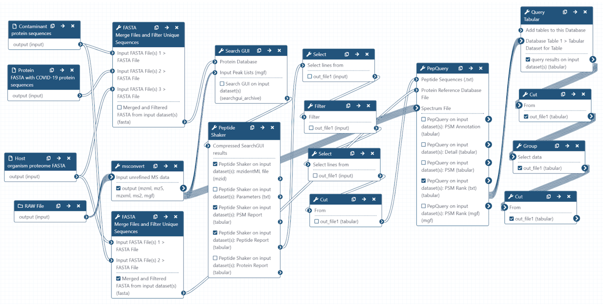

# Proteomics analysis of respiratory tract samples from CoviD-19 infected patients

## Live Resources

| usegalaxy.eu |
|:--------:|:------------:|:------------:|:------------:|:------------:|
| <FlatShield label="Input data" message="view" href="https://usegalaxy.eu/u/pratikjagtap/h/pxd019119inputcovid19pqlk " alt="Raw data" /> |
| <FlatShield label="PXD019119 history" message="view" href="https://usegalaxy.eu/u/pratikjagtap/h/pxd019119searchcovid19pqlk-09032020" alt="Galaxy history" /> |
| <FlatShield label="workflow" message="run" href="https://usegalaxy.eu/u/pratikjagtap/w/imported-imported-pxd019119-workflow-for-pq-and-lk-08202020" /> |

## Description

**[Cardozo et al](https://www.researchsquare.com/article/rs-28883/v1)** collected bottom-up mass spectrometry (MS) data on respiratory tract samples from ten COVID-19 positive patient samples. 
Data-dependent acquisition MS spectra were acquired using hybrid quadrupole-Orbitrap tandem mass spectrometry. The MS data was used to 
generate a spectral library of targeted COVID-19 peptides for targeted MS assay for clinical samples.

## Workflow

The Galaxy workflow includes RAW data conversion to MGF and mzML format. The MGF files are searched against the combined database of 
Human Uniprot proteome, contaminant proteins and SARS-Cov-2 proteins database using X!tandem, MSGF+, OMSSA search algorithms with 
SearchGUI and FDR and protein grouping using PeptideShaker. This resulted in detection of 71 peptides from SARS-CoV-2 proteins. 
The detected peptides were searched against NCBInr to ascertain that these peptides were specific to SARS-CoV-2 proteins. 
The detected peptides were later subjected to analysis by PepQuery and Lorikeet to ascertain the quality of peptide identification.

## Results

We detected 71 COVID-19 peptides from all pooled samples in the respiratory tract datasets. The peptides were subjected to BLAST-P and
Lorikeet analysis to ascertain the validity of peptide spectral matches.

|                   | Pool 18 | Pool 34 | Pool 38 |  Pool 47 | Pool 51 |
|-------------------|:-------:|:-------:|:-------:|:--------:|:-------:|
| COVID-19 Peptides |    12   |    60   |    21   |    59    |    40   |

