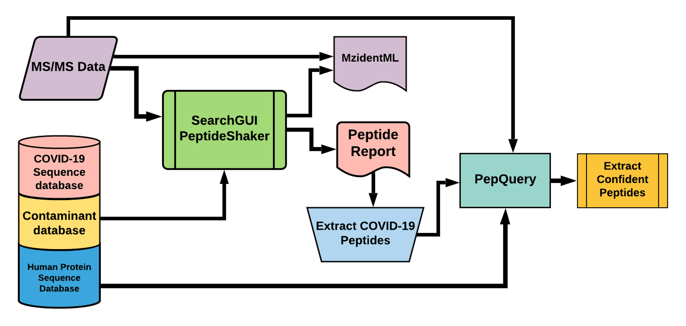
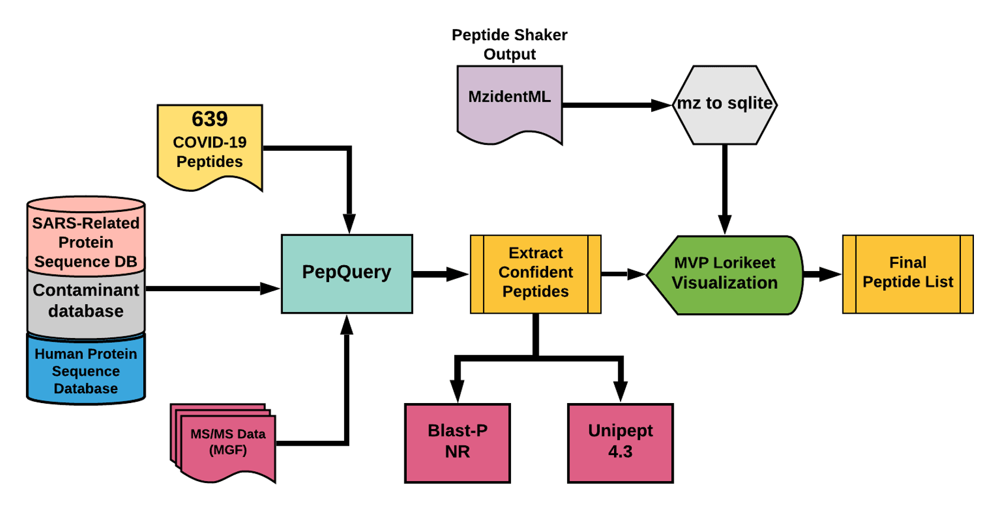
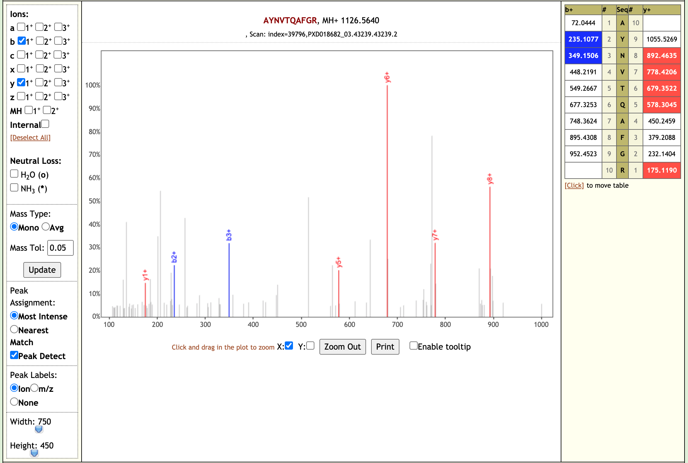
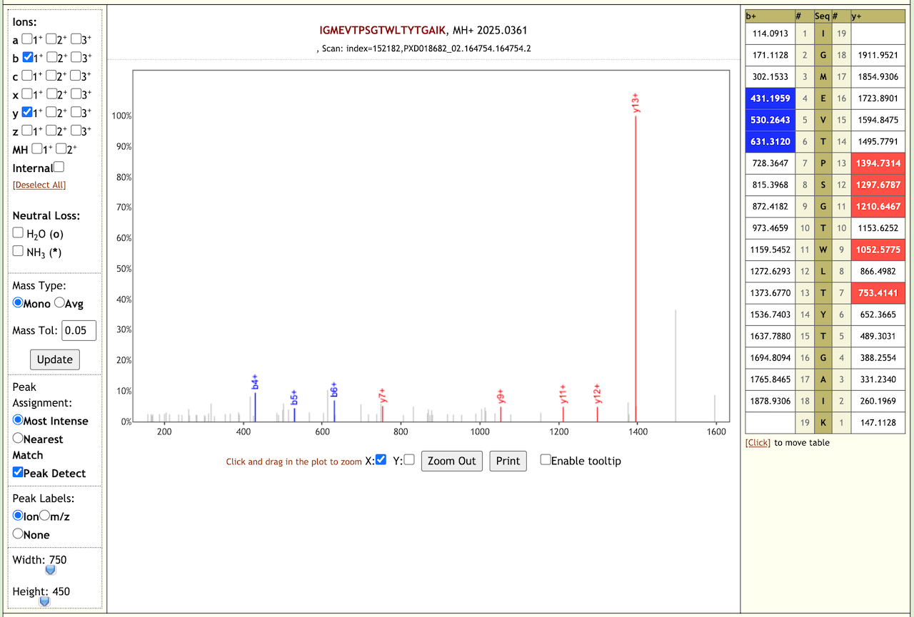
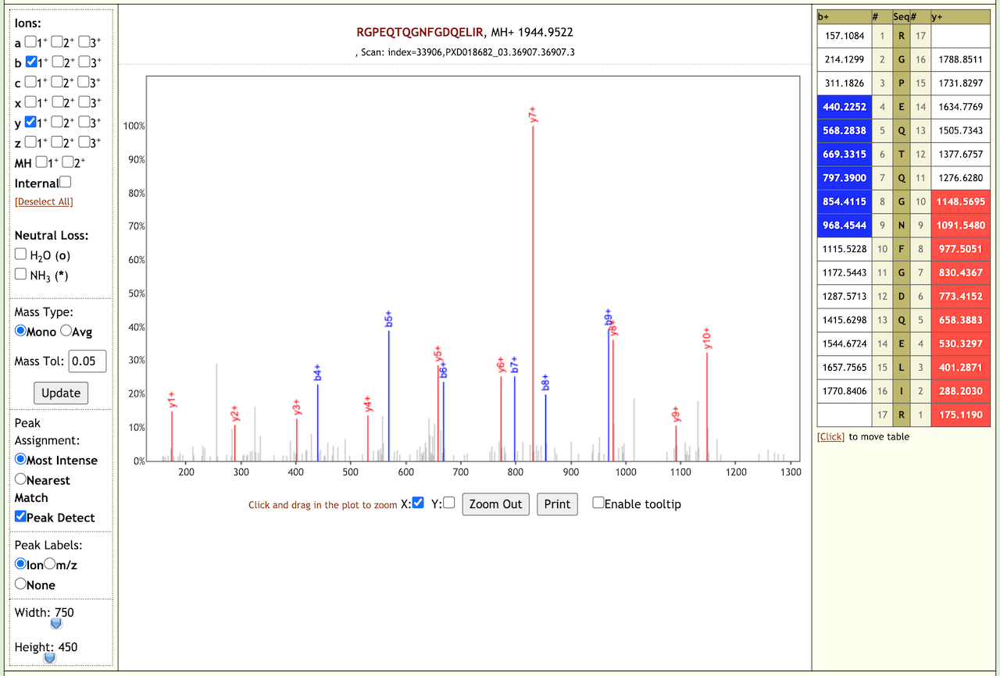
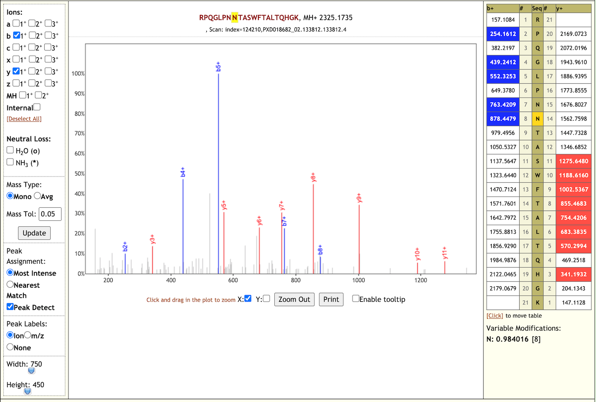

# Proteomics analysis of Gargling samples from CoviD-19 infected patients

## Live Resources

| usegalaxy.eu |
|:--------:|:------------:|:------------:|:------------:|:------------:|
| <FlatShield label="PXD019423 inputs" message="view" href="https://proteomics.usegalaxy.eu/u/pratikjagtap/h/inputs-pxd019423-peptide-validation-11222020" alt="Raw data" /> |
| <FlatShield label="PXD019423 Database search history" message="view" href="https://usegalaxy.eu/u/pratikjagtap/h/pxd019423-search-for-pepquery-lorikeet-ds-09012020" alt="Galaxy history" /> |
| <FlatShield label="PXD019423 Database search workflow" message="run" href="https://usegalaxy.eu/u/pratikjagtap/w/dataset-collection-pxd019423-workflow-for-pq-and-lk-08202020" alt="Galaxy workflow" /> |
| <FlatShield label="PDX019423 Peptide validation history" message="view" href="https://proteomics.usegalaxy.eu/u/pratikjagtap/h/outputs-pxd019423-peptide-validation-11222020" alt="Galaxy history" /> |
| <FlatShield label="workflow" message="run" href="https://proteomics.usegalaxy.eu/u/pratikjagtap/w/workflow-for-pxd019423-covid-19-peptide-validation" alt="Galaxy workflow" /> |

## Description

Ihling et al present a protein MS-based ‘proof-of-principle’ method to detect SARS-CoV-2 virus proteins from gargle samples from COVID-19 patients.
Their protocol consists of an acetone precipitation step, followed by tryptic digestion of gargle solution proteins, followed by MS analysis.
In the original manuscript, the authors detect peptides from SARS-CoV-2 virus proteins and present evidence for their spectral annotation.
This study is an initiative in developing a  routine MS-based diagnostic method for COVID-19 patients.

## Workflow

The Galaxy workflow includes RAW data conversion to MGF and mzML format. The MGF files are searched against the combined database of Human
Uniprot proteome, contaminant proteins and SARS-Cov-2 proteins database using X!tandem, MSGF+, OMSSA search algorithms with SearchGUI
and FDR and protein grouping using PeptideShaker. This resulted in detection of nine peptides from SARS-CoV-2 proteins.

The detected peptides were searched against NCBInr to ascertain that these peptides were specific to SARS-CoV-2 proteins. Also, the detected peptides were subjected to analysis by PepQuery and Lorikeet to ascertain the quality of peptide identification.

## Results

The database search workflow yielded us 8 COV-2 peptides from the second and third raw files.

When we performed the validation search using PepQuery it gave us 21 COV-2 peptides. We also checked the Lorikeet spectra of these peptides. Here are some examples of the Lorikeet spectra using the Multiomics visualization tool in the Galaxy platform.

