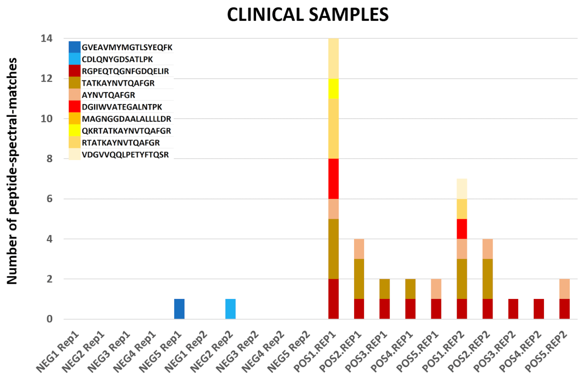

# Proteomics analysis of naso-pharyngeal swabs samples from COVID-19 infected and non-infected individuals

## Live Resources

| usegalaxy.eu |
|:--------:|:------------:|:------------:|:------------:|:------------:|
| <FlatShield label="Input Negative data" message="view" href="https://usegalaxy.eu/u/pratikjagtap/h/pxd020394-inputs-for-negative-samples-sg-ps-and-pq  " alt="Raw data" /> |
| <FlatShield label="Input Positive data" message="view" href="https://usegalaxy.eu/u/pratikjagtap/h/pxd020394-inputs-for-positive-samples-sg-ps--pq  " alt="Raw data" /> |
| <FlatShield label="PXD020394 history" message="view" href="https://usegalaxy.eu/u/pratikjagtap/h/pxd020394-outputs-for-negative-samples-sg-ps-and-pq" alt="Galaxy history" /> |
| <FlatShield label="PXD020394 history" message="view" href="https://usegalaxy.eu/u/pratikjagtap/h/pxd020394-outputs-for-positive-samples-sg-ps--pq " alt="Galaxy history" /> |
| <FlatShield label="workflow" message="run" href="https://usegalaxy.eu/u/pratikjagtap/w/copy-of-dataset-collection-pxd018241-workflow-for-pq-and-lk-09022020 " /> |

## Description

**[Rivera et al](https://www.sciencedirect.com/science/article/pii/S2352340920310155)** performed comparative quantitative proteomic analysis from oro- and naso-pharyngeal swabs used for COVID-19 diagnosis. 
Tryptic peptides obtained from five COVID-19 positive and five COVID-19 negative samples were analysed by LC-MS/MS using a Q-Exactive 
Plus mass spectrometer. The mass spectrometry (MS) data was made available via ProteomeXchange ([PXD020394](http://proteomecentral.proteomexchange.org/cgi/GetDataset?ID=PXD020394)) so as to facilitate the 
use of MS-based approaches for COVID-19 diagnosis.

## Workflow

The Galaxy workflow includes RAW data conversion to MGF and mzML format. The MGF files are searched against the combined database of 
Human Uniprot proteome, contaminant proteins and SARS-Cov-2 proteins database using X!tandem, MSGF+, OMSSA search algorithms with 
SearchGUI and FDR and protein grouping using PeptideShaker. This resulted in detection of ten peptides from SARS-CoV-2 proteins.
The detected peptides were searched against NCBInr to ascertain that these peptides were specific to SARS-CoV-2 proteins. 
The detected peptides were later subjected to analysis by PepQuery and Lorikeet to ascertain the quality of peptide identification.

## Results

The COVID-19 positive patient samples detected peptides from SARS-CoV-2 proteins (see below). COVID-19 negative samples also detected 
two peptides from COVID-19 proteins - however Lorikeet analysis showed that the spectral evidence for these peptides did not support 
the peptide-spectral-match.

