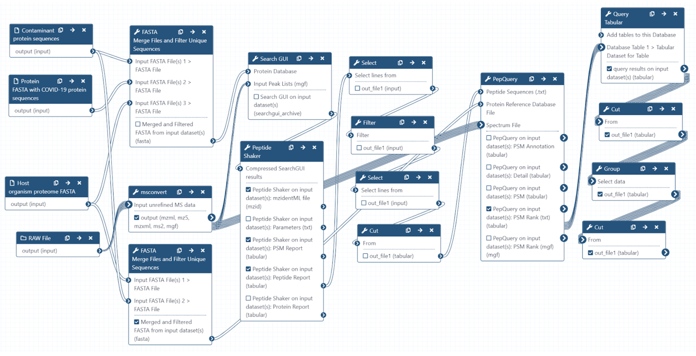
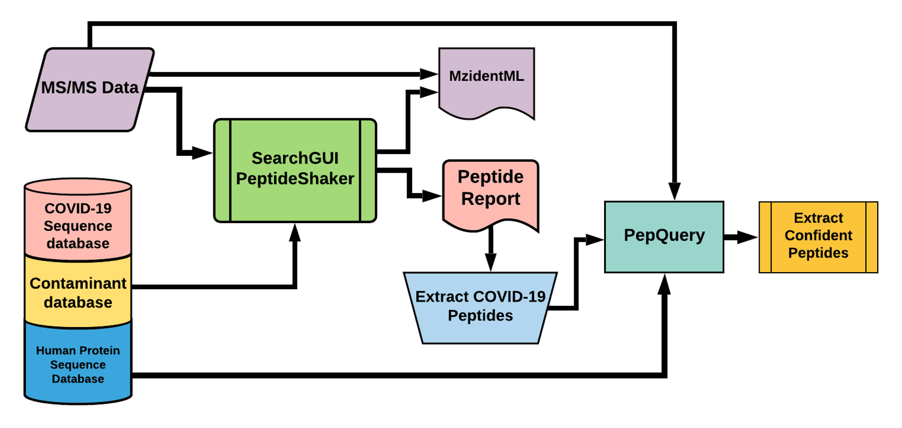
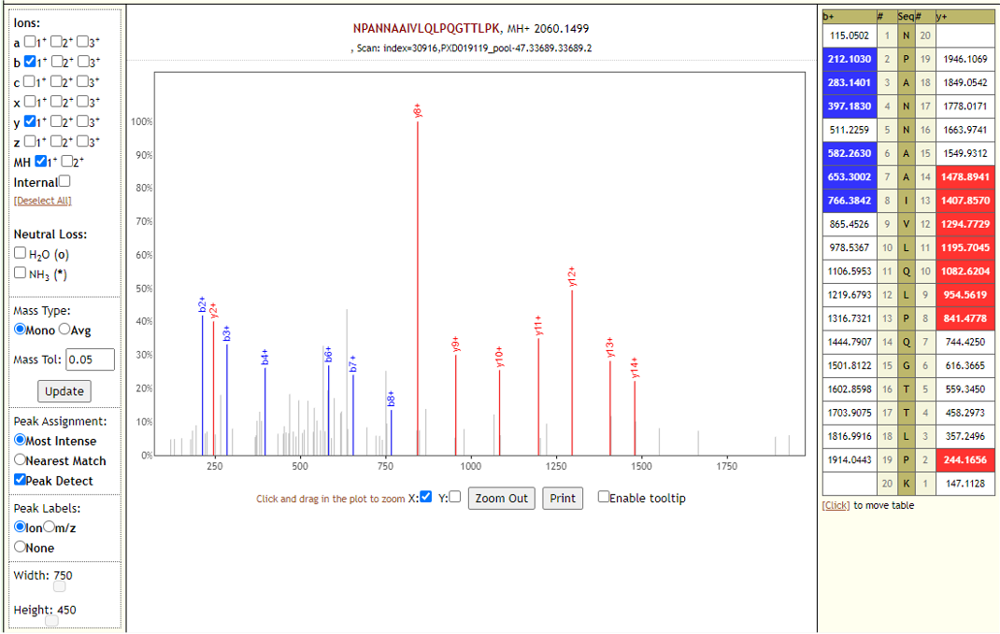
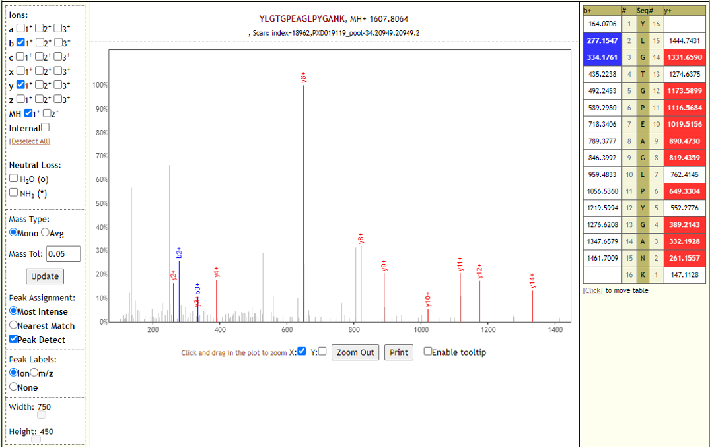
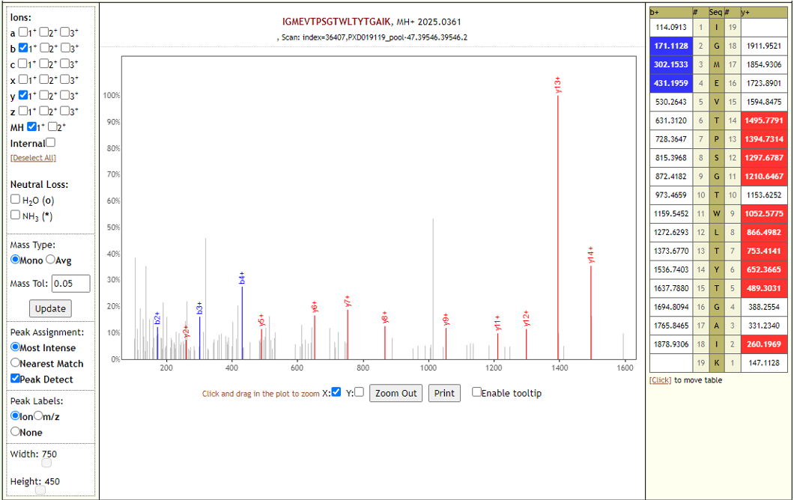

# Proteomics analysis of respiratory tract samples from CoviD-19 infected patients

## Live Resources

| usegalaxy.eu |
|:--------:|:------------:|:------------:|:------------:|:------------:|
| <FlatShield label="Input data for Peptide Search" message="view" href="https://usegalaxy.eu/u/pratikjagtap/h/pxd019119inputcovid19pqlk " alt="Raw data" /> |
| <FlatShield label="Peptide Search workflow" message="run" href="https://usegalaxy.eu/u/pratikjagtap/w/imported-imported-pxd019119-workflow-for-pq-and-lk-08202020" /> |
| <FlatShield label="PXD021328 DBsearch history" message="view" href="https://usegalaxy.eu/u/pratikjagtap/h/pxd021328-outputs-covid10-peptide-search-11222020 " alt="Galaxy history" /> |
| <FlatShield label="Input data for Peptide Validation" message="view" href="https://proteomics.usegalaxy.eu/u/pratikjagtap/h/outputs-pxd021328-covid-19-peptide-validation-11222020" alt="Raw data" /> |
| <FlatShield label="Peptide Validation workflow" message="run" href="https://proteomics.usegalaxy.eu/u/pratikjagtap/w/workflow-for-pxd021328-covid-19-peptide-validation-test" /> |
| <FlatShield label="PXD021328 Validation history" message="view" href="https://proteomics.usegalaxy.eu/u/pratikjagtap/h/outputs-pxd021328-covid-19-peptide-validation-11222020" alt="Galaxy history" /> |

## Description

**[Cardozo et al](https://www.researchsquare.com/article/rs-28883/v1)** collected bottom-up mass spectrometry (MS) data on respiratory tract samples from ten COVID-19 positive patient samples. 
Data-dependent acquisition MS spectra were acquired using hybrid quadrupole-Orbitrap tandem mass spectrometry. The MS data was used to 
generate a spectral library of targeted COVID-19 peptides for targeted MS assay for clinical samples.

## Workflow

The Galaxy workflow includes RAW data conversion to MGF and mzML format. The MGF files are searched against the combined database of 
Human Uniprot proteome, contaminant proteins and SARS-Cov-2 proteins database using X!tandem, MSGF+, OMSSA search algorithms with 
SearchGUI and FDR and protein grouping using PeptideShaker. This resulted in detection of 76 peptides from SARS-CoV-2 proteins. 

The detected peptides were searched against NCBInr to ascertain that these peptides were specific to SARS-CoV-2 proteins. 
Then, these peptides were later subjected to analysis by PepQuery and Lorikeet to ascertain the quality of peptide identification.

## Results

We detected 76 COVID-19 peptides from all pooled samples using the first workflow and our validation study showed us that we could validate the presence of 70 peptides from SARS-CoV-2 proteins. 

|                   | Pool 18 | Pool 34 | Pool 38 |  Pool 47 | Pool 51 |
|-------------------|:-------:|:-------:|:-------:|:--------:|:-------:|
| COVID-19 Peptides |    12   |    60   |    21   |    59    |    40   |

Lorikeet analysis of few of the peptides are shown below.

