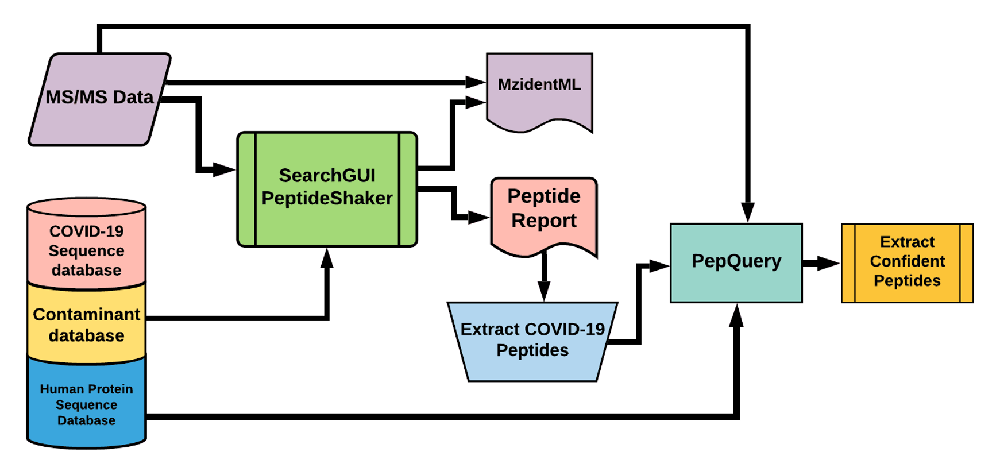

# Proteomic re-analysis of bronchoalveolar lavage fluid in COVID-19 patients

## Live Resources

| usegalaxy.eu |
|:--------:|:------------:|:------------:|:------------:|:------------:|
| <FlatShield label="Input data" message="view" href="https://usegalaxy.eu/u/subina/h/pxd022085inputfiles" alt="Raw data" /> |
| <FlatShield label="PXD022085 history" message="view" href="https://usegalaxy.eu/u/arajczewski/h/imported-pxd022085-balf-samples-2" alt="Galaxy history" /> |
| <FlatShield label="workflow" message="run" href="https://usegalaxy.eu/u/arajczewski/w/imported-workflow-for-covid-19-peptide-validation-pxd018094-and-pxd022085" /> |

## Description

**[Zeng lab](https://www.iprox.org/page/subproject.html?id=IPX0002429001)** collected bottom-up mass spectrometry (MS) data on bronchoalveolar lavage fluid in COVID-19 positive patient samples with respiratory failure. 
Data-dependent acquisition MS spectra were acquired using Q Exactive HF-X mass spectrometer coupled with an EASY-nLC 1200 system and a nano-electrospray ion source. 

## Workflow

The Galaxy workflow includes RAW data conversion to MGF and mzML format. The MGF files are searched against the combined database of 
Human Uniprot proteome, contaminant proteins and SARS-Cov-2 proteins database using PepQuery Validation workflow. This resulted in detection of 88 peptides from SARS-CoV-2 proteins. The detected peptides were searched against NCBInr to ascertain that these peptides were specific to SARS-CoV-2 proteins. 
The detected peptides were later subjected to analysis by Lorikeet visualization to ascertain the quality of peptide identification. 

Our Database search workflow did not detect any SARS-CoV2 peptides from both positive and negative samples.

## Results

We detected 36 COVID-19 peptides from all pooled samples in the respiratory tract datasets, We detected 25 SARS-CoV2 peptides from positive patients , 11 SARS-CoV2 peptides from negative patient samples. The peptides were subjected to BLAST-P andLorikeet analysis to ascertain the validity of peptide spectral matches.

