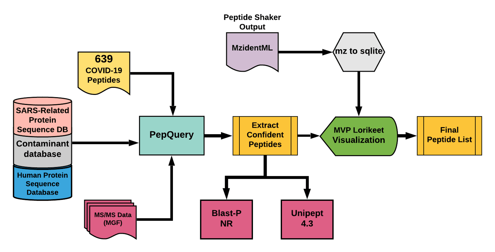

# Proteomic re-analysis of upper respiratory tract clinical samples 

## Live Resources

| usegalaxy.eu |
|:--------:|:------------:|:------------:|:------------:|:------------:|
| <FlatShield label="Input data" message="view" href="https://usegalaxy.eu/u/subina/h/pxd025214-positive-and-negative-input-samples " alt="Raw data" /> |
| <FlatShield label="PXD025214 Positive sample history" message="view" href="https://usegalaxy.eu/u/arajczewski/h/pxd025214-positive-samples-07april2021" alt="Galaxy history" /> |
| <FlatShield label="PXD025214 Negative samplehistory" message="view" href="https://usegalaxy.eu/u/arajczewski/h/pxd025214-negative-samples-07april2021" alt="Galaxy history" /> |
| <FlatShield label="workflow" message="run" href="https://usegalaxy.eu/u/arajczewski/w/covid19-pepquery-validation-07april2021" /> |

## Description

**[Carvalho lab](http://proteomecentral.proteomexchange.org/cgi/GetDataset?ID=PXD025214)** performed shotgun proteomics analysis of upper respiratory samples of patients.
Data-dependent acquisition MS spectra were acquired using Q Exactive HF-X mass spectrometer coupled with an UltiMate 3000 Nano LC system via EASY-spray positive ion source. 

## Workflow

The Galaxy workflow includes RAW data conversion to MGF and mzML format. The MGF files are searched against the combined database of 
Human Uniprot proteome, contaminant proteins and SARS-Cov-2 proteins database using PepQuery Validation workflow. This resulted in detection of 39 peptides from SARS-CoV-2 proteins. The detected peptides were searched against NCBInr to ascertain that these peptides were specific to SARS-CoV-2 proteins. 
The detected peptides were later subjected to analysis by Lorikeet visualization to ascertain the quality of peptide identification. 

## Results

We detected 39 COVID-19 peptides from all pooled samples in the upper respiratory tract datasets. We detected 39 SARS-CoV2 peptides from positive patients , 9 SARS-CoV2 peptides from negative patient samples. The peptides were subjected to BLAST-P andLorikeet analysis to ascertain the validity of peptide spectral matches. The validation of the spectral quality showed the presence of the peptides "**MAGNGGDAALALLLLDR**", "**DGIIWVATEGALNTPK**", "**RGPEQTQGNFGDQELIR**", and "**IGMEVTPSGTWLTYTGAIK**" in COVID-19 positive patients.

