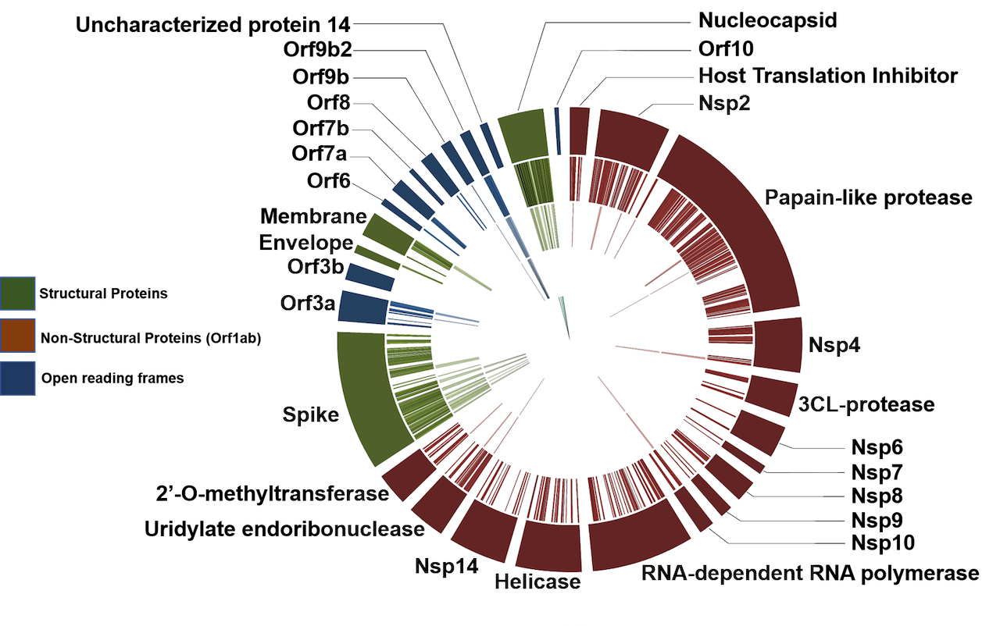
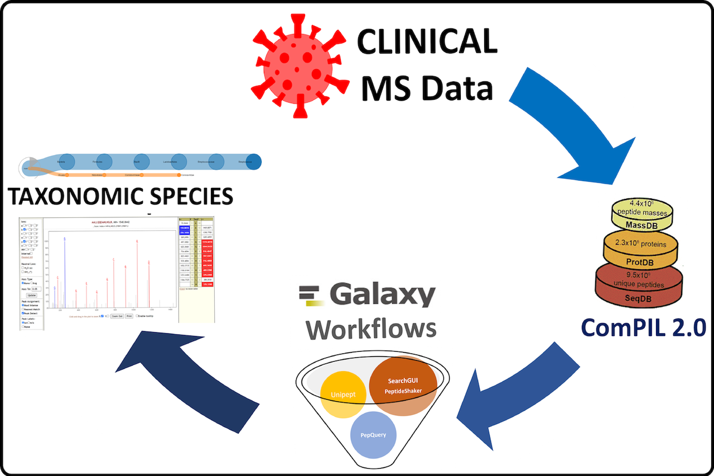

# MS data analysis

Powered by:
<FlatShield label="usegalaxy" message="eu" href="https://usegalaxy.eu"/>
<FlatShield label="usegalaxy" message="fr" href="https://usegalaxy.fr"/>

Mass spectrometry (MS) based datasets (both from peer-reviewed manuscripts and preprint version) are now available
via [ProteomeXchange](https://massive.ucsd.edu/ProteoSAFe/static/corona-mass-kb.jsp) and
[PRIDE](https://www.ebi.ac.uk/pride/archive?filter=project_tags_facet%3D%3DSars-cov-2). Here, we demonstrate the use of Galaxy workflows to reanalyze MS datasets from cell culture samples (PXD018804, PXD018241, PXD018594), clinical samples (PXD018682, PXD021328, PXD019423, PXD020394) and protein-protein interaction datasets (PXD018117). We also performed metaproteomics analysis on three clinical samples (PXD021328, PXD019423, PXD020394). 

  * [SARS-Cov-2-human-protein-protein interaction (PXD018117 from Krogan Lab)](PXD018117)
  * [Proteomics analysis of SARS-CoV-2 infected cell culture samples (PXD018241 from Matthews lab)](PXD018241)
  * [Proteomics analysis of time-course data from SARS-CoV-2 infected cell culture samples(PXD018594 from Armengaud lab)](PXD018594)
  * [Deep proteomic analysis of CoviD-19 virus infected Vero cells. (PXD018804 from Armengaud Lab)](PXD018804)
  * [Proteomics analysis of Gargling samples from CoviD-19 infected patients (PXD019423 from Sinz Lab)](PXD019423)
  * [Proteomics analysis of naso-pharyngeal swabs samples from COVID-19 infected and non-infected individuals (PXD020394 from Lima Lab)](PXD020394)
  * [Proteomics analysis of respiratory tract samples from CoviD-19 infected patients(PXD019119 from Cardozo lab)](PXD021328)
  

  
  Metaproteomics analysis of Clinical samples now [published in JPR](https://pubs.acs.org/doi/10.1021/acs.jproteome.0c00822).
  * [Metaproteomics analysis of the gargle solutions dataset (PXD019423 from Sinz Lab)](mPXD019423)
  * [Reanalysis and metaproteomics analysis of naso-pharyngeal swabs samples from COVID-19 infected and non-infected individuals (PXD020394 from Rivera Lab)](mPXD020394)
  * [Reanalaysis and metaproteomics analysis of the respiratory tract samples from CoviD-19 infected patients (PXD021328 from Cardozo Lab)](mPXD021328)
  

