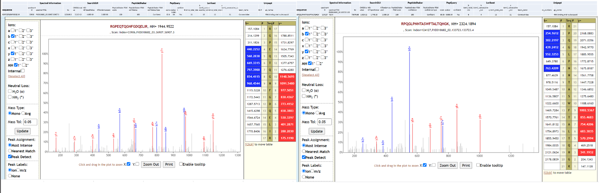

# Metaproteomics analysis of gargling samples from COVID-19 infected patients

## Live Resources

| usegalaxy.eu |
|:--------:|:------------:|:------------:|:------------:|:------------:|
| <FlatShield label="data library" message="view" href="https://usegalaxy.eu/library/list#folders/F61b36ed9cec77ec5" alt="Raw data from data library" /> |
| <FlatShield label="Input data" message="view" href="https://usegalaxy.eu/u/galaxyp/h/pr-2020-00822a-inputs-for-pxd019423-metaproteomics-search-12052020" alt="Raw data plus auxillary data" /> |
| <FlatShield label="ComPIL2.0 Analysis" message="view" href="https://usegalaxy.eu/u/galaxyp/h/pr-2020-00822a-pxd019423-compil-20-analysis" alt="ComPIL2.0 Analysis" /> |
| <FlatShield label="Result history" message="view" href="https://usegalaxy.eu/u/galaxyp/h/pr-2020-00822a-outputs-pxd019423-metaproteomics-search-12052020" alt="Galaxy history" /> |
| <FlatShield label="workflow" message="run" href="https://usegalaxy.eu/u/galaxyp/w/pr-2020-00822a-pxd019423metaproteomics-workflow-12052020" alt="Galaxy workflow" /> |
| <FlatShield label="ComPIL2.0_output_processing_workflow" message="run" href="https://usegalaxy.eu/u/galaxyp/w/pr-2020-00822a-compil-20-output-processing-to-distinct-peptides-pxd019423---17-columns" alt="ComPIL2.0_output_processing_workflow" /> |
| <FlatShield label="Metaproteomics JPR Letter" message="view" href="https://pubs.acs.org/doi/10.1021/acs.jproteome.0c00822" alt="Metaproteomics JPR Letter" /> |

## Description

[**_Ihling et al_**](https://pubs.acs.org/doi/10.1021/acs.jproteome.0c00280)  from Martin Luther University Halle-Wittenberg (Halle, Germany) have published a protein MS-based ‘proof-of-principle’ method to detect SARS-CoV-2 virus proteins from gargle samples from COVID-19 patients. Their protocol consists of an acetone precipitation step, followed by tryptic digestion of gargle solution proteins, (see [here](../PXD018682/)),followed by targeted MS analysis on an Orbitrap Fusion Tribrid mass spectrometer with nano-ESI source (Thermo Fisher Scientific). In the original manuscript, the authors detect peptides from SARS-CoV-2 virus proteins and present evidence for their spectral annotation. This study is an initiative in developing a routine MS-based diagnostic method for COVID-19 patients. This MS data was submitted in May 2020 as [PXD019423](http://dx.doi.org/10.6019/PXD019423) on the ProteomeXchange Repository.

We were interested in exploring the possibility of presence of microorganisms in the samples from the original manuscript. For this, Peter Thuy-Boun (Wolan Lab, Scripps Institute) searched the three RAW files using COMPIL 2.0 against a comprehensive 113 million protein sequences and roughly 4.8 billion unique tryptic peptide sequences database library. We used a Galaxy workflow to generate a list of peptides detected using [COMPIL 2.0](https://pubs.acs.org/doi/10.1021/acs.jproteome.8b00722) search. The peptides were subjected to [Unipept analysis] (https://unipept.ugent.be/datasets) using ‘Advanced Missed Cleavage Handling” option to generate outputs with taxonomic and functional information. We selected a list of species (identified with atleast two peptides) for the metaproteomics search and validation workflow based on whether they were reported - or had the potential to be present in human samples. We used this list of species along with RAW files and COVID-19 protein database as inputs for a Galaxy workflow to ->
- a) search the datasets; 
- b) detect microbial peptides and determine the taxonomy associated with the peptides using Unipept; 
- c) validate peptide spectral matches by using [PepQuery](https://genome.cshlp.org/content/29/3/485.full) and 
- d) determining the number of valid peptides corresponding to microbial taxonomic units, by using spectral visualization via Lorikeet.

## Workflow

RAW Files from clinical datasets were searched against a comprehensive UniRef database using COMPIL Peptides detected from COMPIL 2.0 search were extracted using a Galaxy workflow (A) to extract peptides that were subjected to Unipept analysis. Clinically important species (detected with at least two peptides) were used to generate the UniProt database. The RAW files were re-interrogated against a combined database of human proteins, UniProt database of detected species, SARS-CoV-2 proteins and contaminants using SearchGUI/PeptideShaker within a Metaproteomics Search and Validation Workflow (B in figure above and details in figure below).   

Briefly, this Galaxy workflow converts RAW files to MGF format. The MGF files are searched against the combined database of Human Uniprot proteome, UniProt database of detected species, contaminant proteins and SARS-Cov-2 proteins database using X! tandem, MSGF+, OMSSA search algorithms within SearchGUI and FDR and protein grouping using PeptideShaker. Peptides were subjected to Unipept analysis to detect microbial peptides and they were further confirmed by using PepQuery. The confirmed peptides were used to detect species (with at least 2 peptides) after validating the spectral quality of the microbial peptides using Lorikeet. Species were reported to be present in a sample only when they were detected by at least two peptides in a sample or replicate.

## Results
The analysis of the gargling solutions using COMPIL 2.0 and Unipept (both outside of Galaxy) and using SearchGUI/PeptideShaker, Unipept and PepQuery (all within Galaxy workflows) resulted in detection of **_Streptococcus pneumoniae_** (an opportunistic pathogen) and **_Lactobacillus rhamnosus_** (a component of probiotic treatment). In the published letter to the editor, we only report bacteria which were identified with at least two peptides per dataset.
All the files associated with this analysis is available via https://covid19.galaxyproject.org/proteomics/.

| Taxonomic species        | RAW 01 | RAW 02 | RAW 03 |
|--------------------------|--------|--------|--------|
|                          |        |        |        |
| **_SARS-CoV-2_**               |   ND   |    1   |    1   |
| **_Streptococcus pneumoniae_** |   ND   |    3   |   ND   |
| **_Lactobacillus rhamnosus_**  |   ND   |   ND   |    8   |

*Number indicates number of peptides detected after SearchGUI/PeptideShaker analysis, confirmed by PepQuery and validated using Lorikeet analysis; ND = Not detected.*

 **_Streptococcus pneumoniae_** is a commensal microorganism that colonizes the upper respiratory tract in healthy individuals. However, in susceptible individuals with weaker immune systems, such as the elderly, the bacterium may become pathogenic and spread to other locations to cause disease. Clinical studies have started identifying possible co-infecting bacteria in [COVID-19](https://pubmed.ncbi.nlm.nih.gov/32408156/) patients. Amongst these *S. pneumoniae* has been shown to be the [most common](https://www.ncbi.nlm.nih.gov/pmc/articles/PMC7245213/), is known to be nosocomial, detected in immuno-compromised patients and are difficult to treat because of its multi-drug resistance.
As a last step, all the peptides, confidently identified by SearchGUI/PeptideShaker, confirmed by PepQuery were subjected to Lorikeet analysis. Below is Lorikeet visualization of two peptides from **_S. pneumoniae_** and each PSM has metrics for spectrum, charge state, total ion current, OMSSA, MS-GF+ and X! Tandem identification statistics, PeptideShaker PSM score and confidence along with PepQuery-generated score, p-value, confidence and Lorikeet and Unipept metrics.

**_Lactobacillus rhamnosus_** is one of the [most studied probiotic](https://onlinelibrary.wiley.com/doi/abs/10.1111/j.1601-0825.2007.01386.x) bacterium, used in prevention of [oral candidiasis](https://doi.org/10.1177/154405910708600204) infections. Since no clinical history is available for the COVID-19 patient (RAW 02), we can only speculate that the presence of this bacterium due to oral prebiotic treatment during hospitalization.  Below is Lorikeet visualization of two peptides from **_L. rhamnosus_** and each PSM has metrics for spectrum, charge state, total ion current, OMSSA, MS-GF+ and X! Tandem identification statistics, PeptideShaker PSM score and confidence along with PepQuery-generated score, p-value, confidence and Lorikeet and Unipept metrics.

Two of the datasets from this study could also detect **_SARS-CoV-2_** peptides, while the third one could not detect SARS-CoV-2 peptides in the original study or in our reanalysis. Below is Lorikeet visualization of two peptides from **_SARS-CoV-2_** and each PSM has metrics for spectrum, charge state, total ion current, OMSSA, MS-GF+ and X! Tandem identification statistics, PeptideShaker PSM score and confidence along with PepQuery-generated score, p-value, confidence and Lorikeet and Unipept metrics.

We have contacted the authors of the original manuscript and reported our findings and have discussed the possibility of using new gargling solutions samples to detect the presence of any cohabitating emerging pathogens in COVID-19 patients using mass spectrometry based metaproteomics analysis.

