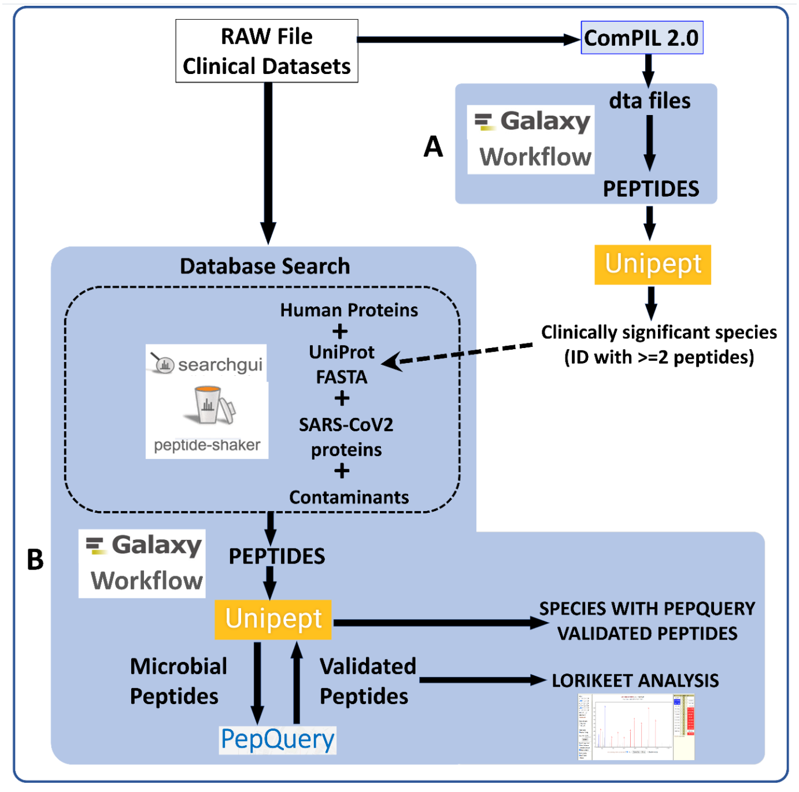

# Metaproteomics analysis of naso-pharyngeal swabs samples from COVID-19 infected and non-infected individuals

## Live Resources

| usegalaxy.eu |
|:--------:|:------------:|:------------:|:------------:|:------------:|
| <FlatShield label="Input data" message="view" href="https://usegalaxy.eu/u/galaxyp/h/pr-2020-00822a-inputs-pxd020394-metaproteomics-workflow-12052020 " alt="Raw data plus auxillary data" /> |
| <FlatShield label="ComPIL2.0 analysis" message="view" href="https://usegalaxy.eu/u/galaxyp/h/pr-2020-00822a-compil-20-outputs---pxd020394" alt="ComPIL2.0 analysis" /> |
| <FlatShield label="Result history" message="view" href="https://usegalaxy.eu/u/galaxyp/h/pr-2020-00822a-outputs-pxd020394-metaproteomics-workflow-12052020" alt="Galaxy history" /> |
| <FlatShield label="workflow" message="run" href="https://usegalaxy.eu/u/galaxyp/w/pr-2020-00822a-compil-20-output-processing-to-distinct-peptides-pxd020394-and-pxd021328 " alt="Galaxy workflow" /> |
| <FlatShield label="ComPIL2.0 output processing workflow" message="run" href="https://usegalaxy.eu/u/galaxyp/w/pr-2020-00822a-pxd020394metaproteomics-workflow-12052020 " alt="Galaxy workflow" /> |
| <FlatShield label="Metaproteomics JPR Letter" message="view" href="https://pubs.acs.org/doi/10.1021/acs.jproteome.0c00822" alt="Metaproteomics JPR Letter" /> |

## Description

[**_Rivera et al_**](https://www.sciencedirect.com/science/article/pii/S2352340920310155) from Institut Pasteur de Montevideo and Universidad de la República (Montevideo, Uruguay) performed comparative quantitative proteomic analysis from oro- and naso-pharyngeal swabs used for COVID-19 diagnosis. Tryptic peptides obtained from five COVID-19 positive and five COVID-19 negative samples were analysed by LC-MS/MS using a Q-Exactive Plus mass spectrometer. The mass spectrometry (MS) data was made available via ProteomeXchange (PXD020394) so as to facilitate the use of MS-based approaches for COVID-19 diagnosis. 
We were interested in detecting the presence of microorganisms apart from the SARS-CoV2 virus in the clinical samples. Peter Thuy-Boun from Wolan Lab at the Scripps Institute searched the twenty RAW files (five negative and positive samples along with a technical replicate each) using COMPIL 2.0 against a comprehensive 113 million protein sequence database. The detected peptides identified were subjected to Unipept 4.3 analysis to detect taxonomic information about microorganisms present in the sample. A list of clinically significant genera/species (with at least two peptides) was used to generate a protein FASTA database within the Galaxy workflow. The generated protein database along with the RAW files and COVID-19 protein database was used as inputs for a Galaxy workflow to
a) search the datasets;
b) detect microbial peptides and determine the taxonomy associated with the peptides using Unipept; and
c) validation of peptide spectral matches by using PepQuery and Lorikeet to determine the number of valid peptides corresponding to microbial taxonomic units.

## Workflow

RAW Files from clinical datasets were searched against a comprehensive UniRef database using COMPIL Peptides detected from COMPIL 2.0 search were extracted using a Galaxy workflow (A) to extract peptides that were subjected to Unipept analysis. Clinically important species (detected with at least two peptides) were used to generate UniProt database. The RAW files were re-interrogated against a combined database of human proteins, UniProt database of detected species, SARS-CoV-2 proteins and contaminants using SearchGUI/PeptideShaker within a Metaproteomics Search and Validation Workflow (B in figure above and details in figure below).  

Briefly, this Galaxy workflow converts RAW files to MGF format. The MGF files are searched against the combined database of Human Uniprot proteome, UniProt database of detected species, contaminant proteins and SARS-Cov-2 proteins database using X! tandem, MSGF+, OMSSA search algorithms within SearchGUI and FDR and protein grouping using PeptideShaker. Peptides were subjected to Unipept analysis to detect microbial peptides and they were further confirmed by using PepQuery. The confirmed peptides were used to detect species (with at least 2 peptides) after validating the spectral quality of the microbial peptides using Lorikeet. Species were reported to be present in a sample only when they were detected by at least two peptides in a sample or replicate.

## Results

Clinical studies from COVID-19 patients have reported co-infecting bacteria in COVID-19 patients. PepQuery analysis also supports the detection of these microbial peptides. We followed this up with Lorikeet analysis to ascertain the spectral evidence. In this study, we detected two potentially pathogenic organisms - **_Acinetobacter ursingii_** and **_Pseudomonas monteilii_** - from an individual who was not infected with coronavirus and other uncharacterized bacterium - **_Pseudomonas sp. Bc-h_** from a patient infected with coronavirus. The analysis of the respiratory tract samples using COMPIL 2.0 and Galaxy workflow with SearchGUI/PeptideShaker, Unipept, PepQuery and Lorikeet resulted in characterization of a few opportunistic pathogens (see figure below).

Peptides detected after SearchGUI/PeptideShaker analysis, confirmed by PepQuery and validated using Lorikeet analysis
In the published letter to the editor, we only report bacteria which were identified with at least two peptides per dataset. All the files associated with this analysis is available via https://covid19.galaxyproject.org/proteomics/.

**_Acinetobacter ursingii_** is a nonmotile, aerobic, gram-negative bacterium that is found in natural moist environments and has been isolated from blood samples of pediatric patients. Known to be a commensal bacterium present in newborns, it is also capable of generating bacteremia and infections in immunocompromised [hospitalized premature infants](https://journals.lww.com/pidj/Fulltext/2020/03000/Nosocomial_Bacteraemia_Caused_by_Acinetobacter.22.aspx). Underlying serious conditions such as cancer, intravascular catheterization, treatment with broad spectrum antibiotics and prolonged hospitalization have been identified as risk factors for **_A. ursingii_** infection. It’s potential to cause [nosocomial infections](https://www.ncbi.nlm.nih.gov/pmc/articles/PMC4907768/) and outbreaks in hospital environment have been noted. **_A. ursingii_** has also been isolated from [bronchoscopic samples](https://www.ncbi.nlm.nih.gov/pmc/articles/PMC7365381/) of intensive-care patients.
As a last step, all the peptides, confidently identified by SearchGUI/PeptideShaker, confirmed by PepQuery were subjected to Lorikeet analysis. Below is Lorikeet visualization of two peptides from **_A. ursingii_** and each PSM has metrics for spectrum, charge state, total ion current, OMSSA, MS-GF+ and X! Tandem identification statistics, PeptideShaker PSM score and confidence along with PepQuery-generated score, p-value, confidence and Lorikeet and Unipept metrics.

**_Pseudomonas monteilii_** is a Gram-negative, rod-shaped, motile bacterium isolated from human bronchial aspirate. Multi-drug resistant strains of **_P. monteilii_** have been isolated from clinical samples with the possibility of transfer of antibiotic resistance genes to gut microbiome. Below is Lorikeet visualization of two peptides from P. monteilii  and each PSM has metrics for spectrum, charge state, total ion current, OMSSA, MS-GF+ and X! Tandem identification statistics, PeptideShaker PSM score and confidence along with PepQuery-generated score, p-value, confidence and Lorikeet and Unipept metrics.

**_Pseudomonas sps. Bc-h_** is an unclassified Pseudomonas strain that has not yet been shown to be associated with infection. The proteome of this species is available as part of the **_Pseudomonas lutea pan proteome_**. 
Below is Lorikeet visualization of two peptides from **_Pseudomonas sps. Bc-h_** and each PSM has metrics for spectrum, charge state, total ion current, OMSSA, MS-GF+ and X! Tandem identification statistics, PeptideShaker PSM score and confidence along with PepQuery-generated score, p-value, confidence and Lorikeet and Unipept metrics.

The workflow also detected **_SARS-CoV-2_** peptides from COVID-19 positive samples and none from COVID-19 negative patient samples. Below is Lorikeet visualization of two peptides from **_SARS-CoV-2_** and each PSM has metrics for spectrum, charge state, total ion current, OMSSA, MS-GF+ and X! Tandem identification statistics, PeptideShaker PSM score and confidence along with PepQuery-generated score, p-value, confidence and Lorikeet and Unipept metrics.

We believe that the workflows will help in detecting the presence of any cohabitating emerging pathogens in COVID-19 patients using mass spectrometry based metaproteomics analysis.
