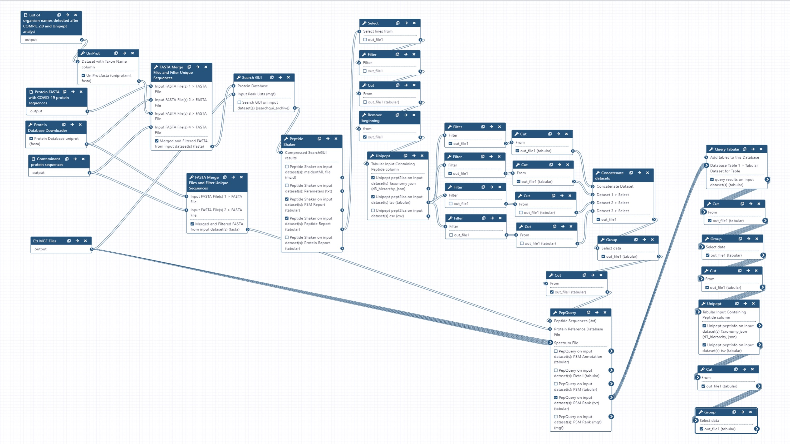

# Metaproteomics analysis of naso-pharyngeal swabs samples from COVID-19 infected and non-infected individuals

## Live Resources

| usegalaxy.eu |
|:--------:|:------------:|:------------:|:------------:|:------------:|
| <FlatShield label="Input data" message="view" href="https://usegalaxy.eu/u/pratikjagtap/h/pxd020394-negatives-sps-sgps-pq-for-metaproteomics-inputs" alt="Raw data plus auxillary data" /> |
| <FlatShield label="Input data" message="view" href="https://usegalaxy.eu/u/pratikjagtap/h/pxd020394-positives-sps-sgps-pq-for-metaproteomics-inputs" alt="Raw data plus auxillary data" /> |
| <FlatShield label="Result history" message="view" href="https://usegalaxy.eu/u/pratikjagtap/h/outputs-pxd020394-negatives-sps-sgps-pq-for-metaproteomics" alt="Galaxy history" /> |
| <FlatShield label="Result history" message="view" href="https://usegalaxy.eu/u/pratikjagtap/h/outputs-pxd020394-positives-sps-sgps-pq-for-metaproteomics" alt="Galaxy history" /> |
| <FlatShield label="workflow" message="run" href="https://usegalaxy.eu/u/pratikjagtap/w/pxd020394-negativepositive-species-sgps-pq-for-metaproteomics-10072020 " alt="Galaxy workflow" /> |

## Description

[Rivera et al](https://www.sciencedirect.com/science/article/pii/S2352340920310155) performed comparative quantitative proteomic analysis from oro- and naso-pharyngeal swabs used for COVID-19 diagnosis. Tryptic peptides obtained from five COVID-19 positive and five COVID-19 negative samples were analysed by LC-MS/MS using a Q-Exactive Plus mass spectrometer. The mass spectrometry (MS) data was made available via ProteomeXchange [(PXD020394)](http://proteomecentral.proteomexchange.org/cgi/GetDataset?ID=PXD020394) so as to facilitate the use of MS-based approaches for COVID-19 diagnosis. We were interested in detecting the presence of microorganisms apart from the SARS-CoV2 virus in the clinical samples. Peter Thuy-Boun from Wolan Lab at the 
Scripps Institute searched the twenty RAW files (five negative and positive samples along with a technical replicate each) using [COMPIL 2.0](https://pubs.acs.org/doi/10.1021/acs.jproteome.8b00722) against a comprehensive 113 million protein sequence database. The detected peptides identified were subjected to [Unipept 4.3](https://unipept.ugent.be/datasets) analysis to detect taxonomic information about microorganisms present in the sample. A list of clinically significant genera/species (Acinetobacter ursingii, Pseudomonas monteilii and Pseudomonas sp. Bc-h) was used to generate a protein FASTA database within the [Galaxy workflow](https://usegalaxy.eu/u/pratikjagtap/w/pxd020394-negativepositive-species-sgps-pq-for-metaproteomics-10072020). The generated protein database along with the RAW files and COVID-19 protein database was used as inputs for a Galaxy workflow to 
- a) search the datasets; 
- b) detect microbial peptides and determine the taxonomy associated with the peptides using Unipept; and 
- c) validation of peptide spectral matches by using [PepQuery](https://genome.cshlp.org/content/early/2019/01/04/gr.235028.118) and determining the number of valid peptides corresponding to microbial taxonomic units.

The analysis of the respiratory tract samples using COMPIL 2.0 and [Galaxy workflow](https://usegalaxy.eu/u/pratikjagtap/w/pxd020394-negativepositive-species-sgps-pq-for-metaproteomics-10072020) with SearchGUI/PeptideShaker, Unipept and PepQuery resulted in characterization of a few 
opportunistic pathogens (see table below).

## Workflow

The Galaxy workflow includes software tools to convert the input RAW files to MGF format. The MGF files are layer searched against the combined database of Human Uniprot proteome, UniProt database of clinically significant genera/species along with contaminant proteins and SARS-Cov-2 proteins database using X!tandem, MSGF+, OMSSA search algorithms (within SearchGUI) and False Discovery Rate and protein grouping using PeptideShaker. The detected peptides were searched with Unipept 4.3 to obtain the taxonomic and functional information. Taxonomically relevant peptides were later subjected to analysis by PepQuery and Lorikeet to ascertain the quality of peptide identification.

## Results

Clinical studies from COVID-19 patients have reported co-infecting bacteria in COVID-19 patients. PepQuery analysis also supports the detection of these microbial peptides. We plan to follow 
this up with Lorikeet analysis to ascertain the spectral evidence. 

The workflow that we propose can be used to detect any microorganisms that are present in the clinical samples. In this study, we detected two potentially pathogenic organisms - **_Acinetobacter ursingii_** and **_Pseudomonas monteilii_** - from an individual who was not infected with coronavirus and other uncharacterized bacterium - **_Pseudomonas sp. Bc-h_** from a patient infected with coronavirus.
**_Acinetobacter ursingii_** is a nonmotile, aerobic, gram-negative bacterium that is found in natural moist environments and has been isolated from blood samples of pediatric patients. Known to be a commensal bacterium present in newborns, it is also capable of generating bacteraemia and infections in immunocompromised [hospitalized premature infants](https://journals.lww.com/pidj/Fulltext/2020/03000/Nosocomial_Bacteraemia_Caused_by_Acinetobacter.22.aspx).
Underlying serious conditions such as  cancer, intravascular catheterization, treatment with broad spectrum antibiotics and prolonged hospitalization have been identified as risk factors for **_A. ursingii_** infection. It’s potential to cause [nosocomial infections](https://www.ncbi.nlm.nih.gov/pmc/articles/PMC4907768/) and outbreaks in an hospital environment have been noted. [**_Pseudomonas monteilii_**](https://pubmed.ncbi.nlm.nih.gov/9226917/)is a Gram-negative, rod-shaped, motile bacterium isolated from human bronchial aspirate. Multi-drug resistant strains of **_P. monteilii_** have been isolated from clinical samples 
with the possibility of transfer of antibiotic resistance genes to gut microbiome. **_Pseudomonas sps. Bc-h_** is an unclassified Pseudomonas strain that has not yet been shown to be associated with infection. 
The proteome of this species is available as part of the **_Pseudomonas lutea_** pan proteome.This along with the analysis of gargling samples dataset analysis and nasopharyngeal samples demonstrates the use of COMPIL 2.0 and metaproteomics workflow to detect any cohabitating emerging pathogens in COVID-19 patients using mass spectrometry based metaproteomics analysis.
