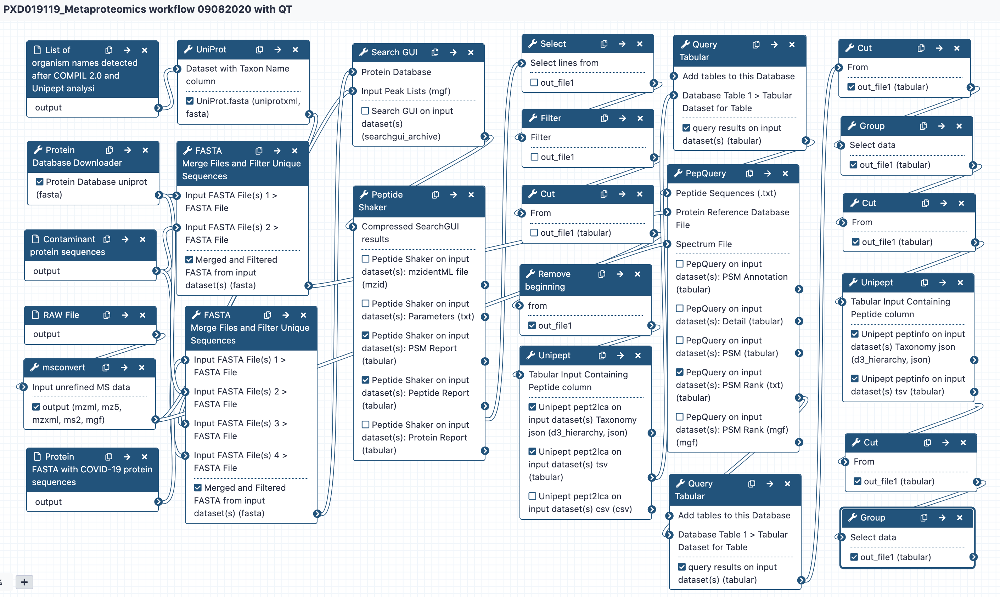
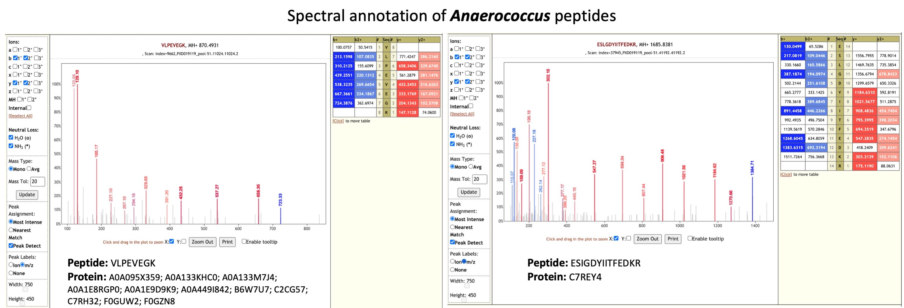
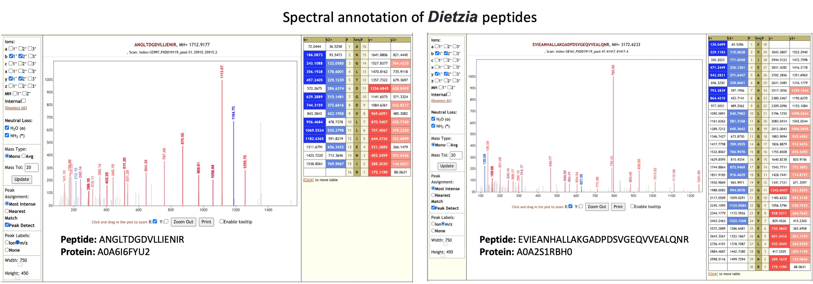
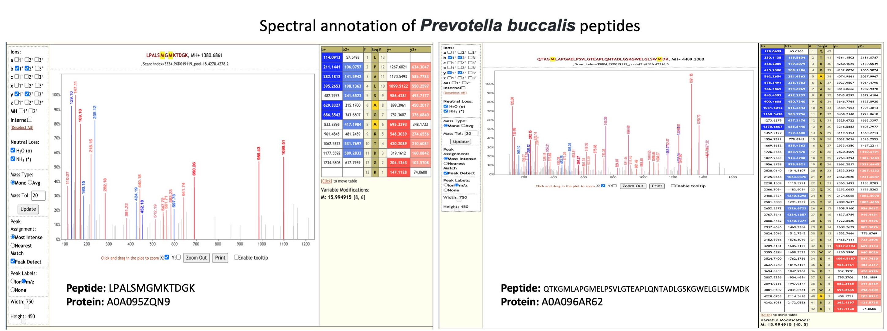
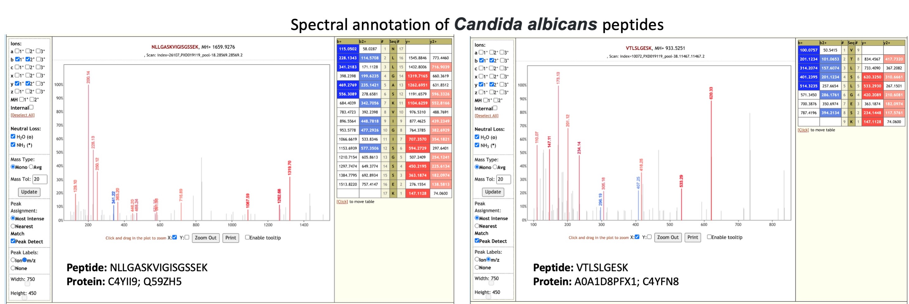
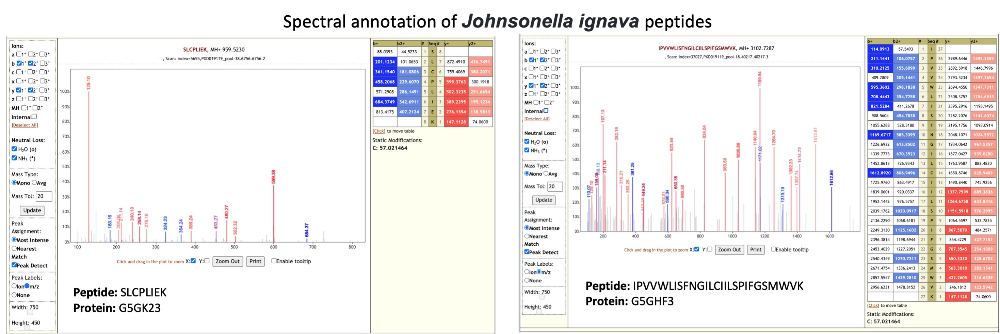
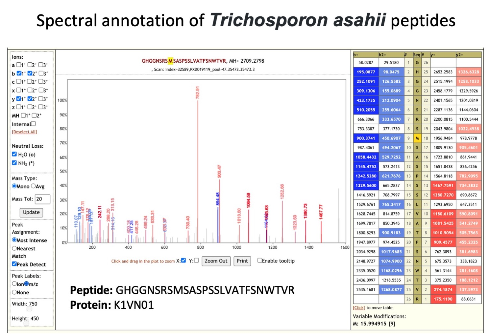
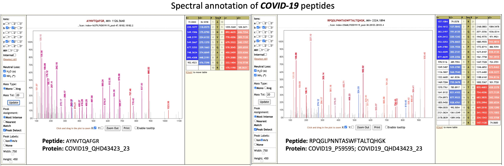

# Metaproteomics analysis of respiratory tract samples from COVID-19 infected patients

## Live Resources

| usegalaxy.eu |
|:--------:|:------------:|:------------:|:------------:|:------------:|
| <FlatShield label="data library" message="view" href="https://usegalaxy.eu/library/list#folders/F9ae5f5ec2d597409" alt="Raw data from data library" /> |
| <FlatShield label="Input data" message="view" href="https://usegalaxy.eu/u/pratikjagtap/h/pxd019119inputmetaproteomics-09022020" alt="Raw data plus auxillary data" /> |
|
| <FlatShield label="Result history" message="view" href="https://usegalaxy.eu/u/subina/h/pxd019119searchmetaproteomics-09082020" alt="Galaxy history" /> |
| <FlatShield label="workflow" message="run" href="https://usegalaxy.eu/u/subina/w/pxd019119metaproteomics-workflow-09082020-with-qt" alt="Galaxy workflow" /> |

## Description

[Cardozo et al](https://www.researchsquare.com/article/rs-28883/v1) collected bottom-up mass spectrometry (MS) data on respiratory tract samples from ten COVID-19 
positive patient samples. Data-dependent acquisition MS spectra were acquired using hybrid quadrupole-Orbitrap tandem mass spectrometry. The MS data was used to generate 
a spectral library of targeted COVID-19 peptides for targeted MS assay for clinical samples. We were interested in exploring the possibility of presence of microorganisms 
in the clinical samples. Peter Thuy-Boun from Wolan Lab at the Scripps Institute searched the five RAW files (pools 18, 34, 38, 47 and 51) using 
[COMPIL 2.0](https://pubs.acs.org/doi/10.1021/acs.jproteome.8b00722) against a comprehensive 113 million protein sequence database. The detected peptides identified 
were subjected to Unipept 4.3 analysis to detect taxonomic information about microorganisms present in the sample. A list of clinically significant genera/species was 
used to generate a protein FASTA database within the [Galaxy workflow](https://usegalaxy.eu/u/subina/w/pxd019119metaproteomics-workflow-09082020-with-qt). The generated 
protein database along with the RAW files and COVID-19 protein database was used as inputs for a Galaxy workflow to a) search 
the [datasets](https://usegalaxy.eu/u/pratikjagtap/h/pxd019119inputmetaproteomics-09022020); b) detect microbial peptides and determine the taxonomy associated with the 
peptides using Unipept; and c) validation of peptide spectral matches by using [PepQuery](https://genome.cshlp.org/content/early/2019/01/04/gr.235028.118) and determining 
the number of valid peptides corresponding to microbial taxonomic units.The analysis of the respiratory tract samples using COMPIL 2.0 and 
[Galaxy workflow](https://usegalaxy.eu/u/subina/w/pxd019119metaproteomics-workflow-09082020-with-qt) with SearchGUI/PeptideShaker, Unipept and PepQuery resulted in detection 
of a few opportunistic pathogens (see table below).

## Workflow

The Galaxy workflow includes software tools to convert the input RAW files to MGF format. The MGF files are layer searched against the combined database of Human Uniprot proteome, 
UniProt database of clinically significant genera/species along with contaminant proteins and SARS-Cov-2 proteins database using X!tandem, MSGF+, OMSSA search algorithms (within SearchGUI) 
and FDR and protein grouping using PeptideShaker. The detected peptides were searched with Unipept 4.3 to obtain the taxonomic and functional information. Taxonomically relevant peptides 
were later subjected to analysis by PepQuery and Lorikeet to ascertain the quality of peptide identification.

## Results

Clinical studies from COVID-19 patients have reported co-infecting bacteria in COVID-19 patients. Interestingly, the PepQuery analysis supports the detection of these microbial peptides. 
We have followed this up with Lorikeet analysis to ascertain the spectral evidence. 

|    Taxonomic Unit     | Pool 18 | Pool 34 | Pool 38 |  Pool 47 | Pool 51 |
|:---------------------:|:-------:|:-------:|:-------:|:--------:|:-------:|
|    *Coronaviridae*    |    1    |    9    |    5    |    11    |    6    |
|     *Anaerococcus*    |    0    |    2    |    1    |     2    |    3    |
|       *Dietzia*       |    1    |    1    |    0    |     2    |    2    |
| *Prevotella buccalis* |    1    |    1    |    0    |     2    |    1    |
|   *Candida albicans*  |    1    |    0    |    2    |     0    |    0    |
|  *Johnsonella ignava* |    1    |    0    |    1    |     2    |    0    |
| *Trichosporon asahii* |    0    |    0    |    0    |     2    |    0    |

Apart from **_Coronavirus_** peptides, we also detected peptides for **_Anaerococcus, Dietzia, Prevotella buccalis, Candida albicans, Johnsonella ignava and Trichosporon asahii_**.
[**_Anaerococcus species_**](https://doi.org/10.1099/00207713-51-4-1521) are anaerobic cocci that have been isolated in skin, vagina, and nasal cavity . [Recent report](https://doi.org/10.1016/j.anaerobe.2019.102130) 
has also demonstrated the isolation of **_Anaerococcus_** from bloodstream infection from an elderly immunocompetent person and shown that **_Anaerococcus_** are resistant to antimicrobial treatment. 

**_Dietzia_** species are aerobic, [*Gram-positive actinomycetes*](https://doi.org/10.1111/j.1574-695X.2008.00513.x) and have been implicated as potential invasive human pathogen and have been isolated from specimens taken from patients with acute infections . **_Dietzia_** species was also isolated from an immunocompromised patient with chronic obstructive pulmonary disease (COPD), and the infection is presumably related to the [use of catheters](https://doi.org/10.1086/313490). 

**_Prevotella buccalis_** is an anaerobic bacterium isolated from [dental plaque](https://www.ncbi.nlm.nih.gov/pmc/articles/PMC170248/). It was detected as one of the species associated with asthma patients based on [nasal microbiome analysis](https://www.ncbi.nlm.nih.gov/pmc/articles/PMC6123291/).

**_Candida albicans_** is one of the most common fungal infections acquired during hospitalization and is prevalent in [critically ill or immunocompromised patients](https://cmr.asm.org/content/24/1/141). Patients develop [oropharyngeal candidiasis](https://doi.org/10.1099/jmm.0.045054-0),
which can have an effect on the absorption of medication.

**_Johnsonella ignava_** is an anaerobic Gram-negative rod-shaped bacterium isolated from human gingival crevices. In a study [comparing oral microbiota](https://www.ncbi.nlm.nih.gov/pmc/articles/PMC3507910/) in tumor and non-tumor tissues of patients with oral squamous cell carcinoma (OSCC), **_Johnsonella ignava_** was shown to be associated with the tumor site.

**_Trichosporon asahii_** is an 
opportunistic fungal pathogen whose infections have increased in recent years, resulting in [high mortality](https://doi.org/10.1093/mmy/myaa076) due to invasive infections in immunocompromised patients. It can cause [infections](https://www.ncbi.nlm.nih.gov/pmc/articles/PMC7439294/) on the skin, hair and lungs (chronic pneumonia).

This along with the analysis of [gargling samples dataset](https://covid19.galaxyproject.org/proteomics/mpxd019423/#live-resources) analysis demonstrates the use of COMPIL 2.0 and metaproteomics workflow to detect any cohabitating emerging pathogens in COVID-19 patients using mass spectrometry based metaproteomics analysis.

