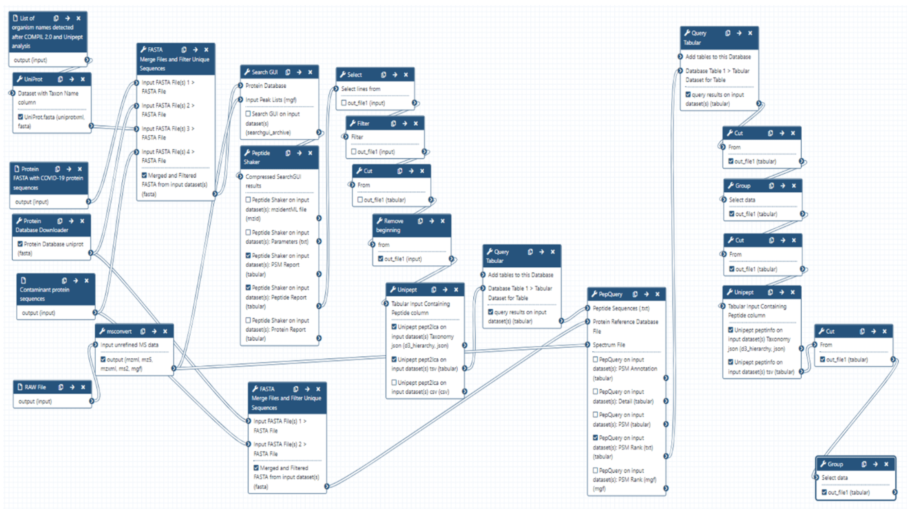
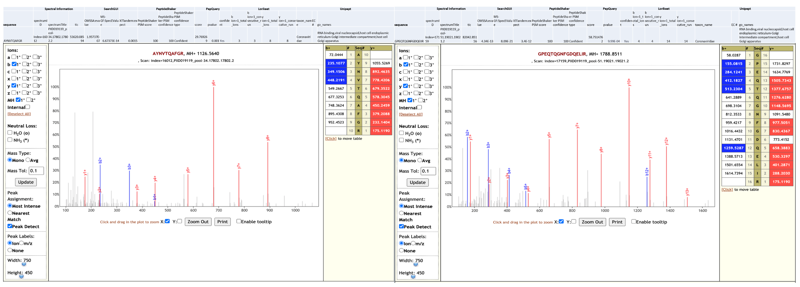

# Metaproteomics analysis of respiratory tract samples from CoviD-19 infected patients

## Live Resources

| usegalaxy.eu |
|:--------:|:------------:|:------------:|:------------:|:------------:|
| <FlatShield label="data library" message="view" href="https://usegalaxy.eu/library/list#folders/F9ae5f5ec2d597409" alt="Raw data from data library" /> |
| <FlatShield label="Input data" message="view" href="https://usegalaxy.eu/u/galaxyp/h/pr-2020-00822a-inputs-pxd021328-metaproteomics-12052020" alt="Raw data plus auxillary data" /> |
| <FlatShield label="ComPIL2.0 analysis" message="view" href="https://usegalaxy.eu/u/galaxyp/h/pr-2020-00822a-compil-20-outputs---pxd021328" alt="ComPIL2.0 analysis" /> |
| <FlatShield label="Result history" message="view" href="https://usegalaxy.eu/u/galaxyp/h/pr-2020-00822a-outputs-pxd021328-metaproteomics-12052020" alt="Galaxy history" /> |
| <FlatShield label="workflow" message="run" href="https://usegalaxy.eu/u/galaxyp/w/pr-2020-00822a-pxd021328metaproteomics-workflow-12052020" alt="Galaxy workflow" /> |
| <FlatShield label="ComPIL2.0 processing workflow" message="run" href="https://usegalaxy.eu/u/galaxyp/w/pr-2020-00822a-compil-20-output-processing-to-distinct-peptides-pxd020394-and-pxd021328" alt="ComPIL2.0 processing workflow" /> |

## Description

[**_Cardozo et al_**](https://www.researchsquare.com/article/rs-28883/v1) from Fleury Group (São Paulo, Brazil) collected bottom-up mass spectrometry (MS) data on Respiratory tract samples (combined materials from nasopharyngeal and oropharyngeal swabs) from ten COVID-19 positive patient samples. Data-dependent acquisition MS spectra were acquired using hybrid quadrupole-Orbitrap tandem mass spectrometry. The MS data was used to generate a spectral library of targeted COVID-19 peptides for targeted MS assay for clinical samples. The RAW data was submitted to the ProteomeXchange Repository [PXD021328](http://dx.doi.org/10.6019/PXD021328).
Peter Thuy-Boun from Wolan Lab at the Scripps Institute searched the five RAW files (pools 18, 34, 38, 47 and 51) using COMPIL 2.0 against a comprehensive 113 million protein sequence database. The detected peptides identified were subjected to Unipept 4.3 analysis to detect taxonomic information regarding microorganisms present in the sample. A list of clinically significant species (detected with at least two peptides) was used to generate a protein FASTA database within the Galaxy workflow (see below). The generated protein database along with the RAW files and COVID-19 protein database was used as inputs for a Galaxy workflow to 
- a) search the datasets; 
- b) detect microbial peptides and determine the taxonomy associated with the peptides using Unipept; and 
- c) validation of peptide spectral matches by using PepQuery and Lorikeet to determine the number of valid peptides corresponding to microbial taxonomic units. The analysis of the respiratory tract samples using COMPIL 2.0 and Galaxy workflow with SearchGUI/PeptideShaker, Unipept, PepQuery  and Lorikeet resulted in detection of SARS-CoV-2 peptides and Trichosporon asahii in some of the samples (see table below).

## Workflow

RAW Files from clinical datasets were searched against a comprehensive UniRef database using COMPIL Peptides detected from COMPIL 2.0 search were extracted using a Galaxy workflow (A) to extract peptides that were subjected to Unipept analysis. Clinically important species (detected with at least two peptides) were used to generate the UniProt database. The RAW files were re-interrogated against a combined database of human proteins, UniProt database of detected species, SARS-CoV-2 proteins and contaminants using SearchGUI/PeptideShaker within a Metaproteomics Search and Validation Workflow (B in figure above and details in figure below). 

Briefly, this Galaxy workflow converts RAW files to MGF format. The MGF files are searched against the combined database of Human Uniprot proteome, UniProt database of detected species, contaminant proteins and SARS-Cov-2 proteins database using X! tandem, MSGF+, OMSSA search algorithms within SearchGUI and FDR and protein grouping using PeptideShaker. Peptides were subjected to Unipept analysis to detect microbial peptides and they were further confirmed by using PepQuery. The confirmed peptides were used to detect species (with at least 2 peptides) after validating the spectral quality of the microbial peptides using Lorikeet. Species were reported to be present in a sample only when they were detected by at least two peptides in a sample or replicate.

## Results

Clinical studies from COVID-19 patients have reported co-infecting bacteria in COVID-19 patients. Interestingly, the PepQuery analysis supports the detection of these microbial peptides. We have followed this up with Lorikeet analysis to ascertain the spectral evidence. All the files associated with this analysis is available via https://covid19.galaxyproject.org/proteomics/.

|     Taxonomic Unit     | Pool 18 | Pool 34 | Pool 38 | Pool 47 | Pool 51 |
|:----------------------:|:-------:|:-------:|:-------:|:-------:|:-------:|
|       **_SARS-CoV-2_**       |    1    |    3    |    4    |    3    |    3    |
|   **_Trichosporon asahii_**  |    ND   |    1    |    1    |    ND   |    1    |
| **_Paenibacillus swuensis_** |    ND   |    ND   |    1    |    ND   |    ND   |

*Number indicates number of peptides detected after SearchGUI/PeptideShaker analysis, confirmed by PepQuery and validated using Lorikeet analysis; ND = Not detected.*

Apart from SARS-CoV-2 peptides, we also detected peptides for **_Trichosporon asahii_**  and **_Paenibacillus swuensis_**. While three datasets (Pools, 34, 38 and 47) detected at least two peptides for **_SARS-CoV-2_**, we could not detect more than one peptide for other two organisms. In the published letter to the editor, we only report bacteria which were identified with at least two peptides per dataset.
As a final step, all the peptides, confidently identified by SearchGUI/PeptideShaker, confirmed by PepQuery were subjected to Lorikeet analysis. Below is Lorikeet visualization of two peptides from **_SARS-CoV-2_** and each PSM has metrics for spectrum, charge state, total ion current, OMSSA, MS-GF+ and X! Tandem identification statistics, PeptideShaker PSM score and confidence along with PepQuery-generated score, p-value, confidence and Lorikeet and Unipept metrics.

We have contacted the authors of the original manuscript and reported our findings and have discussed the possibility of using new clinical samples to detect the presence of any cohabitating emerging pathogens in COVID-19 patients using mass spectrometry based metaproteomics analysis.

